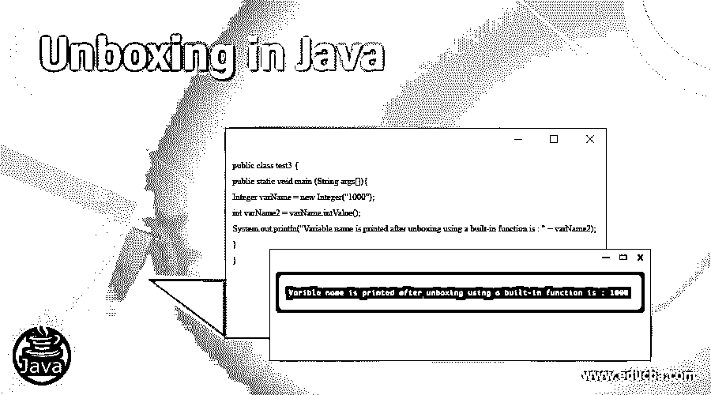

# Java 中的 Unboxing

> 原文：<https://www.educba.com/unboxing-in-java/>




## Java 拆箱简介

拆箱是将 JAVA 中包装类的对象转换成原始数据类型的过程。它作为“java.lang”包的一部分出现，在导入该包后可以在 java 程序中使用。例如，将包装类 Integer 的对象转换为 Int。这与 JAVA 中的自动装箱相反。它是作为 JAVA 5 开发的一部分引入的，使开发人员的生活变得更加容易。

**语法**

<small>网页开发、编程语言、软件测试&其他</small>

下面提供了用于在 JAVA 中取消装箱的语法:

```
import java.lang.*
class mainClass
{
public static void main (String args[] )
{
Integer variableName=new Integer( VariableValue);
variableName2 = variableName; //Unboxing in JAVA
}
}
```

这里，包装类“Integer”的对象被赋给原始数据类型 Int，该值作为包装类的构造函数中的参数传递。这在自动装箱中是隐式发生的。

### Java 中拆箱是如何工作的？

取消装箱是将对象转换为原始数据类型的过程。这个过程由 JAVA 编译器自动完成，因为 JAVA 中的库在 JAVA 第 5 版及更高版本中支持它。JAVA 编译器运行拆箱需要两个先决条件。这两个先决条件列举如下:

1.  当所用包装类的对象期望相关原始数据类型的“值”时，编译器使用取消装箱。
2.  所使用的包装类的对象又被分配给原始数据类型的变量。

下表包含包装类及其相关的原始数据类型:

| 包装类 | 相关原始数据类型 |
| 布尔代数学体系的 | 布尔型 |
| 整数 | （同 Internationalorganizations）国际组织 |
| 浮动 | 漂浮物 |
| 性格；角色；字母 | 茶 |
| 字节 | 字节 |
| 长的 | 长的 |
| 短的 | 短的 |
| 两倍 | 两倍 |

JAVA 中拆箱的数据流和解释将在下一节中用例子进行适当的解释。

### Java 中取消装箱的例子

下面提供的一些示例将提供拆箱技术的概念清晰性。

#### 示例#1

**代码:**

```
public class test1
{
public static void main(String args[])
{
Integer var1=new Integer(50);
if( var1 > 10) // Unboxing using comparator.
{
int var2=var1 + 10;
int var3=var2;
System.out.println(" The value of variable using unboxing functionality is JAVA is :"+ var3);
} else
{
int var2=var1 - 10;  //Unboxing using assignment operator.
int var3=var2;
System.out.println(" The value of variable using unboxing functionality is JAVA is :"+ var3);
}
}
}
```

**输出:**


解释:在这个程序中，主类被声明为“test1 ”,因为它包含 main()方法。程序执行从 main()函数开始。包装类“Integer”的一个对象被创建为名称“var1 ”,并被赋予值“50”。您应该关注为变量“var1”赋值的语法，这与自动装箱不同。这里，使用对象代替数据类型进行声明和赋值。一旦赋值完成，该对象的拆箱也就完成了。

这里，比较运算符用于取消对象装箱。“If”逻辑检查“var1”的值是否大于 10。如果不是，则控制流向程序的另一部分，从“else”关键字开始，跳过 If 循环下的整个代码片段。在 else 部分，没有比较器操作符，所以它进入控制逻辑。赋值操作符“=”在调用 else 时取消装箱。您可以通过更改提供给包装类的构造函数的参数来更改“var1”的值(在本例中为“Integer()”)。最后，根据逻辑加减数值并打印出来。

#### 实施例 2

**代码:**

```
public class test2
{
public static void main(String args[])
{
Character charName = 'M'; // Autoboxing.
char charName2 = charName; // Unboxing
System.out.println("The process used here is auto-unboxing to display the character : "+ charName2 );
}
}
```

**输出:**


说明:这里，取消装箱是使用赋值操作符完成的。数据流和控件执行将会工作，如前面的示例中所解释的那样。这里需要注意的一点是，我们没有使用包装类的对象来声明变量“charName”并为其赋值。虽然取消装箱是使用赋值操作符在“charName”上完成的。

#### 实施例 3

**代码:**

```
public class test3 {
public static void main (String args[]){
Integer varName = new Integer("1000");
int varName2 = varName.intValue();
System.out.println("Variable name is printed after unboxing using a built-in function is : " + varName2);
}
}
```

**输出:**


**解释:**这与前面的例子类似，只是增加了一个名为“intValue()的函数。该函数应该从变量“varName”中提取值，并将其赋给另一个名为“varName2”的变量。函数“intValue()”显式返回对象“varName”的值。这正是编译器在后端做的事情。您应该尝试删除此函数，并查看结果，将其与示例 2 进行比较。

### 优势

下面的列表展示了 JAVA 中取消装箱的一些基本优点:

1.  它代表了 JAVA 面向对象特性的真正使用。
2.  在整个项目中使用标准代码和语法风格，但增加了代码行数。
3.  更干净易懂的代码。
4.  易于由 AMS(应用程序维护支持)团队为大型项目进行维护。

### 结论

取消装箱与 JAVA 中的自动装箱相反。它将包装类的对象转换为原始数据类型。虽然我们有直接使用原始数据类型来声明和分配变量的功能(这被称为 JAVA 的自动装箱特性)，但是当代码的标准化很重要时，包装类的对象化然后将该对象分配给原始数据类型会被多次使用。这揭示了 JAVA 真正的面向对象特性。它主要用于大型项目，便于维护。

### 推荐文章

这是一个 Java 拆箱指南。在这里，我们讨论了在 Java 中拆箱是如何工作的，以及代码和输出的例子。您也可以看看以下文章，了解更多信息–

1.  [Java array.push](https://www.educba.com/java-array-push/)
2.  [Java 别名](https://www.educba.com/java-alias/)
3.  [Java 按值调用](https://www.educba.com/java-call-by-value/)
4.  [Java 引用调用](https://www.educba.com/java-call-by-reference/)


