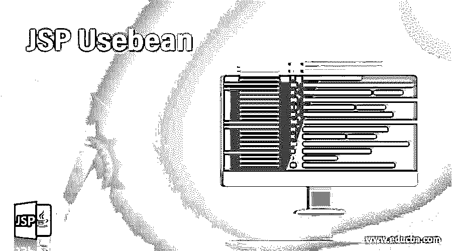

# JSP Usebean

> 原文：<https://www.educba.com/jsp-usebean/>




## JSP Usebean 介绍

简介:JSP usebean 标签用于定位远程 EJB (Enterprise JAVA bean)并为其创建一个对象以便使用。IDE(集成开发环境)能够在 JAVA source 文件夹中定位和创建 EJB 的对象，因此在这种情况下，它已经被检测到，并且不需要让 jsp usebean 显式地实例化它。而如果没有创建对象，则需要实例化。

### 句法

JSP usebean 的语法在本节中指定。use bean 标记的语法是在 jsp 标记启动时由附加的 useBean 决定的。有不同的属性可以分配给这个标签。一些属性已经存在预定义属性。我们只需要就此做出决定。这些属性解释如下:

<small>网页开发、编程语言、软件测试&其他</small>

**1。Id:** Id 是 JSP useBean 的标识符。它用于识别定义范围内的 EJB。

**2。Scope:** 这个属性定义了这个标签的范围。如果在此标记定义的范围之外调用，此标记将不起作用。有四个作用域，分别是“页面”、“请求”、“会话”、“应用程序”。如果没有明确的定义，JSP 中的 useBean 标记将默认使用“Page”属性。“请求”是为了支持 bean 的更大范围。这将页面范围扩大到使用相同 JSP 请求访问 bean 的所有用户。这里的关键字也是如此，因为如果请求被更改，那么 bean 将无法访问。“会话”范围向 EJB 提供在该特定会话中使用的特权，而不考虑任何请求者。它提供了比请求范围更广的范围。“应用”范围为 EJB 提供了最广泛的可见性。这种作用域类型表示 EJB 可以由任何 JSP 页面通过应用程序范围内的任何请求调用。也可以通过不同的会话访问它。

**3。class:**class 标签提到了 java 可植入类的名字。该类包含实现业务逻辑的数据成员和成员函数。这个类应该存在于一个包中。包应该作为 class 的前缀来调用 useBean 标记中的类。定义的类不应有构造函数或参数。这个类也不应该是抽象的。只有当前面提到的条件都满足时，useBean 标签才起作用。

**4。Type:** 用于在定义的作用域下，为已经实例化的类的一个对象提供数据类型。该类必须创建一个对象，这样才能起作用。这是用 bean 或类名定义的(提示:Bean 和类名应该相同，以避免任何混淆或数据问题)。

**5。beanName:** 如果想使用 JSP 库中预定义的 instantiate()函数实例化 EJB，就使用这个函数。这个函数的完整调用路径是 java.beans.Beans.instantiate()。

```
<jsp:useBean id= "nameOfInstance" scope= "predefinedScope"
class= "packageName.className" type= "packageName.className"
beanName="packageName.className | <%= anyExpression >" >
</jsp:useBean>
```

### Usebean 标签如何在 JSP 中工作？

借助下一节给出的例子，可以更好地理解这一点。

下面提供的例子解释了 JSP 中 useBean 标签的工作原理。它用于定位远程退出的 EJB，并包含从那里到 jsp 页面的函数或过程。下面提供的示例将帮助您理解数据和控制流。

#### 示例#1

**JAVA 文件:BODMAS.java**

```
package test1JSP;
public class BODMAS {
public int bodmas(int a, int b, int c, int d, int e){return a+b-c/d*e;}
}
```

**JSP 文件:useBean1.jsp**

```
<jsp:useBean id="obj" class="test1JSP.BODMAS"/>
<html>
<head>
<meta http-equiv="Content-Type" content="text/html; charset=ISO-8859-1">
<title>Example 1 of JSP useBeans</title>
</head>
<body>
<h1>This is an example to demonstrate the use of useBean tag in JSP.</h1>
<br><br>
<p>
<%
int m=obj.bodmas(5,10,24,24,12);
out.print("The outcome of calculating 5+10-24/24*12 expression using BODMAS rule is ");
%>
<font color="#FF0000"> <% out.print(m); %></font> <% out.print("!"); %>
</p>
</body>
</html>
```

**输出:**


#### 实施例 2

**useBean2.jsp:**

```
<jsp:useBean id="obj" class="test1JSP.Calculator"/>
<html>
<head>
<meta http-equiv="Content-Type" content="text/html; charset=ISO-8859-1">
<title>Example 2 of JSP useBeans</title>
</head>
<body>
<h1>This is an example to demonstrate the use of useBean tag in JSP.</h1>
<br><br>
<p>
<%
String Uname=request.getParameter("name");
int m=obj.calculate(Uname);
out.print("The number of letters containing in the string is ");
%>
<font color="#FF0000"> <% out.print(m); %></font> <% out.print("!"); %>
</p>
</body>
</html>
```

**useBean3.jsp:**

```
<%@ page language="java" contentType="text/html; charset=UTF-8"
pageEncoding="UTF-8"%>
<!DOCTYPE html>
<html>
<head>
<meta charset="UTF-8">
<title> Example 2 of JSP useBeans </title>
</head>
<body>
<form action="useBean2.jsp" method="post">
How many number of letters are present in this letter: <input type="text" name="name"><br> <br>
<input name="name" type="submit" value="Find">
</form>
</body>
</html>
```

**Calculator.java:**

```
package test1JSP;
public class Calculator {
public int calculate(String name) {
String str = name;
int count = 0;
for (int i = 0; i < str.length(); i++)
{
if (Character.isLetter(str.charAt(i)))
count++;
}
return count;
}
}
```

**输出:**


**解释:**在这个例子中，数字 1 BODMAS·EJB 被创建，它将计算任何数量的提供的数字以及要执行的操作。这个名为“BODMAS.java”的 EJB 位于远程位置，可以使用 JSP 页面进行调用。在这种情况下，useBean1.jsp 是呼叫页面。请关注 useBean 标签的 class 属性。例如，数字 2，三个文件用两个 JSP 页面创建，而一个 EJB“calculator . Java”远程执行业务操作。useBean3.jsp 用于从用户那里获取输入，并将其传递给 useBean2.jsp 来执行计算，包括计算所提供的字符串中的字符数。一旦通过 calculator.java 执行了这个操作，这个“计数”就会再次传递给 jsp 页面并显示出来。

### 结论

JSP useBean 标记是调用远程 EJB 的最方便的方法之一。useBean 标记的实用性增加了，因为它的语法简单，并且增加了业务操作与设计的分离。越来越多的远程资源的出现也增加了这个标签在 JSP 中的实用性。

### 推荐文章

这是一个 JSP Usebean 的指南。这里我们讨论 Usebean 标签如何在 JSP 中工作，以及示例、输出和语法。您也可以看看以下文章，了解更多信息–

1.  [JSP 警报](https://www.educba.com/jsp-alert/)
2.  [JSON.stringify JavaScript](https://www.educba.com/json-stringify-javascript/)
3.  [JSP 过滤器](https://www.educba.com/jsp-filters/)
4.  [JSP 格式化程序](https://www.educba.com/jsp-formatter/)


