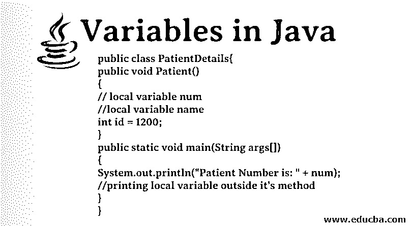
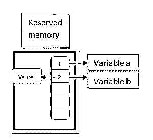

# Java 中的变量

> 原文：<https://www.educba.com/variables-in-java/>




## 什么是 Java 变量？

变量是用来在 Java 中存储任何信息的基本单位。变量名是分配给这些单元的名称。Java 代码可能需要数字或字符串形式的信息。一个代码的多个阶段可能需要相同的一组值。这就是变数出现的地方。

所有这些所需的值可以被分配给不同的变量，这些变量将被存储在它们各自的存储器位置中；因此，变量只不过是一个内存位置的名称。将值存储到变量中比在代码中到处重复这些值更有效。此外，当所需的值发生变化时，这也很有帮助，因为只需在变量声明的一个位置进行更改就足够了，而不必在多个位置进行更改。

<small>网页开发、编程语言、软件测试&其他</small>

### 变量声明

一个变量只有在被声明后才能使用，我们在声明时指定的数据类型定义了它可以保存的值的类型。可以将各种数据类型(如 int、float、string、char、Boolean、long、double)赋给变量。

在 Java 中声明变量的一般语法如下:

```
Ex: int a = 1;
```

在哪里，

*   int – datatype
*   a–变量名
*   1–变量值

下图给出了相同的图形表示:




### 变量的初始化

给变量赋一个默认值叫做该变量的初始化。根据需要，变量可以在声明期间和程序的后期初始化。**示例:**以下是我们可以根据变量的特定数据类型为其赋值的一些值:

*   int I；i = 10
*   弦城；city= "班加罗尔"；
*   char a；a = ' H
*   浮动 decdec = 3.5
*   Boolean val; val=true;

### 变量的类型

Java 中有 3 种类型的变量:

*   局部变量
*   [实例变量](https://www.educba.com/instance-variable-in-java/)
*   静态变量

#### 1.局部变量

*   这些变量是在它们所在的特定方法或块或构造函数中声明的。
*   它们的变量值在声明期间存储，仅在该方法的范围内有效，在退出该方法时会丢失。
*   具有相同变量名的局部变量可以在多个方法或块中声明，而不会有任何冲突。

**示例:**在下面的示例中，我们考虑将“num”和“name”作为局部变量。**代号:**

```
public class PatientDetails{
public void Patient()
{
// local variable num
//local variable name
int num = 1200;
string name = "Harish";
id = id + 1;
System.out.println("Patient Name is: " + name + " Patient Number is: " + num);
name = "Sudha";
System.out.println("Patient Name is: " + name + " Patient Number is: " + num);
}
public void DoctorDetails()
{
int num = 12000;
string name = "Vijay";
num = num +1;
System.out.println("Doctor Name is: " + name + " Doctor ID is: " + num);
name = "Suma";
System.out.println("Doctor Name is: " + name + " Doctor ID is: " + num);
}
public static void main(String args[])
{
PatientDetails pat = new PatientDetails();
pat. Patient();
pat.DoctorDetails();
}
}
```

**输出:**

患者姓名:哈里什
患者编号:1200
患者姓名:苏哈
患者编号:1201
医生姓名:维杰
医生编号:12000
医生姓名:苏马
医生编号:12001

这表明，当在两个不同的方法(即 Patient 和 DoctorDetails)中声明时，相同的局部变量名称“num”和“name”可用于分配任意数量的不同值。

**举例:**

如果我们试图在它们的方法之外显示它们的值，相同的局部变量“num”和“name”将是无效的。

**代码:**

```
public class PatientDetails{
public void Patient()
{
// local variable num
//local variable name
int id = 1200;
}
public static void main(String args[])
{
System.out.println("Patient Number is: " + num);
//printing local variable outside it's method
}
}
```

**输出:**

java 代码编译错误:-
prog.java:12:错误:找不到符号
System.out.println("病人号为:"+num ")；
^
符号:变量编号
位置:类病人详细信息
1 错误

#### 2.实例变量

*   实例变量是那些在类中而不是在任何方法中声明的变量。
*   它们是在创建对象时创建的，当对象被销毁时，它们的值就丢失了。
*   这些变量的初始化不是强制性的，默认情况下，该值为零。
*   它们是非静态变量，这意味着每当创建新对象时，都会分配变量的内存。

**举例:**

这里 a、b、c 是由两个不同的对象在两个不同的实例中声明的实例变量。

**代码:**

```
import java.io.*;
class Marks {
// a, b, c are instance variables
// a, b, c variables are being declared inside a class and not function
int a;
int b;
int c;
}
class MarksDemo {
public static void main(String args[])
{
// first object declaration
Alpha alp1 = new Alpha();
alp1 .a= 44;
alp1 .b= 77;
alp1 .c= 88;
// second object declaration
Alpha alp2 = new Alpha();
alp2 .a= 77;
alp2 .b= 55;
alp2 .c= 74;
// displaying variable values for first object
System.out.println("Values for first object:");
System.out.println(alp1.a);
System.out.println(alp1.b);
System.out.println(alp1.c);
// displaying variable values for second object
System.out.println("Values for second object:");
System.out.println(alp2.a);
System.out.println(alp2.b);
System.out.println(alp2.c);
}
}
```

**输出:**

第一个对象的值:
44
77
88
第二个对象的值:
77
55
74

#### 3.静态变量

*   静态变量在程序开始时声明，前面是静态关键字[。](https://www.educba.com/static-keyword-in-java/)
*   像实例变量一样，静态变量的初始化不是强制性的，它们的默认值是 0。
*   当程序启动时，只创建一个静态变量名，当程序执行结束时，静态变量名将丢失。
*   这些变量的内存只在加载类时分配一次，可以由多个对象共享。
*   当对象不同时，其中一个对象中静态变量的值的变化将反映在所有不同的实例变量中，其中一个对象中声明的值不会反映在其他对象中。

**举例:**

**代码:**

```
import java.io.*;
class Students {
//static variable rollno
public static double rollno;
public static String name = "Lilly";
public static classnum;
}
public class StudentDetails {
public static void main(String args[])
}
{
// no need of object to access static variables
Students .rollno= 101;
Students.classnum=3;
System.out.println(Students .name + "'s rollno is:" + Students .rollno + "and class number is:" + Students.classnum);
}
}
```

**输出:**

Lilly 的 rollno 是 101，班号是:3

### 结论 Java 中的变量

变量是 Java 程序的基本组成部分。当它们被创建时，它们指向一个特定的内存位置，当对象不再被引用时，它们被释放。当垃圾收集发生时，这些被释放的内存将被清除。这个过程也可以认为是一个变量的生命周期。

### 推荐文章

这是 Java 中的变量指南。这里我们讨论类型的基本概念以及变量的初始化和声明。您也可以阅读以下文章，了解更多信息——

1.  [Java 中的 While 循环](https://www.educba.com/while-loop-in-java/)
2.  [最佳 Java 编译器](https://www.educba.com/best-java-compilers/)
3.  [c#中如何初始化变量？](https://www.educba.com/variables-in-c-sharp/)
4.  [Shell 脚本中的变量|如何初始化？](https://www.educba.com/variables-in-shell-scripting/)


