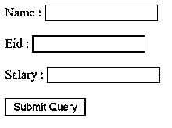
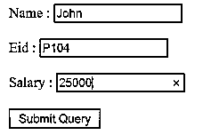

# JSF 转换器

> 原文：<https://www.educba.com/jsf-converters/>


## JSF 转换器介绍

在 JSF (JavaServer Faces)应用程序中，使用 http 请求作为客户端请求将用户输入发送到服务器。这些用户输入被称为值。这些请求值以字符串的形式发送到服务器。然而，JSF 应用程序使用各种数据类型，如 int、float、double、String、Boolean、date 等。因此，在处理请求值之前，需要将其转换为适当的数据类型。这个转换过程被称为转化。在本主题中，我们将了解 JSF 转换器。

为了在 JSF 应用程序中完成转换，JSF 框架提供了标准的转换器。这些转换器作为 JSF 核心标签库中的标签提供。此外，您可以创建自己的转换器来满足应用需求。这些转换器被称为定制转换器。

<small>网页开发、编程语言、软件测试&其他</small>

### 转换器标签

在 JSF 应用程序中，用户输入到 UI 组件中的数据需要转换成适当的格式，然后才能由应用程序处理。下表列出了 JSF 核心标签库提供的用于执行转换的标准标签。

用于数据转换的 JSF 核心标签

**f:converter–**该标签用于将任意转换器添加到实例父组件中。

**例子**

```
<f:converter converterId = "javax.faces.Integer"/>
```

**f:convert number–**该标签用于向父组件添加一个“NumberConverter”实例。

**例子**

```
<c:convertNumber type = "javax.faces.Integer"/>
```

**f:convert datetime–**该标签用于将“DateTimeConverter”实例添加到父组件中。

**例子**

```
<f:convertDateTime pattern = "dd/mm/yyyy"/>
```

JSF 框架提供了数字和日期的标准转换器。有时在应用程序中，我们需要将用户输入转换为数字和日期数据类型，因此我们可以使用 JSF 框架来提供标准的转换器。所有的标准转换器都包含在 javax.faces.convert 包 JSF 框架中。所有的转换器都是基于组件的值隐式应用的，如果我们想要访问这些转换器，我们可以通过转换器 Id 来访问它们。

### JSF 框架转换器

IntegerConverter 类，用于将用户输入字符串值转换为 java.lang.Integer 类型的值，其转换器 id 为 javax.faces.Integer

**例子**

```
<h:inputText id="age" converter="javax.faces.Integer" />
```

BigIntegerConverter 类，用于将用户输入字符串值转换为 java.lang.BigInteger 类型的值，其转换器 id 为 javax.faces.BigInteger。

**例子**

```
<h:inputText id="age" converter="javax.faces.Integer" />
```

同样的方法可以用于不同的整数类型。

ShortConverter 类，用于将用户输入字符串值转换为 java.lang.Short 类型的值，其 conveter id 为 javax.faces.Short

用于将用户输入字符串值转换为 java.lang.Short 类型值的 LongConverter 类，其 conveter id 为 javax.faces.Long

NumberConverter 类用于将用户输入的字符串值转换为 java.lang.Number 类型的值，其 conveter id 为 javax.faces.Number。

**例子**

```
<h:outputText value="#{userBean.height}">
<f:convertNumber maxFractionDigits="2" />
</h:outputText>
```

FloatConverter 类，用于将用户输入字符串值转换为 java.lang.Float 类型的值，其 conveter id 为 javax.faces.Float。

BigDecimalConverter 类，用于将用户输入字符串值转换为 java.lang. BigDecimal 类型的值，其转换器 id 为 javax.faces.BigDecimal。

DoubleConverter 类，用于将用户输入字符串值转换为 java.lang. Double 类型的值，其 conveter id 为 javax.faces.Double。

用于将用户输入字符串值转换为 java.lang.Byte 类型值的字节转换器类，其转换器 id 为 javax.faces.Byte。

用于将用户输入字符串值转换为 java.lang 的 CharacterConverter 类。值的字符类型及其转换 id 为 javax.faces.Character。

用于将用户输入字符串值转换为 java.lang.Boolean 类型值的 BooleanConverter 类，其 conveter id 为 javax.faces.Boolean。

DateTimeConverter 类，用于将用户输入字符串值转换为 java.lang. DateTime 类型的值，其 conveter id 为 javax.faces.Datetime。

EnumConverter 类，用于将用户输入字符串值转换为 java.lang. Enum 类型的值，其 conveter id 为 javax.faces.Enum。

#### 1.convertdatetime tag 转换日期时间标记

JSF convertDateTime 包含以下用于转换日期时间格式的属性。

*   **date style–**该属性指定要格式化的日期字符串的日期的格式样式。
*   **区域设置–**该属性指定以区域设置格式表示日期。
*   **pattern–**该属性指定格式的格式模式。

*   **time style–**该属性指定要格式化的日期字符串的日期的预定义格式样式。
*   **Time zone–**该属性指定要格式化的日期字符串的日期所在的时区。
*   **type–**该属性指定要格式化的日期和/或时间。

**例子**

```
<h:inputText id="DOB" label = "Date of Birth" value="#{bean.DOB }">
<f:convertDateTime pattern="dd/mm/yyyy" />
</h:inputText>
```

#### 2\. convertNumber Tag

JSF convertNumber 包含以下属性来转换数字格式。currency code–该属性指定应用货币格式。

*   **货币符号–**该属性指定应用货币格式。
*   **分组使用–**该属性指定格式化输出是否有分组分隔符。
*   **integerOnly–**该属性指定是否只有整数部分格式。
*   **locale–**该属性指定用 Locale 格式表示数字。
*   **minFractionDigits–**该属性指定小数部分的最小位数。
*   **maxFractionDigits–**该属性指定小数部分的最大位数。
*   **minIntegerDigits–**该属性指定整数部分的最小位数。
*   **maxIntegerDigits-**该属性指定整数部分的最大位数。
*   **pattern–**该属性指定格式的格式模式。
*   **type–**该属性指定数字、百分比和货币的类型。

**例子**

```
<h:outputText value = "#{bean.height}">
<f:convertNumber maxFractionDigits = "1" />
</h:outputText>
```

让我们看一个 JSF 项目的例子。

用下面的代码创建 index.xhtml。

```
<!DOCTYPE html PUBLIC "-//W3C//DTD XHTML 1.0 Transitional//EN"
"http://www.w3.org/TR/xhtml1/DTD/xhtml1-transitional.dtd">
<html 
xmlns:ui="http://xmlns.jcp.org/jsf/facelets"
xmlns:h="http://xmlns.jcp.org/jsf/html"
xmlns:f="http://xmlns.jcp.org/jsf/core">
<h:form>
<h:outputLabel for="name">Name : </h:outputLabel>
<h:inputText id="name" value="#{Emp.name}"/><br/>
<h:outputLabel for="eid">Eid : </h:outputLabel>
<h:inputText id="eid" value="#{Emp.eid}">
<h:outputLabel for="sal">Salary : </h:outputLabel>
<h:inputText id="sal" value="#{Emp.sal}">
<f:converter converterId="javax.faces.Integer" />
</h:inputText><br/>
<h:commandButton action="disp.xhtml" value="Submit Query"/>
</h:form>
</html>
```

在项目中使用以下代码创建 Emp.java 类。

```
package jsfp;
import javax.faces.bean.ManagedBean;
import javax.faces.bean.RequestScoped;
@ManagedBean
@RequestScoped
public class Emp {
String name;
String eid;
int sal;
public String getName() {
return name;
}
public void setName(String name) {
this.name = name;
}
public String getEid() {
return eid;
}
public void setEid(String eid) {
this.eid = eid;
}
public int getSal() {
return sal;
}
public void setSal(int sal) {
this.sal = sal;
}
}
```

使用以下代码为响应创建 disp.xhtml。

```
<!DOCTYPE html PUBLIC "-//W3C//DTD XHTML 1.0 Transitional//EN"
"http://www.w3.org/TR/xhtml1/DTD/xhtml1-transitional.dtd">
<html 
xmlns:ui="http://xmlns.jcp.org/jsf/facelets"
xmlns:h="http://xmlns.jcp.org/jsf/html"
xmlns:f="http://xmlns.jcp.org/jsf/core">
<h:head>
<title>Reply Page</title>
</h:head>
<h:body>
<h:outputText value="Welcome #{Emp.name}. Your eid is #{Emp.eid}. Your Salary is #{Emp.sal}."/>
</h:body>
</html>
```

序列中上述项目的输出是




您填写以下详细信息——




单击该按钮后，输出为–


### 结论

用户输入使用字符串形式的 http 请求发送到服务器，首先需要使用 JSF 框架的 JSF 转换器将需要处理的请求值转换为适当的数据类型，如 int、float、double、string、Boolean、date 等。

### 推荐文章

这是一个 JSF 转换器指南。在这里，我们讨论了转换器标签和框架的 JSF 转换器以及例子。您也可以看看以下文章，了解更多信息–

1.  什么是 JSF？
2.  [JSF 面试问题](https://www.educba.com/jsf-interview-questions/)
3.  [JSF 生命周期](https://www.educba.com/jsf-life-cycle/)
4.  [什么是 ExpressJS？](https://www.educba.com/what-is-expressjs/)


