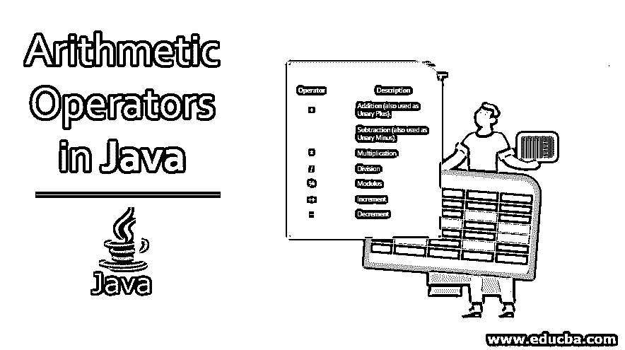
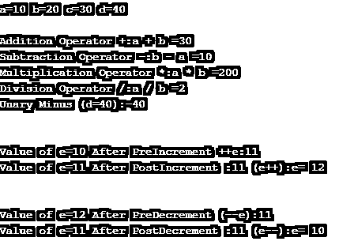

# Java 中的算术运算符

> 原文：<https://www.educba.com/arithmetic-operators-in-java/>




## Java 算术运算符简介

Java 提供了丰富的运算符环境，如算术、关系、按位和逻辑。Java 算术运算符用于执行简单的数学运算。在 Java 中，我们将加减乘除运算符视为基本算术运算符。对于算术运算符，操作数应该是数字类型。Java 允许对 char 类型使用算术运算；在 java 中，char 被认为是 int 的子集。有些二元[算术运算符也用](https://www.educba.com/arithmetic-operators-in-javascript/)作为一元运算符；例如，减法运算符也用于对正值求反。如果任何操作数类型是 double、float、long。另一个操作数也分别转换为 double、float、long。

### Java 中的算术运算符列表

下表显示了 java 中所有算术运算符的列表。

<small>网页开发、编程语言、软件测试&其他</small>

| **操作员** | **描述** |
| + | 加法(也用作一元加号)。 |
| – | 减法(也用作一元减号)。 |
| * | 增加 |
| / | 分开 |
| % | 系数 |
| ++ | 增量 |
| — | 减量 |

下面解释上面列出的运算符及其功能和语法。

#### 1.加法运算符“+”

加法运算符是一元运算符，即在两个操作数之间执行的算术运算。基本上，这个“+”运算符用于执行简单的算术加法运算。

*   加法运算符+也用于字符串类型操作数，以连接两个单独的字符串。
*   此外，运算符+还用作一元+；它返回变量的正值。
*   当应用数字操作数时，它执行加法运算，当应用字符串操作数时，它执行串联运算。
*   Java 允许我们对 char 类型的变量进行算术加法运算。

**语法:**

```
"Result=Operand1 + Operand2" or "ResultString=String1 + String2" Or "+Operand"
```

Operan1 和 operand2 是数值类型，返回数值类型的结果。ResultString 是 String1+String2 的新串联字符串。

#### 2.减法运算符“-”

减法运算符“**–**”执行基本的减法运算。该运算符是一个二元运算符。此算术运算符仅适用于数字运算符。

*   减法运算符也可以用作一元运算符，对操作数的数值求反。
*   java 允许我们对 char 类型的变量进行算术减法运算，因为在 Java 中 char 被认为是 int 的子集。

**语法:**

```
Result = Operand1 – Operand2 or "- Operand"
```

操作 1 和操作 2 可以是任何数字类型。

#### 3.乘法运算符" * "

乘法运算符也是二元运算符。该运算符仅适用于数字操作数。乘法运算符执行基本的数学乘法运算。

**语法**:

```
Result = Operand1 * Operand2
```

Operand1 & operand2 是 int、long、double 或 float 的两个数值。

#### 4.除法运算符"/"

除法运算符执行数学除法运算。该运算符也是二元运算符；如果两个操作数都是整数类型，那么结果将是整数类型。如果的任何操作数是 float 类型，则返回 Float 类型的结果。用 0 Java Exception 除任何数值时，处理程序抛出 ArithmaticException 类型的 DivideByZeroException。

**语法:**

```
result = Operand1 / Operand2;
```

操作 1 和操作 2 可以是任何数值。Operand2 必须是任何非零值。

#### 5.模数运算符" % "

模运算符返回两个操作数的余数。该运算符也是二元运算符。模运算符可以应用于整数或任何其他浮点类型的变量。如果尝试对任何浮点数执行模零运算，将引发 ArithmaticException 并返回值 NaN。

**语法:**

```
Result = Operand1 % Operand2;
```

操作 1 和操作 2 可以是任何数值。Operand2 必须是非零数值。

#### 6.递增运算符“++”

递增运算符“++”一次将操作数值递增 1。增量运算符是一元运算符，即只应用一个操作数。该运算符可用作前增量或后增量。

*   **预递增:**预递增中，先递增数值；后来就一直用。运算符以操作数为前缀。
*   **Post Increment:** 在 post-increment 中——先使用变量的前一个值，后一个值被递增。运算符后面带有操作数。

增量运算符可用于任何数值变量。

#### 7.减量运算符“–”

减量运算符“–”是一元运算符。该运算符一次将操作数值减 1。该运算符可用作前减量或后减量。

*   **预减量:**在预减量中——运算符以操作数为前缀。第一操作数值随后递减 1；其值已被使用。
*   **后递减:**在后递减中，递减运算符与操作数后固定在一起。这里首先使用操作数的前一个值，后来它被递减。适用于任何数值变量的减量。

### 用 Java 实现算术运算符的示例

下面是 java 中算术运算符的例子。

**代码:**

```
public class OperatorDemo1
{
public static void main(String[] args)
{
int a=10;
int b=20;
int c=30;
int d=40;
int e=10;
System.out.println("");
System.out.println("a="+a+" b="+b+" c="+c+" d="+d);
System.out.println("");
System.out.println("Addition Operator +:a + b ="+(a+b));
System.out.println("Subtraction Operator -:b - a ="+(b-a));
System.out.println("Multiplication Operator *:a * b ="+(a*b));
System.out.println("Division Operator /:a / b ="+(b/a));
System.out.println("Unary Minus (d=40):"+(-d));
System.out.println("");
System.out.println("");
//Increment Operator ++
System.out.println("Value of e="+e+" After PreIncrement ++e:"+(++e));
System.out.println("Value of e="+e+" After PostIncrement :"+(e++)+" (e++):e= "+e);
System.out.println("");
//Decrement Operator --
System.out.println("");
System.out.println("Value of e="+e+" After PreDecrement (--e):"+(--e));
System.out.println("Value of e="+e+" After PostDecrement :"+(e--)+" (e--):e= "+e);
}
}
```

**输出:**




### 结论

[算术运算符执行](https://www.educba.com/sql-arithmetic-operators/)简单的数学运算。因为每种编程语言[都使用算术运算符](https://www.educba.com/arithmetic-operators-in-php/)，但是与其他语言相比，Java 提供了更多的灵活性。我们可以将单个算术运算符用于一元加号以及字符串连接运算。它甚至降低了代码的复杂性。开发人员只需观察与操作相关的操作数的类型，就可以很容易地理解操作。

### 推荐文章

这是 Java 中算术运算符的指南。这里我们讨论 Java 中的算术运算符列表及其示例和代码实现。您也可以浏览我们推荐的文章，了解更多信息——

1.  [Java 中的一元运算符](https://www.educba.com/unary-operators-in-java/)
2.  [Java 流过滤器](https://www.educba.com/java-stream-filter/)
3.  [Java 瞬态](https://www.educba.com/java-transient/)
4.  [Java bytearray output stream](https://www.educba.com/java-bytearrayoutputstream/)


