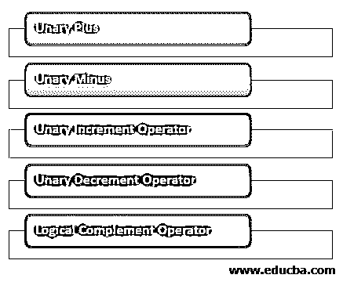

# Java 中的一元运算符

> 原文：<https://www.educba.com/unary-operators-in-java/>


## Java 中的一元运算符简介

对于任何编程语言来说，都可以根据需要使用各种各样的运算符、方法和函数。基于类的、面向对象的编程语言 Java 提供了广泛的运算符，Java 中的一种这样的运算符是“一元运算符”

一元运算符可以简单地定义为只接受一个操作数并简单地将值递增或递减 1 的运算符。增加了，一元运算符也对表达式进行求反运算，并且[布尔值](https://www.educba.com/java-booleans/)的值可以取反。

<small>网页开发、编程语言、软件测试&其他</small>

### 一元运算符的类型

有五个一元运算符能够执行各种运算。下面是五个一元运算符的列表:

*   一元加号，用“+”表示
*   一元减号，用“-”表示
*   一元增量运算符，用“++”表示
*   一元减量运算符，用“-”表示
*   逻辑补码运算符，用“！”表示

一元运算符与二元运算符截然不同，后者接受两个操作数。这些操作符就像用于对操作数执行某些操作的特殊符号；这里的操作数是变量和值。




#### 1.一元加号

简单地返回正值。无论值是什么，一元加号都不会返回负数形式。

#### 2.一元减操作

像加号运算符返回正值，一元减号返回相同值的负形式。对于上面解释的一元运算符，我们将演示一个示例，其中我们将实现一元加号和减号运算符。

**代码:**

```
class unary_ops {
public static void main(String[] args) {
int num = 6;
num = +num;
System.out.println(num);
num = -num;
System.out.println(num);
}
}
```

代码解释:我们已经在上面的例子中演示了加减一元运算符。我们有自己的类，然后是其中的主类，我们声明了一个值为 6 的简单整数。然后我们将 num 赋值给一元加号运算符。后来打印结果，这将是简单的平原 6。然后，我们将同一个变量传递给一元减号运算符，这里的值发生了变化。我们已经用 print 语句打印了输出，它应该是-6，意味着负 6。在执行上述代码时，6 和-6 是预期的输出。

**输出:**


#### 3.一元增量运算符

顾名思义，这个一元运算符执行的操作是将值递增 1。无论变量的值是什么，在用 increment 运算符传递后，该值都会增加 1。根据增量运算发生的时间，一元增量运算符可以分为两种类型:

*   **后递增:**首先处理值，然后递增。在后增量中，无论值是什么，它首先用于计算目的，之后，该值递增 1。
*   **Pre-Increment:** 相反，Pre-Increment 先做增量，然后对增量值执行运算操作。

#### 4.一元减量运算符

像递增运算符将值增加 1 一样，一元递减运算符将变量值减少 1。

与增量运算符类似，减量运算符也有两种类型:

*   **后期递减:**在后期表单中使用递减运算符时，首先使用值，然后更新值。
*   **预递减:**前缀形式，值先递减，然后用于任何计算操作。

演示上述递增和递减运算符的使用。

**代码:**

```
class unary_ops {
public static void main(String[] args) {
int num = 6;
num--;
System.out.println(num);
num++;
System.out.println(num);
}
}
```

**代码解释:**与主类内的类相同，整数 num，值为 5。我们首先将减量操作符作为 num 传递给变量——值将被打印出来。稍后，我们将相同的计算值传递给 increment 操作符，结果将被打印出来。我们的初始值是 6，执行后，输出将是“5 6”。这意味着它将首先递减到 5，然后递增 1，再次变为 6。

**输出:**


#### 5.逻辑补码运算符

这个操作符只是用来反转任何变量的布尔值。《出埃及记》如果一个变量的布尔值为真，在用一个逻辑运算符传递后，它将被转换为假。

**代码:**

```
class unary_ops {
public static void main(String[] args) {
boolean bvalue = false;
System.out.println(bvalue);
System.out.println(!bvalue);
}
}
```

**代码解释:**我们已经使用布尔数据类型演示了一个逻辑补码运算符。在我们的类中，有一个主类和一个简单的布尔变量，它包含 false 值。在我们的第一个 print 语句中，我们已经打印了原始值，后来我们传递了逻辑补码运算符；如您所见，我们使用了“！”符号。通过这种实现，布尔变量的值将被反转，导致输出发生变化，这将是真的。

**输出:**


以下是执行时会导致错误的情况:

*   重要的是要理解这样一个事实，即这些递增和递减运算符只能用于变量，而不能用于常量。用 contact 值实现这些运算符将导致错误。另一个有趣的问题是，如果您以嵌套形式使用这些操作符，将会如何出现意外错误。不可接受的嵌套形式是:*int x = ++(++y)；*
*   **对 final 变量的操作:**声明一个 final 变量就像在数据类型前加一个 Final 关键字一样简单，这样就产生了一个值不能改变的类型变量。记住这一点，我们不能在 final 变量上实现这些操作符，因为这些操作会导致值的变化。
*   **对于布尔值:**这些操作符可以在除布尔值之外的所有类型的原始数据类型上实现。
*   在上述任何一种情况下，都会导致错误。

### 结论

有 5 个一元运算符，有前置和后置两种类型。我们理解每个运算符都有特定的定义和用法。随着解释，我们有各自的运营商和屏幕截图以及代码解释程序。以及一些明智地实现这些操作符的重要技巧。

### 推荐文章

这是 Java 中一元运算符的指南。这里我们讨论 Java 中一元运算符的介绍和不同类型。您也可以看看以下文章，了解更多信息–

1.  [JavaScript 中的算术](https://www.educba.com/arithmetic-operators-in-javascript/)
2.  [JavaScript 中的按位运算符](https://www.educba.com/bitwise-operators-in-javascript/)
3.  [Java 流过滤器](https://www.educba.com/java-stream-filter/)
4.  [Java bytearray output stream](https://www.educba.com/java-bytearrayoutputstream/)


