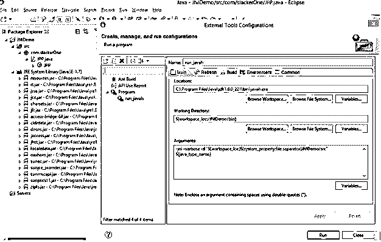

# Java 中的本机关键字

> 原文：<https://www.educba.com/native-keyword-in-java/>


## Java 中 Native 关键字介绍

native 关键字充当 JAVA 语言和用除 JAVA 之外的不同语言编写的代码块或库之间的链接，这可能取决于您操作的机器。如果 native 关键字应用于一个方法，那么这意味着该方法将通过 JNI (JAVA native interface)使用用其他语言(如 C 或 C++)编写的本机代码来实现。

### Java 中 Native 关键字的语法

本机代码的语法与普通函数定义相同，只是在函数的开头添加了“native”关键字。

<small>网页开发、编程语言、软件测试&其他</small>

**例如:**

```
public class testing
{public native String testMethod (String parameter);}
```

在这里，公众是一个访问修饰符。它应该是公共的，以便另一个文件可以使用它。字符串是函数的返回数据类型。它可以是整数、字符或布尔值，具体取决于关键字。传递给这个函数的参数的数据类型也是 string。一切都应该被归为下层阶级。

在函数声明之后，我们通过创建对象和加载库来调用这个函数。

```
public static void main(String[] args)
{
System.loadLibrary("testing");
testing testingnew = new testing();
String  output   = testingnew.stringMethod("NATIVE");
}
```

应该首先加载上面定义的库，然后创建它的对象。在这个对象的帮助下，调用本机函数。

### Native 关键字是如何工作的？

应该有两个文件。一个包含 JAVA 代码，而另一个应该有 C/C++遗留代码。Java 代码将用于调用遗留代码。这个遗留代码将与硬件交互，并返回预期的输出。

当遗留代码与硬件交互时，它将不会遵循 JAVA 制定的准则。这段代码将进行所需的处理，以获得输出并将结果传递给 JNI。Java native interface 随后将在其包含所有与本机代码相关的规则的目录中进行检查(在 SDK 中，该目录位于一个名为 javah.exe 的文件下)。JNI 是作为 Java 工具包的一部分设计的。在这个处理之后，JAVA 将用 JAVA 语言本身发布输出。当我们创建 JAVA 程序时，我们必须确保在 JAVA 文件和遗留文件之间有一个变量/数据流链接，以便在两者之间有一个平滑的数据流。

下面给出了解释如何使用本机关键字的步骤:

1.  编写包含本地方法、加载的共享库的 JAVA 代码，并使用“filename”保存它。JAVA”。
2.  编译 JAVA 代码并将代码转换成字节码。
3.  创建一个 C/C++头文件，其中包含应该调用的本机函数签名。
4.  编写 C/C++代码有一个本机方法的实现。
5.  运行 JAVA 可执行文件来查看结果。

### 例子

我们应该在 Eclipse 中编写代码，并运行代码来创建一个库，然后使用它来实现 C 代码。

**代码**:package com . slackrone；

```
public class JPP {
public static native void pAccess();
public static native int pRead();
public static native void pWrite(int port, int output);
static{
System.loadLibrary("JPPlibs");
}
public void jAccess(){
JPP.pAccess();
}
public int jRead(){
return JPP.pRead();
}
public void jWrite(int port, int output){
JPP.pWrite(port, output);
}
}
```

在将这段代码保存到 java 项目的新“类”中之后，我们必须设置一个运行环境来生成一个头文件。




当我们运行这个程序时，我们应该会生成一个库。

**输出:**

这里我们从 java 代码创建了头文件，它将本地代码和 java 语言链接起来。


### Java 中 Native 关键字的优势

下面给出了一些优点。

1.  它为 JAVA 提供了一个额外的优势，即与用其他语言编写的代码进行交互，并减少用 JAVA 编写相同代码的工作量，从而减少代码冗余。
2.  它提高了整体代码性能。由于代码是用其他语言编写的，所以当它与机器语言一起工作时可能比 JAVA 更快。然后我们可以使用 JAVA 程序调用这段代码。
3.  使用这种方法，我们可以直接给出系统调用。减少了外部干扰的可能性，提高了代码执行的速度。
4.  您可以使用用 JAVA 编写的任意驱动代码动态调用预加载的库(用除 JAVA 之外的任何语言编写),并且仍然可以用 JAVA 获得响应。
5.  它使得 JAVA 可以访问只能由其他语言使用的硬件资源。
6.  如果您已经为您的应用构建了平台相关的代码，并且 JAVA 不支持这些代码的功能，那么我们可以使用本机代码，并通过 native 关键字将本机代码链接到 JAVA。

### 规则

native 关键字的规则如下。

1.  native 关键字用在方法名之前。
2.  本机方法声明没有主体，应该以分号结束，因为这些方法不是在 JAVA 中定义的，而是在 C/C++语言中存在的。
3.  本机方法不能声明为抽象方法。
4.  由于不能保证以前的旧代码是根据 IEEE 754 标准编写的(IEEE 浮点运算标准是电气和电子工程师协会在 1985 年建立的浮点运算技术标准),所以我们不能[将这些本地方法](https://www.educba.com/native-methods-in-java/)声明为 strictftp。
5.  Java 设计了 Java 本地接口(JNI)规范来定义实现本地方法的规则和声明，比如 JAVA 和本地代码之间的数据类型转换。

### 结论

native 关键字弥补了本地语言和 JAVA 之间的差距。如果我们的软件与硬件的交互在使用预先存在的代码时更有效，这可以用作关键的链接。与从头开始设计一个新的应用程序代码相比，它使得实现工作量更少。

### 推荐文章

这是一个 Java 原生关键字的指南。这里我们讨论 Native 关键字如何与示例一起工作，以及它的优点和规则。您也可以看看以下文章，了解更多信息–

1.  [Java 中的 JTabbedPane](https://www.educba.com/jtabbedpane-in-java/)
2.  [Java 中受保护的关键字](https://www.educba.com/protected-keyword-in-java/)
3.  [Java 虚拟机](https://www.educba.com/java-virtual-machine/)
4.  [Java 中的 Swing 组件](https://www.educba.com/swing-components-in-java/)


