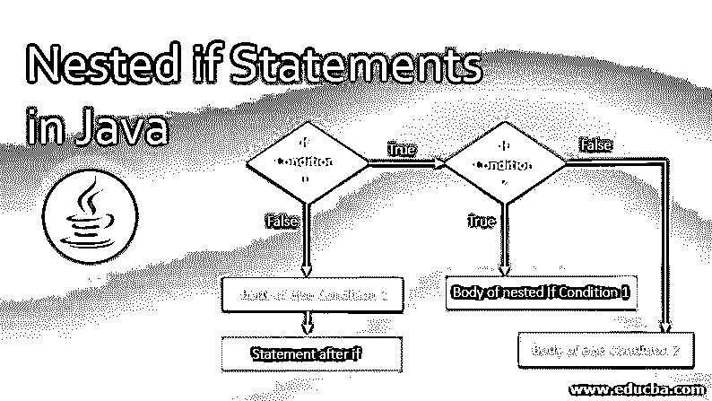
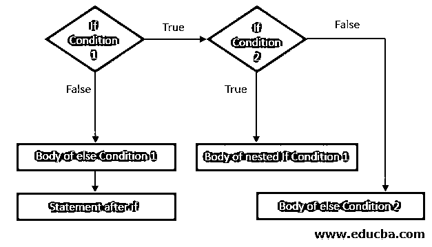

# Java 中的嵌套 if 语句

> 原文：<https://www.educba.com/nested-if-statements-in-java/>




## Java 中嵌套 if 语句概述

嵌套 if 语句是 Java 中根据特定条件流动的决策语句之一。这些条件的分支是程序状态变化的结果。也就是说，在另一个 if-else 中会有一个 if-else 条件。If，if-else，if-else-if，jump，switch-case 等。，是 Java 中其他一些决策语句。现在，让我们详细看看嵌套 if 语句。

### 嵌套 if 语句的语法

下面是 Java 中嵌套 if 语句的语法。

<small>网页开发、编程语言、软件测试&其他</small>

```
If (cond1)
{
//        Executes when the cond1 is satisfied
If (cond2)
{
//        Executes when the cond2 is satisfied
}        }
```

这里，条件 1 是条件 1，条件 2 是条件 2。

**举例:**

```
If (A1= =A2) {
Print A1 is equal to A2
If (A1= =A3) {  Print A1, A2 and A3 are equal.  }
}
```

### 流程图

下图描述了嵌套 if 条件的流程图。




### Java 中嵌套 if 语句的使用

嵌套 If 的工作方式类似于普通的 If-else 条件。唯一的区别是在另一个 if 条件中会有一个 if 条件。工作将如下。

*   如果条件 1 为真，则转到条件 2。如果满足条件 2，它的主体将执行；否则，将执行 else 部分。
*   如果条件 1 为假，那么将执行 else 部分的主体。
*   一旦条件检查完成，退出循环。
*   循环后继续执行语句

**if-else 条件的计数**根据用户的需求而变化。

### 嵌套 if 语句的示例

为了详细理解嵌套 if，让我们看看使用 Java 的例子。

#### 示例#1

一个简单的 java 程序，只使用 if 条件实现嵌套 if 条件。

```
//Nested-if Java program with if conditions only
public class NestedIfExample {
public static void main(String args[]) {
//declare 2 variables and store some values in it
int num1 = 23;
int num2 = 45;
//if the number 1 is 23
if( num1 == 23 ) {
//if number is 45
if( num2 == 45 ) {
System.out.print("Number 1 is :"+ num1 +" and Number 2 is :"+ num2);
} // end of if condition 2
} //end of if condition 1
} //end of main method
} //end of class
```

**输出:**


在这个程序中，声明了两个变量——num 1 和 num2，分别存储两个数字 23 和 45。在 if 条件下，检查 num1 是否为 23。为真，则执行嵌套 if。也就是说，还要检查另一个 if 条件，即数字 2 是否为 45。同样正确的是，打印一行，显示“数字 1 是 23，数字 2 是 45”。

#### 实施例 2

一个简单的 java 程序，用 if 和 else 条件实现嵌套 if 条件。

```
//Nested-if Java program with both if and else conditions
public class NestedIfExample {
public static void main(String args[]) {
//declare 2 variables and store some values in it
int num1 = 23;
int num2 = 48;
//if the number 1 is 23
if( num1 == 23 ) {
//if number is 45
if( num2 == 45 ) {
System.out.print("Number 1 is :"+ num1 +" and Number 2 is :"+ num2);
} // end of if condition 2
else
{
System.out.print("Number 2 is not 45");
}//end of else condition 2
} //end of if condition 1
} //end of main method
} //end of class
```

**输出:**


在这个程序中，声明了两个变量——num 1 和 num2，分别存储两个数字 23 和 48。在 if 条件下，检查 num1 是否为 23。为真，则执行嵌套 if。也就是说，还要检查另一个 if 条件，即数字 2 是否为 45。因为这不是真的，所以打印出一行显示“数字 2 不是 45”。

#### 实施例 3

一个简单的 java 程序，用于实现接受用户输入的嵌套 if 条件。

```
//Nested-if Java program that takes input from user and checks the condition
import java.util.Scanner;
public class NestedIfExample {
public static void main(String args[]) {
//create object of scanner
Scanner <u>sc</u>= new Scanner(System.in);
System.out.print("Enter the number to be checked: ");
int num1 = sc.nextInt();
//if the number 1 is greater than or equal to 23
if( num1 >= 23 ) {
System.out.print("Number 1 is :"+ num1 +" and it is greater than 23.");
//if number is 45
if( num1 >= 45 ) {
System.out.print("Oh!! it is greater than 45 also");
} // end of if condition 2
else
{
System.out.print(" But, the number "+num1+" is less than 45");
}//end of else condition 2
} //end of if condition 1
else
{
System.out.print("The number "+num1+" is less than 23");
}//end of else condition 2
} //end of main method
} //end of class
```

**输出:**


在这个程序中，声明了 num1 变量。然后，要求用户输入 num1。这里，给定 33 作为输入，在 if 条件下，检查 num1 是否大于或等于 23。因为它是真的，如果它被执行，那么它就是嵌套的。也就是说，还检查另一个 if 条件，即数字 2 是否大于或等于 45。因为这不是真的，所以打印一行，显示“数字 1 是 33，并且它大于 23。但是数字 33 小于 45”。

假设我们给定的输入是 20。输出会是什么？？让我们检查一下在那种情况下的流动情况。


在这种情况下，由于第一个条件本身不满足，else 部分被执行。也就是说，一行将被打印为“数字 20 小于 23”。

### 结论

嵌套 if 语句是 Java 中的一个决策语句，包含某些分支，一个 if 条件在另一个 if 条件内。本文讨论了嵌套 if 的语法、工作原理和示例。

### 推荐文章

这是 Java 中嵌套 if 语句的指南。在这里，我们讨论 Java 中嵌套 if 语句的流程图和工作方式，以及示例和输出。您也可以看看以下文章，了解更多信息–

1.  [Java 中的字符串](https://www.educba.com/string-in-java/)
2.  [Java 中的堆栈类](https://www.educba.com/stack-class-in-java/)
3.  [Java 中的嵌套类](https://www.educba.com/nested-class-in-java/)
4.  [在 JavaScript 中嵌套 if](https://www.educba.com/nested-if-in-javascript/)


