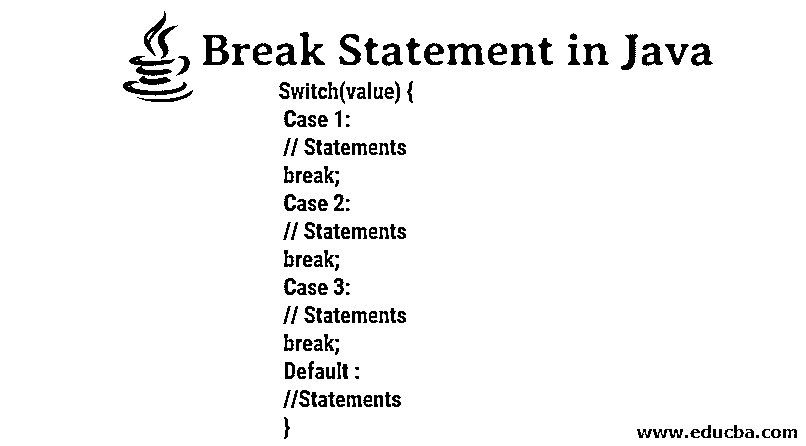
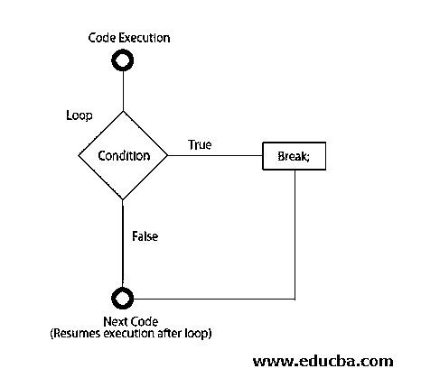
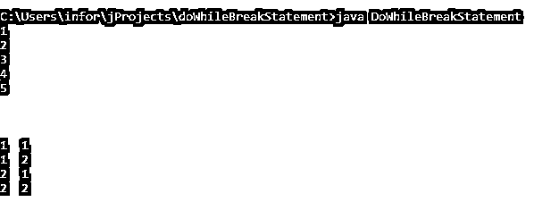

# Java 中的 Break 语句

> 原文：<https://www.educba.com/break-statement-in-java/>




## Java 中 Break 语句的介绍

break 语句是终止循环中指令执行的关键字；循环结束后，代码继续执行。break 语句是终止循环执行的最佳方式之一。java 中的 Break 语句可以在多种用例中使用； [break 语句的最佳用例出现在循环](https://www.educba.com/break-statement-in-python/)中，它终止循环内代码的执行&代码执行在循环后恢复。中断语句的另一个例子是在[开关情况下](https://www.educba.com/switch-case-in-powershell/)。

**举例:**

<small>网页开发、编程语言、软件测试&其他</small>

```
switch(value) {
case 1:
// Statements
break;
case 2:
// Statements
break;
case 3:
// Statements
break;
default :
//Statements
}
```

**语法:**

break 语句是一个简单的单行语句，如下所示。在上面给出的 switch case 语法中，我们可以看到如何在每个 case 的末尾放置 break 来终止循环内部的执行。

```
break;
```

### 流程图

在下面给出的图表中，我们可以看到如何中断语句，终止 loop/switch 语句内的执行&执行在循环后跳到下一步。




### Java 中 Break 语句是如何工作的？

*   Break 语句将代码编译跳转到循环外部，while loop、do-while、for-each、switch 和其他条件语句。
*   break 语句关闭放置它的循环。如果 break 语句没有被标记并放在循环内，它将跳转到循环外执行代码。
*   在带标签的循环中， [break 语句与标签一起放在](https://www.educba.com/break-statement-in-javascript/)中。带标签 Break 语句将程序执行控制跳转到带标签的代码块之外。
*   在 Java 中，break 语句也和其他编程语言一样工作。

#### 示例#1

请看 if 语句成功执行后执行如何终止的例子&程序执行控制移到下一步。

```
public class BreakStatementExample{
public static void main(String[] args){
// Create frame with title Registration Demo
int i=1;
while(i < 10){
if(i == 5){
break;
}
// Printing the counter
System.out.print(i);
System.out.print("\n");
i++;
}
}
}
```

在上面给出的例子中，在循环中，一旦计数器达到 5，就执行 break 语句。一旦 break 语句执行，这个计数器将不会显示为 break 语句执行到循环之外。我们可以在下面附上的截图中看到预期的结果。

**输出:**


#### 实施例 2

在这个例子中，我们可以看到一旦任何 case 为真，执行如何跳转到 switch case 语句的外部。

```
public class BreakStatementSwitchCaseExample{
public static void main(String[] args){
int y=2;
showExecution(y);
}
public static void showExecution(int i){
switch(i){
case 1:
System.out.print("Case 1 Executed");
break;
case 2:
System.out.print("Case 2 Executed");
break;
case 3:
System.out.print("Case 1 Executed");
break;
default:
System.out.print("Default Case Executed");
}
}
}
```

在上面给出的例子中，break 语句放在 switch 语句的每个 case 中。一旦执行了任何 case 代码块，break 语句就在该点停止执行&恢复 switch 语句之外的代码执行。

**输出:**


#### 实施例 3

在本例中，break 语句放在内部循环中。每当条件满足& break 语句执行时，代码执行将程序执行控制转移到内部循环之外。

```
public class LabeledBreakStatement{
public static void main(String[] args){
for(int i=1; i < 3; i++){
for(int j=1; j < 4; j++){
System.out.print(i +"  "+ j);
System.out.print("\n");
if(j == 2){
break;
}
}
}
}
}
```

在下面给出的截图中，内部循环是如何在打印 2。

**输出:**


#### 实施例 4

在下面给出的示例中，我们可以看到一个带标签的 break 语句示例。标记 break 指的是特定的代码块。当带标签的 break 语句执行时，控件移出带标签的代码块。

```
public class LabeledBreakStatement{
public static void main(String[] args){
primary:
for(int i=1; i < 3; i++){
secondary:
for(int j=1; j < 4; j++){
System.out.print(i +"  "+ j);
System.out.print("\n");
if(j == 2){
break primary;
}
}
}
}
}
```

在上面给出的例子中，每个循环从一个标签开始。在某些情况下，break 语句会终止那个带标签的循环。&执行控制移动到带标签的外部。我们可以在下面给出的截图中看到程序的输出。

**输出:**


#### 实施例 5

转到下一个例子，这个例子中有一个 do-while 语句的例子&也标记为 break 语句。

```
public class DoWhileBreakStatement{
public static void main(String[] args){
int j = 1;
do{
if(j == 6){
break;
}
System.out.println(j);
j++;
}
while(j < 9);
System.out.println("\n\n");
labeledBreakLoopExample();
//Further Checking execution moves to this step or not
}
//Labeled statement with nested loop
public static void labeledBreakLoopExample(){
primary:
for(int i=1; i < 3; i++){
secondary:
for(int j=1; j < 4; j++){
System.out.print(i +"  "+ j);
System.out.print("\n");
if(j == 2){
break secondary;
}
}
}
}
}
```

在上面给出的例子中，我们可以看到，该方法将第一个计数器打印到 5。当计数器达到 6 时，执行 break 语句后，程序执行控制执行 if case &进入 if case 内部代码。if 条件内的 Break 语句执行终止循环的执行，并将执行控制移到下一步。

进一步执行下一个方法。此方法有带标签的语句。此方法在某些真条件下执行带有辅助标签的 break 语句，这将关闭辅助标签循环的执行，并在内部标签循环之外跳转程序执行。

**输出:**




### 优势

*   使用 break 语句可以很容易地关闭循环。
*   它可以用于任何类型的循环，如 for、foreach、while、do-while 等。
*   [break 语句可以和](https://www.educba.com/break-vs-continue/)一起使用，并带有标签循环。标记的 break 语句可用于进一步终止标记的循环执行。该带标签的循环可能在语句的内部或顶部标签处。
*   Break 语句使循环更加灵活，并为它提供更多的功能。

### 结论–Java 中的 Break 语句

break 是保留的 java 关键字。它是[关键字](https://www.educba.com/c-keywords/)之一，程序员使用它来立即终止循环或条件语句中的执行&程序执行控制移动到下一步。其更好的用例场景出现在决策陈述中。

### 推荐文章

这是一个 Java 中断语句的指南。这里我们讨论 java 中 break 语句的介绍，Break 语句在 Java 中是如何工作的，以及它的例子。你也可以看看下面的文章来了解更多-

1.  [Java 中的构造函数](https://www.educba.com/constructor-in-java/)
2.  [Java 中的析构函数](https://www.educba.com/destructor-in-java/)
3.  [c++中的 Break 语句](https://www.educba.com/break-statement-in-c-plus-plus/)
4.  [中断 C 语言中的语句](https://www.educba.com/break-statement-in-c/)


