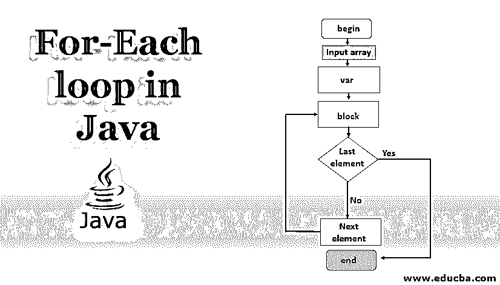
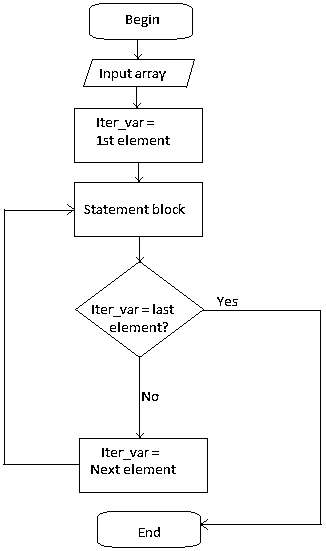

# Java 中的 For-Each 循环

> 原文：<https://www.educba.com/for-each-loop-in-java/>




## Java 中 For-Each 循环介绍

For each 循环已经在 Java 中引入[从 JDK](https://www.educba.com/what-is-jdk/) 5 开始。它的目标是顺序遍历集合或数组中的所有元素。它也存在于其他语言中，如 C#，它使用关键字 for-each。然而，与 C#不同，Java 只使用关键字“for”来实现 for-each 循环，但它的语法不同于传统的 for 循环。这个 for-each 循环在 Java 中也被称为增强 for 循环。

**语法:**

<small>网页开发、编程语言、软件测试&其他</small>

```
for(type iter_var : Collection) statement_block
```

上面使用的每个术语的解释如下:

1.  “type”指示的对象的数据类型
2.  “iter_var”表示迭代变量名，当我们迭代循环时，它存储集合的每个值。
3.  “Collection”指定我们要迭代的集合或数组。
4.  语句块是我们希望在循环的每次迭代中执行的语句集。

需要注意的是，for-each 循环按顺序访问集合/数组元素，它将每个元素的值存储在迭代变量中。下面是 for-each 循环的流程图。




正如您已经注意到的，for 循环和 for-each 循环之间有一些细微的差别。 [For 循环要求](https://www.educba.com/for-loop-in-php/)预先指定迭代次数。然而，for-each 循环的情况并非如此，因为循环从集合/数组的第一个元素迭代到最后一个元素，并且不需要指定迭代次数。

需要记住的重要一点是，for-each 循环中指定的类型必须与集合中元素的类型相匹配，否则将会出现兼容性问题。

### Java 中 For-Each 循环的示例

以下是不同的例子:

#### 1.For 循环

让我们用 for 循环找出一组人的平均年龄:

**代码:**

```
public class Main
{
public static void main(String[] args) {
int ages[] = {15, 18, 16, 17, 14, 12, 13, 20, 22, 25};
int sum = 0;
System.out.print("Ages of the group are : "); for (int i = 0; i < 10 ; i++)
{
System.out.print(ages[i]+" "); sum += ages[i];
}
System.out.println("\n Average age of the group = " + (sum/10));
}
}
```

**输出:**


#### 2.For-Each 循环

使用 for-each 循环计算一组人的平均年龄:

**代码:**

```
public class Main
{
public static void main(String[] args) {
int ages[] = {15, 18, 16, 17, 14, 12, 13, 20, 22, 25};
int sum = 0;
System.out.print("Ages of the group are : "); for (int x : ages)
{
System.out.print(x+" "); sum += x;
}
System.out.println("\n Average age of the group = " + (sum/10));
}
}
```

**输出:**


从上图可以看出，使用两个环路的输出是相同的。

### 使用 Break 语句的 Foreach 循环

使用 break 语句可以减少 for-each 循环[的迭代次数。例如，如果我们只想求出前 5 个元素的和，我们可以使用 break 语句，如下所示:](https://www.educba.com/break-statement-in-javascript/)

**代码:**

```
public class Main
{
public static void main(String[] args) {
int ages[] = {15, 18, 16, 17, 14, 12, 13, 20, 22, 25};
int ctr = 0, sum = 0;
System.out.print("Ages of the group are : "); for (int x : ages)
{
System.out.print(x+" ");
}
for (int x : ages)
{
if (ctr == 5) break; sum += x;
ctr += 1;
}
System.out.println("\nSum of age of first 5 people of the group = " + sum);
}
}
```

**输出:**


在上面提到的 for-each 循环中，x 是每次迭代存储数组中一个元素的迭代变量，它在下一次迭代中会发生变化。在第一次迭代中，x 存储数组的第一个元素和最后一个迭代元素的最后一个元素。与 for 循环不同，我们使用索引来访问数组元素，for 循环使用一个迭代变量来访问元素。

需要注意使用 for each 循环，因为迭代变量临时存储数组元素的值，因为它是“只读”的，并且更改它的值不会修改原始数组。这与 for 循环相矛盾，在 for 循环中，更改元素会修改原始数组。

让我们考虑一个例子，我们给数组的每个元素加 5。我们可以在下面的示例代码中看出输出的不同:

### 对于具有不同条件循环

具有不同条件的 for 循环解释如下:

**代码:**

```
public class Main
{
public static void main(String[] args) {
int ages[] = {15, 18, 16, 17, 14, 12, 13, 20, 22, 25};
System.out.print("Elements of the array are : "); for (int i = 0; i < 10; i++)
{
System.out.print(ages[i]+" "); ages[i]+= 5;
}
System.out.print("\nNew elements of the array are : "); for (int i = 0; i < 10; i++)
{
System.out.print(ages[i]+" ");
}
}
}
```

**输出:**


for 循环的输出显示了原始数组的更新

### 具有不同条件的 Foreach 循环

具有不同条件的 for 循环解释如下:

**代码:**

```
public class Main
{
public static void main(String[] args) {
int ages[] = {15, 18, 16, 17, 14, 12, 13, 20, 22, 25};
System.out.print("Elements of the array are : "); for (int x : ages)
{
System.out.print(x+" "); x += 5;
}
System.out.print("\nNew elements of the array are : "); for (int x : ages)
{
System.out.print(x+" ");
}
}
}
```

**输出:**


for-each 循环的输出显示原始数组没有更新

### java 中 For-Each 循环需要记住的事情

1.  for-Java 中的 Each 循环用于遍历序列中的数组/集合元素。
2.  for——Java 中的每个循环都使用迭代变量来迭代元素的集合或数组。
3.  修改迭代变量不会修改原始数组/集合，因为它是只读的。
4.  for-each 循环中的类型必须与原始数组/集合元素的类型相匹配。
5.  [Foreach 循环不需要指定迭代次数，因为它遍历集合的所有元素。](https://www.educba.com/powershell-foreach-loop/)
6.  可以使用 break 语句停止 for-each 循环。

### 推荐文章

这是 java 中 For-Each 循环的指南。这里我们讨论 java 中的 For-Each 循环及其不同方式的代码实现，包括 break 语句和各种条件。您也可以阅读以下文章，了解更多信息——

1.  [用 Java 打印数组](https://www.educba.com/print-array-in-java/)
2.  [Java 编程中的循环](https://www.educba.com/loops-in-java-programming/)
3.  [Java 中的 While 循环](https://www.educba.com/while-loop-in-java/)
4.  [Java 中的 3D 数组](https://www.educba.com/3d-arrays-in-java/)


