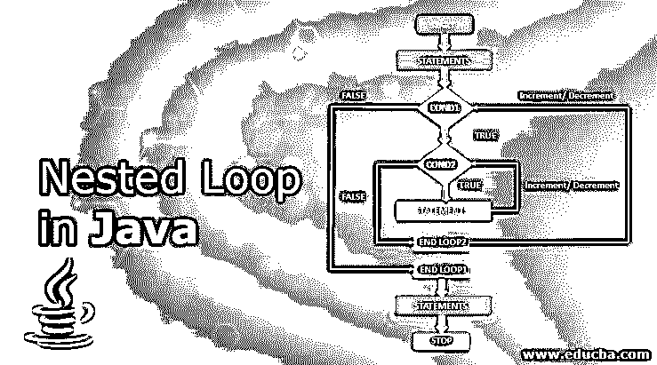
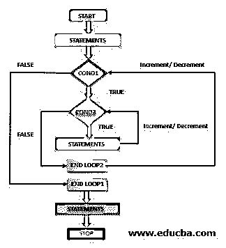
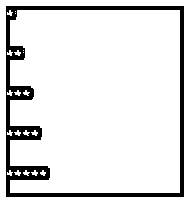
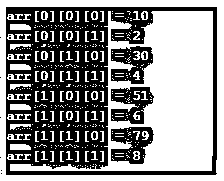

# Java 中的嵌套循环

> 原文：<https://www.educba.com/nested-loop-in-java/>




## Java 中嵌套循环介绍

构建由内部的另一个循环组成的嵌套结构的循环，并且外部循环监视内部循环的执行次数，在这种结构中工作的循环被称为嵌套循环。它也被称为循环中的循环。

### Java 中嵌套循环的语法

以下是不同的语法:

<small>网页开发、编程语言、软件测试&其他</small>

**1。嵌套 For 循环**

```
for(initialize;cond1;increment/decrement)
{
for(initialize;cond2;increment/decrement)
{
//body of loop2
}
//body of loop1
}
```

**2。嵌套 While 循环**

```
while(cond1)
{
while(cond2)
{
// body of loop2
}
//body of loop1
}
```

**3。嵌套的 Do-while 循环**

```
do{
do{
//body of loop 2
}while(cond2)
//body of loop 1
}while(cond1
```

**4。嵌套异构循环**

循环的嵌套没有限制，即只能嵌套相似类型的循环。我们可以将任何循环嵌套在任何其他循环中，例如 while within for 循环或 while loop within do-while 循环，所有其他可能的组合都适用。

```
for(initialize;cond1;increment/decrement)
{
while(cond2){
//body of loop2
}
// body of loop1
}
```

### 流程图




**说明:**

在上面的流程图中，首先，当我们进入程序体时，一个语句如初始化或打印语句得到执行。一旦发现循环，程序检查外部循环的条件；如果返回 true，则进入循环；否则，循环结束，循环后剩余的程序语句执行。

一旦它进入外循环并遇到内循环，变量被初始化(如果有的话)，接着检查内循环的条件，如果它返回真，程序进入内循环；否则，返回到循环 1 的末尾，并为再次执行循环 1 执行递增/递减。

如果 cond2 返回 true，则执行 Loop2 语句，计数器变量递增/递减。这个过程重复多次，然后程序从循环 2 退出，然后从循环 1 退出，并转到循环后出现的语句。

### Java 中嵌套循环是如何工作的？

每个循环由以下三个部分组成:

1.  **初始化:**该步骤是指初始化计数器的值。
2.  **条件:**这个条件是指继续执行循环需要为真的比较。
3.  **计数器递增/递减:**这是指一个循环流程结束后，对计数器进行的操作。

在嵌套循环的情况下，会对其中的每个循环检查上述三个步骤。因此，对于外部循环的每个流，内部循环完全执行，这意味着如果外部循环有 m 个流，外部循环有 n 个流，那么这个循环将一起执行 m*n 次。

**Note: **There are no limitations on the number of loops that can be nested as well as the type of loops that can be nested, one can use any type of loop, but one must take care as it affects the time complexity of the program and thus affects the performance.

**例如:**

```
for(int i=0;i<5;i++){
for(int j=0;j<5;j++){
System.out.println(“LOOP DEMO”);
}
}
```

在上面给出的嵌套循环的情况下:

**外环**

```
Counter variable = i
Condition – i<5
Increment/decrement – i++
```

**内部循环**

```
Counter variable = j
Condition – j<5
Increment/decrement – j++
```

### Java 中嵌套循环的例子

下面是 Java 中嵌套循环的例子:

#### 示例#1

让我们写一个程序来打印下面的图案:

*

**

***

****

*****

**Code:**

```
package Try;
class Demo
{
//static method
public static void main(String[] args)
{
for(int i=0;i<5;i++){
for(int j=0;j<5;j++){
if(i>=j) {
System.*out*.print('*');}
}
System.*out*.println("\n");
}
}
}
```

**Output:**


**Explanation:**

在上面的程序中，使用了两个内部循环，因为需要打印的图案可以类似于一个 2d 数组，该数组以“*”作为其 5 行 5 列的元素。

此外，if(i<=j)条件可以使用 2d 数组中*的位置来计算，其中行的计数器是 I，列的计数器是 j。

|  | I=1 | I=2 | I=3 | I=4 | I=5 |
| J=1 | * |  |  |  |  |
| J=2 | * | * |  |  |  |
| J=3 | * | * | * |  |  |
| J=4 | * | * | * | * |  |
| J=5 | * | * | * | * | * |

我们可以很容易地配置，只有当 i

#### 实施例 2

让我们看看打印 2D 矩阵的例子。

**代码:**

```
package Try;
class Demo
{
public static void printMatrix(int arr[][][]){
int i=0,j=0;
while(i<arr.length){
while(j<arr[i].length){
for (int k = 0; k <arr[j].length; k++)
System.out.println("arr[" + i + "][" + j + "]["+ k + "] = "+arr[i][j][k] );
j++;
}
i++;
j=0;
}
}
public static void main(String[] args)
{
int arr[][][] ={ { { 10, 2 }, { 30, 4 } }, { { 51, 6 }, { 79, 8 } } };
printMatrix(arr);
}
}
```

**输出:**




**解释:**
在上面的程序中，我们使用了 3 个循环来打印存储在 3D 矩阵中的元素，使用了 3 个计数器变量。因此，可以测试任意数量的回路，也可以使用任意类型的回路。

### 结论

嵌套循环是指在循环内部放置循环，以执行需要多次循环遍历的操作，如打印星形模式或对任何集合数据结构数组或链表的搜索操作。虽然它有助于使我们的任务更容易，但它也增加了程序的复杂性，因此必须以有效的方式使用。

### 推荐文章

这是 Java 中嵌套循环的指南。这里我们讨论介绍，例子，以及嵌套循环在 Java 中是如何工作的？分别是。您也可以看看以下文章，了解更多信息–

1.  [Python 嵌套循环](https://www.educba.com/python-nested-loops/)
2.  [c++中的嵌套循环](https://www.educba.com/nested-loop-in-c-plus-plus/)
3.  [C 语言中的嵌套循环](https://www.educba.com/nested-loop-in-c/)
4.  [Java 中的 do-while 循环](https://www.educba.com/do-while-loop-in-java/)


