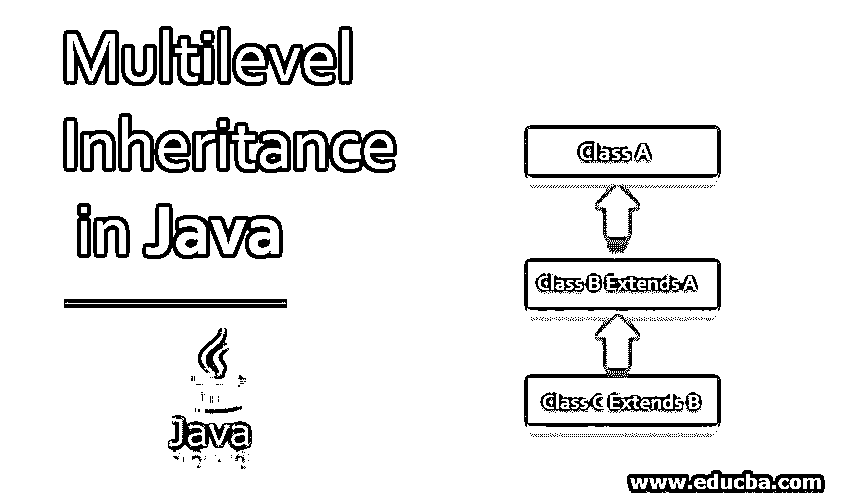

# Java 中的多级继承

> 原文：<https://www.educba.com/multilevel-inheritance-in-java/>




## Java 中的多级继承介绍

继承是 OOPS 概念的重要特征之一。它通过继承一个类(称为父类)的特性，由另一个类(称为其子类)来帮助重用代码。当继承扩展到两个以上的级别时，称为多级继承。当一个新类从一个基类派生出的类中派生出特性时，我们称之为多级继承。这个新类被称为父类的孙类。

例如，A 是父类，B 类是其子类，C 是 B 的子类和 A 的孙类。类似地，A 是 B 类的父类，C 类的祖父类。

<small>网页开发、编程语言、软件测试&其他</small>


### Java 中多级继承的语法

让我们看看下面给出的 java 中多级继承的语法:

```
class A{
//class A is parent of class B
//class A is grand parent of class C
public A(){
//A constructor
}
public void fun1(){
//function in Parent Class
}
}
class B extends A{
//class B is a child class of class A
//class B is a parent class of class C
public B(){
//class B constructor
}
}
class C extends B{
//class C is a child class of class B
//class C is grand child class of class A
public C(){
//Class C constructor
}
}
public class Test{
public static void main(String[] args){
C obj = new C();
}
}
```

对于多级继承的实现，必须有一个基类，例如 A。然后必须有一个派生类 B，它扩展了类 A，而类 C 扩展了 A。

### Java 中多级继承是如何工作的？

多级继承是将一个派生类的特性扩展到另一个新类的一种类型。由于父类特性被扩展到多个级别，因此这种类型的继承被称为多级继承。当子类扩展父类时，它可以使用父类的所有特性。因此，如果有一个类扩展了这个派生类的特性，那么它就是基类的孙类，具有父类和子类的所有特性。

考虑将 A 类作为父类，B 类作为 A 类的子类，C 类作为 B 类的子类，当为 C 类创建一个对象时，就像上面给出的 obj。当我们声明这个对象时，调用 C 类的构造函数。众所周知，当子类的构造函数被调用时，它的父类的第一个构造函数被调用。因此，当我们调用 C()时，就会调用 B()构造函数，此外，由于 B 是 B 类的子类，因此会调用 A()。然后控制回到子类。因此，在下面的系列中，执行构造函数:

A() – > B() – > C()

但是当使用子类的这个对象调用一个方法时，首先检查具有相同签名的方法是否存在于子类中。如果不是，则控制被定向到其父类以找到该方法。因此，在这种情况下，当使用对象 obj 调用 fun1()时，控制转到 C，发现没有这样的方法；因此，控制权转到 B，从而转到 a 类。

这样做的原因是因为人们可以很容易地在子类中重新定义父类的方法，这被称为[方法覆盖](https://www.educba.com/method-overriding-in-java/)。因此，优先选择被覆盖的方法。这样，多级继承在多个级别的类中实现了继承特性。这种类型的继承最常用于实现数据扩充，即在不更新现有代码的情况下增加现有数据的多样性和数量的过程。通过应用简单的转换，它也有助于向一个人的可用训练模型引入可变性。

### 多级继承的例子

让我们看看 java 中多级继承的一些例子。

**代码:**

```
class Electronics {
public Electronics(){
System.out.println("Class Electronics");
}
public void deviceType() {
System.out.println("Device Type: Electronics");
}
}
class Television extends Electronics {
public Television() {
System.out.println("Class Television");
}
public void category() {
System.out.println("Category - Television");
}
}
class LED extends Television {
public LED() {
System.out.println("Class LED");
}
public void display_tech() {
System.out.println("Display Technology- LED");
}
}
public class Tester {
public static void main(String[] arguments) {
LED led = new LED();
led.deviceType();
led.category();
led.display_tech();
}
}
```

**输出:**


**解释:**在上面的例子中，类 Electronics 是一个通用类，它为所有的电子设备提供了方法 device_type()。然后是扩展了 Electronics 类的 television 类，它指定了电子设备，并有一个方法名——category()来显示电子设备的类型。然后，class LED 扩展了 Television 类，以指定用于其显示的技术。它有 display_tech()方法来显示技术是领先的。

在 main 方法中，当我们创建一个 LED 类的对象时，我们用它来调用所有父类的方法。当调用子类的构造函数时，首先调用父类的构造函数；因此，当新的 LED()被调用时，第一个新的电视机()被调用。此外，在这个构造函数中，new Electronics()被调用并显示类电子设备。

然后它被返回到电视机构造器和显示类电视机，然后返回到 LED 类和显示类 LED。当使用 led 类的对象调用一个方法时，第一个控制转到 LED 类并试图找到方法–device _ type()，然后转到 Television 类查找在 LED 类中找不到的方法，当在 Television 类中找不到该方法时，还转到其进一步的超类 Electronics 并找到该方法并执行它。

### 结论

多级继承是一种很好的技术，它实现了继承的主要优点，即代码在多个级别上的可重用性和可读性。它有助于将可变性和多样性引入到提供基本培训材料的现有代码中。这个过程被称为代码文档。

### 推荐文章

这是 Java 中多级继承的指南。在这里，我们将讨论 Java 中多级继承的语法和工作方式，以及示例和代码实现。您也可以浏览我们的其他相关文章，了解更多信息——

1.  [Java 持久性 API](https://www.educba.com/java-persistence-api/)
2.  [Java 中的字符串初始化](https://www.educba.com/string-initialization-in-java/)
3.  [Java 中的不可变类](https://www.educba.com/immutable-class-in-java/)
4.  [Java PrintWriter](https://www.educba.com/java-printwriter/)


