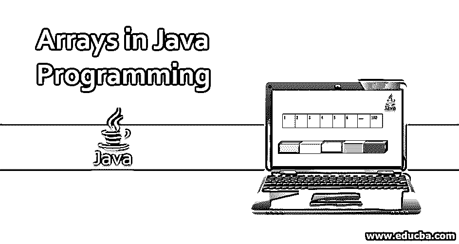
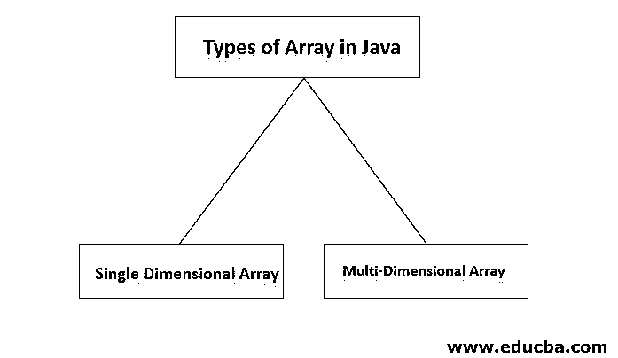

# Java 编程中的数组

> 原文：<https://www.educba.com/arrays-in-java-programming/>




## Java 编程中的数组介绍

*   在今天的部分中，我们将看看 Java 编程中的数组。你会逐渐了解数组。如何使用数组？还有，如何声明、创建和初始化数组？数组适合固定长度。我们将看到数组的一些优点和缺点。我们还会看到如何编写程序，如何访问数组元素。当数组被多维嵌套时，理解起来就变得很繁琐。如果你对将要发生的事情有一个清晰的认识，那么使用数组将会非常容易。
*   Java 是一种编程语言。Java 遵循面向对象的概念。我们可以说 java 是一种纯面向对象的语言。在当今世界，Java 处于每个 IT 部门都与之直接或间接相关的位置，ways.Java 有许多数据类型。有些是原始的，有些是非原始的。数组是编程中使用的一个强大而有用的概念。Java 为我们提供了[数据结构](https://www.educba.com/arrays-in-data-structure/)，即数组，它可以存储固定大小的同类元素的有序集合。
*   数组是用来存储数据集合的，但是把数组看作是相同类型变量的集合更有用。java.util.Arrays 类有一些方法。这些方法可以应用到数组中，得到数组的索引，数组的长度。我们也可以比较两个数组来检查两个给定的数组是否相同。假设我们需要获取数组中的值，以便在每个索引处放置一个特定的值。在每一个指标上，我们都要放一些值。
*   对于按升序排序数组，我们有一些方法可以应用。这可以通过 sort 方法来完成。java 中也有并行排序方法。在多处理器系统上，并行和大型数组的排序比顺序数组快。数据类型之一是数组。假设我们有一个场景，您需要存储大量相同类型的数据。数组是保存多个值的静态数据结构。像 java 中的其他变量一样，我们也可以在方法中传递数组。

**代码:**

```
class Demo
{
public static void main(String args[])
{
int a[] = {3, 1, 2, 5, 4};
sum(a);
}
public static void sum(int[] a)
{
// getting sum of array values
int total = 0;
for (int i = 0; i < a.length; i++)
total+=a[i];
System.out.println("sum of array values : " + total);
}
}
```

**输出:**

<small>网页开发、编程语言、软件测试&其他</small>


### 如何在 Java 中声明数组？

数组只不过是数据的集合。数组是同类数据类型的集合。同样，我们可以说数组是一种用于存储相似数据值的数据结构。这将相似类型的数据存储在一个变量中。假设我们有一个班的学生。每个学生都有一个 id。

假设那里有 100 名学生。看下面；我们将为每个变量声明一个变量。

Int student1 = 1
Int student 2 = 2；

Int student3 = 3

Int student4 = 4
。
。
。

Int student5 = 5

嗯…还是可以的。但是如果你有 1000 个学生。声明变量 1000 次是非常繁琐和耗时的。

那么解决办法是什么呢？是的，答案是数组。让我们看看如何声明一个数组。

在 Array 中，我们可以将值放在一个变量中。

**例如:**

```
int student[] = new int[1000];
```

我们将在下图中清楚地看到这一点:

学生[]


在这里，在一个变量中，我们可以存储任意数量的值。变量只不过是对内存位置的引用。

如果你仔细看过，我们用 new 关键字声明了数组。通常，我们使用一个新的关键字来创建对象。这意味着在 java 中。数组是对象。

嘿，等等，什么？对象。这意味着应该有一个已经存在的类来创建它的对象。是的，我们有一个超类，那就是对象类。数组总是扩展类对象。数组总是占用堆内存。不仅是数组对象，java 中的所有对象都被存储在堆内存中。所以我们只有一个对所有值的引用。通过这种方式，我们有效地利用了内存。数组是几乎所有语言中的常见话题。一旦我们理解了数组的核心概念，那么我们就可以很容易地解决它。

### Java 编程中如何初始化数组？

现在，下一个问题是我们如何初始化一个数组。这个术语是什么意思？初始化就是给变量赋值的过程。

在 java 中有多种初始化数组的方法。

第一种方法是如上例所示，同时声明数组。

**例如:**

```
int student[] = new int[1000];
```

下一件事是我们可以初始化数组，同时声明如下:

**例如:**

```
int student[] = {1, 2, 3, 4, 5, 6, ….1000};
```

在使用数组时，我们可能会遇到异常。如果你学过 java 中的错误处理，那么你一定知道异常。例外是在运行时已知的错误得到有效处理。对于数组，我们有数组索引越界异常。

### 如何访问数组元素？

到目前为止，我们已经学会了如何声明和初始化数组。现在是向前迈进的时候了。让我们假设你有一个和上面一样的数组，即学生数组。

现在，我们想要访问一个特定的值来进行编程。如何获取数组中特定元素的值？

在数组中，我们有索引号的概念。

例如，请看下图。


索引号从零(0)开始。

### Java 中数组的类型(用例子解释每种类型)

在进入数组类型之前，让我们先了解一些基本概念。

由 new 分配的数组中的元素将自动初始化为零(对于数值类型)、false(对于布尔值)或 null(对于引用类型)。Java 中有默认的数组值。获取数组是一个两步过程。您需要声明一个数组类型的变量。然后，你需要用一个新的关键字，为保存数组的对象分配内存，它会把它赋给数组变量。所以，我们可以说，在 Java 中，所有数组都是动态分配的。




有以下两种类型的数组:

#### 1.一维数组

一维由 1D 阵列组成。它可能只有一行或一列。

我们可以如下声明一个一维数组:

```
Int[] a; OR Int a[]; OR Int []a; OR Int[]a;
```

但是最首选的方式是 int[]a；请记住，我们不是在这里声明数组的大小。ex:int[5]a；在 java 中无效。在声明的时候，我们没有给出数组的大小。

现在，我们来看看数组的声明和创建:

```
Int[] a; //Declaration of the array
```

Note: At the time of declaration we are not proving the size of the Array.

```
a = new int[5] //Creation of array
```

在创建数组时，提供数组的大小非常重要。

我们可以在一行中声明并创建一个数组，如下所示:

```
Int[] a = new int[3];
```

现在让我们看看如何初始化数组。假设你必须在一个数组中添加一些值。然后将它添加到特定的索引号，如下所示:

```
a[0] = 1; // We are adding 1 at 0<sup>th</sup> position in array.
a[1] =2;
a[2] =3;
```

现在您已经看到了如何初始化数组。但是如果我给了索引 no，它在数组中不存在。

**例如:**

```
a[10] = 11; // suppose we had array of 5 only
```

此时，它会抛出一个 ArrayIndexLoutOf BoundException。不能添加超过数组大小的值。现在，我们可以在下面的一行中声明、创建和初始化数组:

```
Int[] a = {1,2,3,4,5};     //Declare, create, initialize
```

或者另一种方法如下。

```
Int[] a =  new int[] {1,2,3,4,5};
```

现在，让我们看看如何从一维数组中检索元素:

##### 如何打印数组的值？

我们将在这里使用 for 循环:

**举例:**

```
public class Demo2{
public static void main (String args[]){
int[] a =  new int[] {1,2,3,4,5};
for(int i=0; i<=a.length-1;i++)
{
System.out.println(a[i]);
}
}
}
```

**输出:**


In the above example, we can loop over the array values.

#### 2.多维数组

[多维数组由 2d 和 3d 数组](https://www.educba.com/multi-dimensional-array-in-javascript/)组成。它有多行和多列。我们也称之为数组的数组。我们也可以称之为交错数组。现在让我们看看数组声明。我指的是二维数组声明。上面，我们已经看到了如何声明一个一维数组。现在你将看到二维数组。与我们在 for 循环中使用长度变量读取一维数组一样，我们也可以在两个 for 循环中使用长度变量读取二维数组。假设，一维数组的长度变量给出了一维数组可以容纳的值的总数。一个二维数组的长度变量给出了一个二维数组可以容纳的数组总数。

多维数组可以说是数组的数组。

```
Int [][] a; //here we declared array a
```

现在，和上面我们用一维数组做的一样。声明数组后，我们需要创建一个数组。看下面的例子。

```
a = new int[2][4];
```

在这之后，我们将初始化一个数组。

我们将通过下图更清楚地理解这一点。


通过上图，我们可以很容易地初始化数组元素。

a[0][0]= 10
a[0][1]= 20
a[0][2]= 30<
a[0][3]= 40

看下面的图表，上面的值在给定的位置里面。我们可以很容易地用行和列初始化数组。


现在，像声明、创建和初始化这样的所有过程都可以在下面的一行代码中完成。请仔细看下面的语法。首先，我们将在一行中看到声明和创建:

```
int[][] a =new int[2][3];
```

现在，我们将看到声明、创建和初始化阵列的所有三个过程。

```
int[][] a = {{10,20,30},{100,200,300}};
```

更准确地说，请看下面的程序:

**代码:**

```
public class MyArray {
public static void main(String[] args)
{
int[][] a = {{10,20,30},{100,200,300}};
System.out.print(a[1][2]);
}
}
```

**输出:**


尝试数组中的小程序。操纵这些值。通过在编程大部分小事情的时候动手动脚，你就明白了。

### Java 编程中数组的优缺点

下面我们就来讨论一下优缺点。

#### 优势

1.  一个数组可以在一个变量中存储多个值。
2.  与原始数据类型相比，数组速度更快。
3.  我们可以在数组中存储对象。
4.  数组的成员存储在连续的内存位置。

#### 不足之处

1.  该数组具有固定的大小
2.  我们不能在运行时增加或减少数组的大小。
3.  在数组中，内存浪费可能更多。
4.  我们只能存储[相似数据类型](https://www.educba.com/hive-data-types/)的项目。
5.  而在数组中间添加或删除项目会影响数组的性能。

Java 中的数组是用来存储同类数据类型元素的数据结构。数组的优点是数组中的元素可以使用它的索引号来访问。这使得我们可以非常快速地对数组中的元素执行排序、获取、搜索和其他首选操作。阵列是一个很小的概念，可以在很短的规定时间内覆盖。当我们当时在准备考试或者面试的时候，要确保你已经看到并实现了上面讨论的所有概念。

### 结论 Java 编程中的数组

数组是 java 的核心概念。如果你是每种编程语言中处理数组和字符串的专家，那么这将是有史以来最好的成就。数组非常容易学。我只需要记住一些核心概念。一旦你学会了，你将永远不会忘记[数组实现](https://www.educba.com/array-implementation-of-stack/)。

### 推荐文章

这是 Java 编程中 for 数组的指南。这里我们讨论 Java 编程中数组的优缺点、示例代码和输出。您还可以浏览我们推荐的其他文章——

1.  [C 中的多维数组](https://www.educba.com/multidimensional-array-in-c/)
2.  [c#中的字符串数组](https://www.educba.com/string-array-in-c-sharp/)
3.  [Java 中的 3D 数组](https://www.educba.com/3d-arrays-in-java/)
4.  [c#中的数组](https://www.educba.com/arrays-in-c-sharp/)


