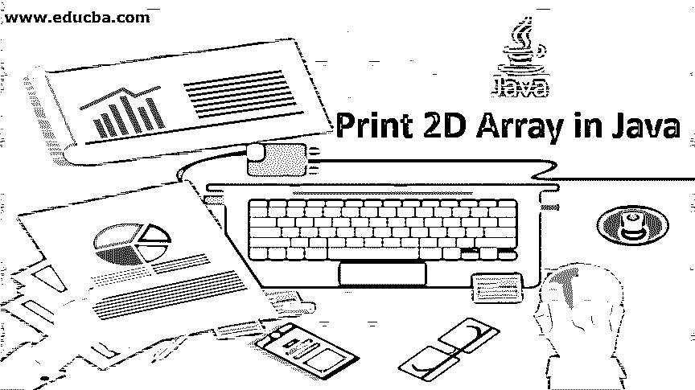

# 用 Java 打印 2D 数组

> 原文：<https://www.educba.com/print-2d-array-in-java/>




## Java 中打印 2D 数组简介

当我们想在 Java 中存储类似类型的元素时，我们取 Array 的名字。数组存储相似类型的元素，即:整数、字符串等。此外，数组的维数在 Java 中也会根据您的需求而变化。因此，只要 2D 数组中有数据，就需要打印这些元素。

有不同类型的技术，您可以选择在 java 中打印二维数组的元素。您可以使用这些技术中的任何一种打印二维数组的元素。

<small>网页开发、编程语言、软件测试&其他</small>

我将在这里展示的所有技术都有相关的代码示例。这些将为你提供更好的见解和实际操作。您应该仔细查看具有行内注释的代码，以提供更好的可读性。我还在每个代码的末尾提供了截屏形式的输出。

让我们一个一个来看技巧。我们将首先从语法开始。

### Java 中 2D 数组的语法

在 2D 数组的情况下，值以矩阵格式存储，这意味着它基于行和列索引。在 java 中声明数组时，可以遵循下面的任何语法。

**语法:**

```
dataType[][] reference_variable name;
dataType [][]reference_variable name;
dataType reference_variable name [][];
dataType []reference_variable name [];
```

您可以按照下面的示例在 java 中创建一个整数类型的二维数组的实例；这里的行数和列数是 5。

```
int[][] matrx=new int[5][5];
```

你可以按照下面的例子在 Java 中初始化一个 2D 数组。

```
matrx [0][0]=51;
matrx [0][1]=62;
matrx [0][2]=73;
matrx [1][0]=84;
matrx [1][1]=95;
matrx [1][2]=46;
matrx [2][0]=37;
matrx [2][1]=18;
matrx [2][2]=29;
```

### 用 Java 打印 2D 数组的例子

下面是一些如何用 java 打印 2d 数组的例子:

#### 示例# 1–相同行数和列数的二维数组

在下面的例子中，我们将展示一个如何用 java 打印整数数组的例子。

**代码:**

```
public class Print2DArrayInJava {
public static void main(String[] args) {
//below is declaration and intialisation of a 2D array
final int[][] matrx = {
{ 11, 22},
{ 41, 52},
};
for (int r = 0; r < matrx.length; r++) {       //for loop for row iteration.
for (int c = 0; c < matrx[r].length; c++) {   //for loop for column iteration.
System.out.print(matrx[r][c] + " ");
}
System.out.println(); //using this for new line to print array in matrix format.
}
}
}
```

**输出:**


#### 示例 2–Java 中的交错数组

当 java 中的一个[多维数组中的行数和列数不相等时，我们在 java 中称之为交错数组。这里的列数与其行数不同。](https://www.educba.com/multidimensional-array-in-java/)

在下面的例子中，我们将展示一个如何在 java 中打印整数的交错数组的例子。

**代码:**

```
public class PrintJaggedArrayInJava {
public static void main(String[] args) {
//below is declaration of a jagged 2 D array
int matrx[][] = new int[2][];
matrx[0] = new int[3];
matrx[1] = new int[5];
//initiatiation of a jagged 2 D array
int cnt = 1;
for (int r=0; r<matrx.length; r++)
for(int c=0; c<matrx[r].length; c++)
matrx[r][c] = cnt++;
//printing of a jagged 2 D array
for (int r=0; r<matrx.length; r++){
for (int c=0; c<matrx[r].length; c++){
System.out.print(matrx[r][c]+" ");
}
System.out.println();//printing of new line
}
}
}
```

**输出:**


#### 示例 3–Java 中的二维字符串数组

在下面的例子中，我们将展示如何用 java 打印字符串的 2D 数组。

**代码:**

```
public class Print2DArrayInJava {
public static void main(String[] args) {
//below is declaration and intialisation of a 2D array of strings
String[][] matrx = {{"OnePlus", "Pixel"}, {"Apple", "Oppo"}};
for (int r = 0; r < matrx.length; r++) {         //for loop for row iteration.
for (int c = 0; c < matrx[r].length; c++) {   //for loop for column iteration.
System.out.print(matrx[r][c] + " ");
}
System.out.println(); //using this for new line to print a 2D array of strings in matrix format.
}
}
}
```

**输出:**


### 用 Java 打印 2D 数组的三大方法

下面解释了用 java 打印 2d 数组的方法:

#### 方法 1–使用 for 循环

For 循环用于迭代，因此我们将使用 for 循环来迭代 java 中的数组元素。

**代码:**

```
public class PrintUsingForLoop {
public static void main(String[] args) {
final int[][] ar = {
{ 5, 9 },
{ 2, 4 }
};
for (int r = 0; r < ar.length; r++) {         //for loop for row iteration.
for (int c = 0; c < ar[r].length; c++) {   //for loop for column iteration.
System.out.print(ar[r][c] + " ");
}
System.out.println();
}
}
}
```

**输出:**


#### 方法 2–使用 for-each 循环

为了遍历数组，我们还可以使用 for-each 循环。

**代码:**

```
import java.util.*;
public class PrintUsingForEachLoop {
public static void main(String[] args) {
int[][] rec = new int[2][2];
rec[0][0] = 15;
rec[0][1] = 25;
rec[1][0] = 35;
rec[1][1] = 45;
for(int[] rc: rec){  //using for each loop
System.out.println(Arrays.toString(rc));
}
}
}
```

**输出:**


#### 方法 3–使用 Arrays.deepToString()方法

这里我们将使用数组**。**Java . util . arrays 包的 deepToString()方法将一个数组深度转换成一个字符串。要使用这个方法，我们需要导入 java.util.Arrays 包。

**代码:**

```
import java.util.*; //import package
public class PrintUsingDeepToString {
public static void main(String[] args) {
int[][] rec = {{37, 57}, {47, 58}};
System.out.println(Arrays.deepToString(rec)); //deep conversion
}
}
```

**输出:**


在上面的输出中，方括号的级别表示数组的维数，即 2。

### 结论

所以，在这个模块中，我们学习了如何用 Java 打印 2 D 数组的不同技术。如果我们把它与打印一维数组相比，这并不是什么新鲜事，除了你需要在声明、初始化和打印部分仔细修改代码。如果你是一个一维数组的高手，这将只是那个的延伸。我还放了代码示例。你需要练习这些，并将你的输出与给定的输出相吻合。为了掌握编码，必须亲自动手[。](https://www.educba.com/what-is-coding/)

### 推荐文章

这是一个用 Java 打印 2D 数组的指南。在这里，我们讨论了如何用 java 打印 2D 数组的三大方法，以及不同的例子。您也可以阅读以下文章，了解更多信息——

1.  [Java 中的数组方法](https://www.educba.com/array-methods-in-java/)
2.  [阵列的优势](https://www.educba.com/advantages-of-array/)
3.  [Java 中的 3D 数组](https://www.educba.com/3d-arrays-in-java/)
4.  [Java 中的 Do-While 循环](https://www.educba.com/do-while-loop-in-java/)


