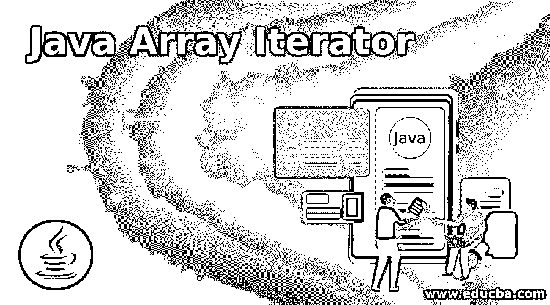
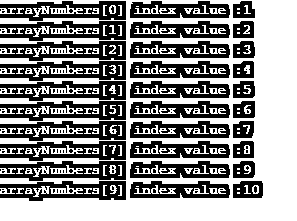
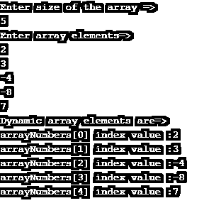
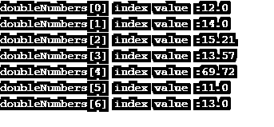
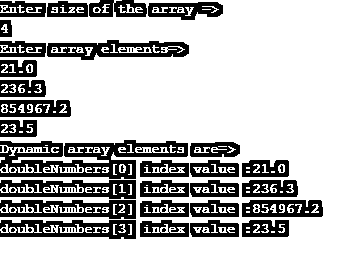
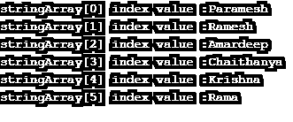
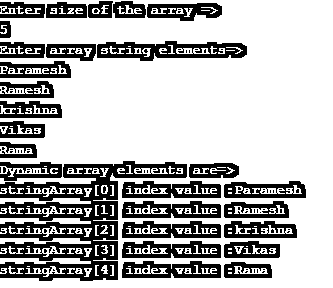

# Java 数组迭代器

> 原文：<https://www.educba.com/java-array-iterator/>




## Java 数组迭代器简介

*   Java 数组迭代器定义为通过在数组上应用不同的循环逻辑来迭代所有的数组元素。
*   数组用于存储同类元素意味着同一时间可以存储相同类型的元素。**例子:**我们可以存储整数、浮点数、双精度数、字符串、字符、对象等。，但一次只能指定一种类型。
*   数组大小不是动态的，所以它总是固定的。在定义数组的时候，只有我们指定了数组的大小。
*   可以用三种方式声明数组:
    *   一个[]

**举例:**

```
int A[]={1,2,4};
```

**举例:**

<small>网页开发、编程语言、软件测试&其他</small>

```
int[] A={1,2,4};
```

**举例:**

```
int[]A={1,2,4};
```

**数组元素为什么要迭代？**

对数组元素执行任何特定的操作，然后迭代元素并应用操作。运算有加、乘、除、减等。，在数组元素上。

数组元素有多少种迭代方式？

*   for 循环
*   对于每个循环
*   while 循环

### 数组迭代器是如何工作的？

正如我们上面讨论的，数组元素可以以 3 种方式迭代，所以基于循环功能，数组可以迭代它的元素。

*   **为循环**

**语法:**

```
int a[]=new int[size of an array];
for(int i=0;i<a.length;i++)
{
//array logic
}
```

*   **对于每个循环**

**语法:**

```
int a[]=new int[size of an array];
for(int i=0:a)
{
//array logic
}
```

*   **对于每个循环**

**语法:**

```
int a[]=new int[size of an array];
int i=0;
for(i<a.length)
{
//array logic
i++;
}
```

### 实现 Java 数组迭代器的例子

下面是 Java 数组迭代器的例子:

#### 示例 1–带有 For 循环的静态数组

**代码:**

```
public class Main {
public static void main(String[] args) {
//defining static array with 10 elements
int arrayNumbers[] = {1,2,3,4,5,6,7,8,9,10};
//for loop
for(int i=0;i<arrayNumbers.length;i++)
{
//displaying array index and its corresponding values
System.out.println("arrayNumbers["+i+"]"+" index value :"+arrayNumbers[i]);
}
}
}
```

**输出:**




#### 示例 2–带有 For 循环的动态数组

**代码:**

```
import java.util.Scanner;
public class Main {
public static void main(String[] args) {
// Scanner for taking input from user
Scanner scanner = new Scanner(System.in);
System.out.println("Enter size of the array =>");
// for integer input user nextInt()
int input = scanner.nextInt();
// defining dynamic array with any required size elements
int arrayNumbers[] = new int[input];
System.out.println("Enter array elements=>");
//for loop for adding elements to the array dynamically
for(int i=0;i<arrayNumbers.length;i++)
{
arrayNumbers[i]=scanner.nextInt();
}
System.out.println("Dynamic array elements are=>");
// for loop
for (int i = 0; i < arrayNumbers.length; i++) {
// displaying array index and its corresponding values
System.out.println("arrayNumbers[" + i + "]" + " index value :" + arrayNumbers[i]);
}
//closing scanner object
scanner.close();
}
}
```

**输出:**




#### 示例# 3–静态数组，For Each 循环

**代码:**

```
public class Main {
public static void main(String[] args) {
//defining static array with 7 elements
double doubleNumbers[] = {12.0,14.0,15.21,13.57,69.72,11,13};
int temp=0;
//for each loop
for(double i:doubleNumbers)
{
//displaying array index and its corresponding values
System.out.println("doubleNumbers["+temp+"]"+" index value :"+i);
temp++;//temp is for storing index values as int type because array index never exist in double form
}
}
}
```

**输出:**




#### 示例# 4–For Each 循环的动态数组

**代码:**

```
import java.util.Scanner;
public class ForEachDynamicArrayIterator {
public static void main(String[] args) {
// Scanner for taking input from user
Scanner scanner = new Scanner(System.in);
System.out.println("Enter size of the array =>");
// for integer input user nextInt()
int input = scanner.nextInt();
// defining dynamic array with any required size elements
double doubleNumbers[] = new double[input];
System.out.println("Enter array elements=>");
//for loop for adding elements to the array dynamically
for(int i=0;i<doubleNumbers.length;i++)
{
doubleNumbers[i]=scanner.nextDouble();
}
System.out.println("Dynamic array elements are=>");
int temp=0;
// foreach loop
for (double d:doubleNumbers) {
// displaying array index and its corresponding values
System.out.println("doubleNumbers[" + temp + "]" + " index value :" +d);
temp++;//temp is for storing index values as int type because array index never exist in double form
}
//closing scanner object
scanner.close();
}
}
```

**输出:**




#### 示例 5–带 While 的静态数组

**代码:**

```
public class WhileStaticArrayIterator {
public static void main(String[] args) {
//defining static array with 6 elements
String[] stringArray = {"Paramesh","Ramesh","Amardeep","Chaithanya","Krishna","Rama"};
int temp=0;
//for each loop
while(temp<stringArray.length)
{
//displaying array index and its corresponding values
System.out.println("stringArray["+temp+"]"+" index value :"+stringArray[temp]);
temp++;//temp is for storing index values
}
}
}
```

**输出:**




#### 示例 6–带有 While 循环的动态数组

**代码:**

```
import java.util.Scanner;
public class WhileDynamicArrayIterator {
public static void main(String[] args) {
// Scanner for taking input from user
Scanner scanner = new Scanner(System.in);
System.out.println("Enter size of the array =>");
// for integer input user nextInt()
int input = scanner.nextInt();
// defining string dynamic array with any required size elements
String stringArray[] = new String[input];
System.out.println("Enter array string elements=>");
// for loop for adding elements to the array dynamically
for (int i = 0; i < stringArray.length; i++) {
stringArray[i] = scanner.next();
}
System.out.println("Dynamic array elements are=>");
int temp = 0;
// foreach loop
while (temp<stringArray.length) {
// displaying array index and its corresponding values
System.out.println("stringArray[" + temp + "]" + " index value :" + stringArray[temp]);
temp++;// temp is for storing index values
}
// closing scanner object
scanner.close();
}
}
```

**输出:**




***Note:** for each loop, iteration time is very less than while, and for loop, so each loop is preferred over while and for a loop.*

### 结论

可以通过使用 for 循环、for each 循环和 while 循环以及静态和动态值来迭代数组。用于对数组元素执行任何操作的数组迭代。

### 推荐文章

这是一个 Java 数组迭代器的指南。在这里，我们讨论 Java 中数组迭代器的工作原理及其代码实现。您也可以浏览我们推荐的其他文章，了解更多信息——

1.  [Java 中的堆排序](https://www.educba.com/heap-sort-in-java/)
2.  [c#中的迭代器](https://www.educba.com/iterators-in-c-sharp/)
3.  [Java 集合面试问题](https://www.educba.com/java-collection-interview-questions/)
4.  [Java ByteArrayInputStream](https://www.educba.com/java-bytearrayinputstream/)


