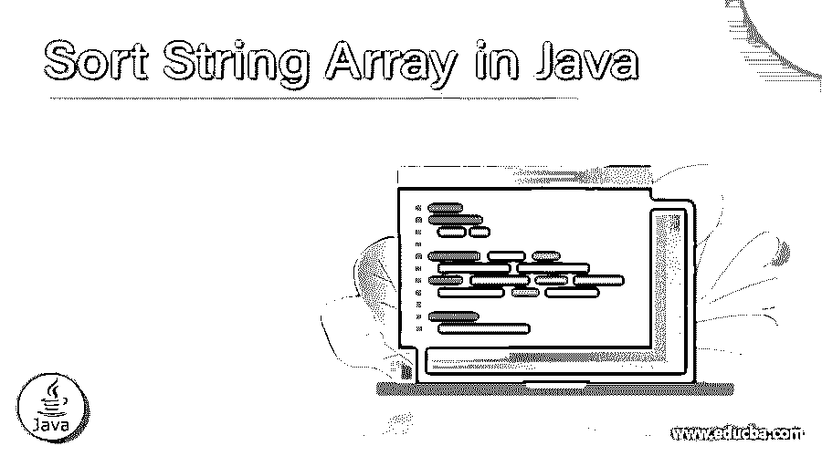
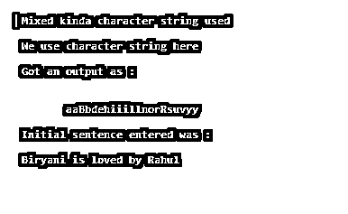

# Java 中的排序字符串数组

> 原文：<https://www.educba.com/sort-string-array-in-java/>




## Java 中的字符串数组排序介绍

排序在编程中是一个非常重要的特性，因为它将数组的不同元素按要求的顺序进行设置。一般情况下，人们使用字母顺序或递增或递减顺序。排序通常是为了将原始的无组织形式的数据转换成适当的有组织的顺序，使其对人脑有意义。对字符串数组进行排序有两种方法。第一种方法称为自定义排序或用户定义的逻辑排序，第二种方法称为自然排序或 Array.sort()排序。在本文中，这两种方法都用多个例子解释了它们的工作原理。在这个主题中，我们将学习 Java 中的排序字符串数组。

### Java 中字符串数组排序的方法及实例

下面是下面提到的例子和方法

<small>网页开发、编程语言、软件测试&其他</small>

#### 1.使用用户定义的逻辑或自定义排序

可以通过将每个元素与其余元素进行单独比较来进行排序。在第一个示例中，执行相同的过程。使用了两个循环，内部循环避免了执行比较时的重复。当条件(favorite food[a]。compare to(favorite food[b])> 0)的结果为真，现在程序执行交换，数组排序完成。类似地，使用条件检查数组的所有元素，排序完成。在此示例中，使用用户定义的逻辑或自定义排序，按字母顺序对元素进行排序。

##### 示例#1

```
import java.util.Arrays;
public class Sortingexample1
{
public static void main(
String args[])
{
String[] favouritefood = {" Pizza \n "
, " Pasta \n "
, " Chole Bhature \n "
, " Paratha \n "
, " Chowmein \n "
, " Momo \n "
, " Fried Rice \n "
, " Maggie \n "
, " Garlic Bread \n "
, " Biryani \n "
, " Gulab Jamun \n "
};
System.out.print(" Rahul favourite foods are: \n " );
int length = favouritefood.length;
for(int a = 0
; a<length-1
; a++)
{
for (int b = a+1
; b<favouritefood.length
; b++)
{
if(favouritefood[a].compareTo(
favouritefood[b]
)>0)
{
String virtual = favouritefood[a];
favouritefood[a] = favouritefood[b];
favouritefood[b] = virtual;
}
}
}
System.out.println(
Arrays.toString(
favouritefood
));
}
}
```

**输出:**


##### 实施例 2

这个例子使用了三个简单的步骤。首先，使用 loop 我们必须将输入字符串转换成一个字符数组。现在，Arrays.sort(array1，new Comparator <character>()用于对字符数组进行排序。这里根据定制排序的行为使用 compare()方法。现在，使用 StringBuilder 从字符数组创建一个字符串。</character>

```
import java.util.Arrays;
import java.util.Comparator;
public class Sortingexample2
{
public static String sortString(
String initialstringused
)
{
System.out.println(
" Mixed kinda character string used \n "
);
Character array1[] = new Character[
initialstringused.length()
];
for (int a = 0
; a < initialstringused.length()
; a++) {
array1[a] = initialstringused.charAt(a);
}
System.out.println(
" We use character string here \n "
);
Arrays.sort(
array1, new Comparator<Character>()
{
@Override
public int compare(Character FirstInput, Character SecondInput)
{
return Character.compare(Character.toUpperCase(FirstInput),
Character.toUpperCase(SecondInput));
}
});
StringBuilder b = new StringBuilder(array1.length);
for (
Character c
: array1
)
b.append(
c.charValue()
);
return b.toString();
}
public static void main(String[] args)
{
String initialstringused = " \n Biryani is loved by Rahul \n ";
String stringwegetinreturn = sortString(
initialstringused
);
System.out.println(
" Got an output as : \n " + stringwegetinreturn
);
System.out.println(
" \n Initial sentence entered was : \n " + initialstringused
);
}
}
```

**输出:**




#### 2.使用 Arrays.sort()或自然排序

自然排序分三步完成。首先，对输入字符串应用 toCharArray()方法来创建输入字符串的字符数组。现在，Arrays.sort(char c[])方法用于对字符数组进行排序。现在，字符串类构造函数用于从字符数组创建一个排序字符串。

##### 示例#1

```
import java.util.Arrays;
public class Sortingexample3
{
public static String sortString(
String initialstringused)
{
char sameArray[] = initialstringused.toCharArray();
System.out.println(
" Mixed kinda character string used \n "
);
Arrays.sort(
sameArray);
System.out.println(
" We use character string here \n "
);
return new String(sameArray);
}
public static void main(String[] args)
{
String initialstringused = " \n Choley Bhature is loved by Rahul \n ";
String stringwegetinreturn = sortString(
initialstringused
);
System.out.println(
"Input String : " + initialstringused
);
System.out.println("Output String : " + stringwegetinreturn
);
}
}
```

**输出:**


##### 实施例 2

```
import java.util.Arrays;
public class Sortingexample4
{
public static void main(String args[])
{
String[] favouritefood = {" \n Pizza \n "
, " \n Pasta \n "
, " \n Chole Bhature \n "
, " \n Paratha \n "
, " \n Chowmein \n "
, " \n Momo \n "
, " \n Fried Rice \n "
, " \n Maggie \n "
, " \n Garlic Bread \n "
, " \n Biryani \n "
, " \n Gulab Jamun \n "
};
System.out.print(" \n Actual food list entered: \n " );
System.out.println(Arrays.toString(favouritefood));
System.out.print(" \n Rahul favourite foods are: \n " );
Arrays.sort(favouritefood);
System.out.println(Arrays.toString(favouritefood));
}
}
```

**输出:**


### 结论

根据上面的文章，我们理解了 Java 中的排序字符串数组。排序字符串数组有两种方法，这两种方法都在文章中用多个例子进行了解释。这些例子将帮助初学者理解在 Java 代码中实现排序字符串数组以获得所需的结果。

### 推荐文章

这是一个在 Java 中对字符串数组进行排序的指南。这里我们讨论用各种方法对 Java 中的字符串数组进行排序，并举例说明。您也可以看看以下文章，了解更多信息–

1.  [Unix 中的排序命令](https://www.educba.com/sort-command-in-unix/)
2.  [C++ sort()](https://www.educba.com/c-plus-plus-sort/)
3.  [Golang 排序](https://www.educba.com/golang-sort/)
4.  [Python 中的快速排序](https://www.educba.com/quick-sort-in-python/)


