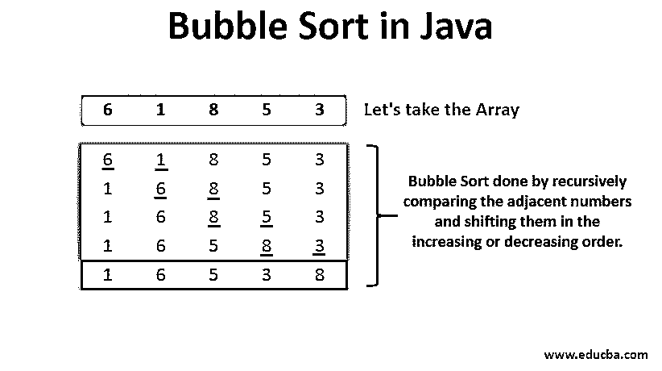

# Java 中的冒泡排序

> 原文：<https://www.educba.com/bubble-sort-in-java/>




## Java 中的冒泡排序简介

冒泡排序是 Java 中最常用的数据排序算法之一。排序是通过递归比较相邻的数字，并按升序或降序排列它们来完成的。这种元素的移位一直进行到所有的数字都按照要求的顺序完全排序。冒泡排序之所以叫冒泡排序，是因为数组中的元素是以冒泡开始的。让我们通过一个例子来理解[冒泡排序算法](https://www.educba.com/bubble-sort-algorithm/)。

**示例:**考虑一个需要按升序排列的数字数组[6 1 8 5 3]。

<small>网页开发、编程语言、软件测试&其他</small>

冒泡排序算法在多次迭代中工作，直到发现所有数字都已排序。

### 迭代次数

下面是 Java 中冒泡排序执行的迭代，如下所示:

#### 第一次迭代

[<u>6</u> <u>1</u> 8 5 3] – It starts by comparing the first two numbers and shifts the lesser number of the two to its right. Hence among 6 and 1, 1 is the smaller number that is shifted to the left and 6 to the right. [1 <u>6</u> <u>8</u> 5 3] – Next, it compares the adjacent two numbers by shifting one position to the right. Here, number 6 is lesser than 8, and hence the same order is retained. [1 6 <u>8</u> <u>5</u> 3] – Again, by shifting one position to the right, a comparison takes place between 8 and 5\. Number 5 gets shifted to the left as it is smaller than 8. [1 6 5 <u>8</u> <u>3</u>] – Here, the comparison takes place between numbers 8 and 3\. Number 3 is shifted to the left since it is smaller than 8. [1 6 5 3 8] – This is the final result of the order after 1st iteration.

#### 第二次迭代

由于数字仍然没有完全增加，程序进行第二次迭代。

[<u>1</u> <u>6</u> 5 3 8] – Here, the comparison again starts from the first two digits of the first iteration result. It compares numbers 1 and 6 and retains the same order since 1 is smaller than 6. [1 <u>6</u> <u>5</u> 3 8] – Here, numbers 5 and 6 are compared. The same order is retained as it is already in the required increasing order. [1 5 <u>6</u> <u>3</u> 8] – A comparison occurs between numbers 6 and 3\. Number 3 is shifted to the left as it is smaller than 6. [1 5 3 <u>6</u> <u>8</u>] – Next, numbers 6 and 8 are compared with each other. The same order is retained as it is in an expected order.[1 5 3 6 8] – This is the final result after the second iteration. Still, we can notice that the digits are not completely arranged in their increasing order. Still, we need to exchange numbers 5 and 3 to get the final result. Hence the program goes for the third iteration.

#### 第三次迭代

[<u>1</u> <u>5</u> 3 6 8] – the Third iteration starts by comparing the first two digits, 1 and 5\. Since the order is as expected, it is retained the same. [1 <u>5</u> <u>3</u> 6 8]- Next, the adjacent numbers 3 and 5 are compared. Since 5 is larger than 3, it is shifted to the right side. [1 3 5 6 8] – The iteration goes on to compare numbers 5 and 6, 6 and 8\. Since it is in the required order, it retains the order. [1 3 5 6 8] – Finally, the iteration is stopped as the program traverses comparing each adjacent element and finds that all the digits are in increasing order.

因为一个数组中只有 5 个元素需要排序，所以只需要 3 次迭代。随着数组中元素的增加，迭代次数也会增加。

### 使用 Java 实现冒泡排序

下面是实现冒泡排序算法的 Java 代码。(注意 Java 中数组的第一个位置从 0 开始，以 1 为增量继续，即 array[0]，array[1]，array[2]，继续下去。)

**代码:**

```
import java.util.Scanner;
public class BubbleSort {
static void bubbleSort(int[] arraytest) {
int n = arraytest.length; //length of the array is initialized to the integer n
int temp = 0; //A temporary variable called temp is declared as an integer and initialized to 0
for(int i=0; i < n; i++){ // first for loop performs multiple iterations
for(int j=1; j < (n-i); j++){
if(arraytest[j-1] > arraytest[j]){ // if loop compares the adjacent numbers
// swaps the numbers
temp = arraytest[j-1]; // assigns the greater number to temp variable
arraytest[j-1] = arraytest[j]; // shifts the lesser number to the previous position
arraytest[j] = temp; // bigger number is then assigned to the right hand side
}
}
}
}
public static void main(String[] args) {
int arraytest[] ={23,16,3,42,75,536,61}; // defining the values of array
System.out.println("Array Before Doing Bubble Sort");
for(int i=0; i < arraytest.length; i++){ // for loop used to print the values of array
System.out.print(arraytest[i] + " ");
}
System.out.println();
bubbleSort(arraytest); // array elements are sorted using bubble sort function
System.out.println("Array After Doing Bubble Sort");
for(int i=0; i < arraytest.length; i++){
System.out.print(arraytest[i] + " "); // for loop to print output values from array
}
}
}
```

**输出:**


### Java 中冒泡排序的优缺点

以下是 java 中冒泡排序的不同优缺点:

#### 优势

1.  代码非常容易编写和理解。通常只需要几分钟。
2.  实现起来也很容易。
3.  冒泡排序将数字排序并保存在内存中，因此节省了大量内存。

#### 不足之处

1.  该算法不适合大型数据集，因为比较需要大量时间。对输入数字进行排序所需的时间呈指数增长。
2.  O(n^2)是冒泡排序的平均复杂度，O(n)是最好的情况复杂度(最好的情况是元素首先排序的时候)，其中 n 是元素的个数。

### 实时应用

由于冒泡排序能够检测出排序中的微小错误，所以它被用于计算机图形学。它还用于多边形填充算法，其中多边形的顶点线需要排序。

### 结论

本文展示了冒泡排序算法是如何工作的，以及如何使用 Java 编程来实现它[。冒泡排序是一种非常稳定的算法，可以很容易地实现相对较小的数据集。这是一个比较算法的例子，由于它的简单性而被新手使用。](https://www.educba.com/arrays-in-java-programming/)

### 推荐文章

这是一个 Java 中的冒泡排序指南。这里我们讨论在 java 中执行冒泡排序的多次迭代及其代码实现，以及优缺点。您也可以阅读以下文章，了解更多信息——

1.  [JavaScript 中的气泡排序](https://www.educba.com/bubble-sort-in-javascript/)
2.  [Python 中的冒泡排序](https://www.educba.com/bubble-sort-in-python/)
3.  [数据结构中的冒泡排序](https://www.educba.com/bubble-sort-in-data-structure/)
4.  [c#中的冒泡排序](https://www.educba.com/bubble-sort-in-c-sharp/)


