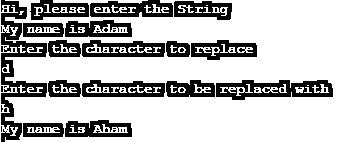
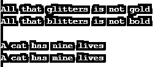

# Java 替换字符串中的字符

> 原文：<https://www.educba.com/java-replace-char-in-string/>


## Java 简介替换字符串中的字符

替换字符串中的字符是指在指定字符的位置放置另一个字符。索引代表指定的字符。在 java 中，String 类用于替换字符& strings。string 是 java.lang 包的类。

在编程中，开发人员面临许多需要替换字符串中字符的情况。Java 提供了多种方法来替换字符串中的字符。去除是替换字符的重要方法之一。使用 remove 方法时，应该记住一些事情

<small>网页开发、编程语言、软件测试&其他</small>

1.  Java 中的字符串是不可变的，所以在替换字符后，会创建一个新的字符串。
2.  应用 replace 方法之前的字符串变量在应用 replace 方法之后保持不变。
3.  方法用新字符替换字符串中的所有字符。

**语法:**

在下面的语法中，给出了一个字符是如何被替换的。replace 方法中有两个参数:第一个参数是要替换的字符&，第二个参数是要替换的字符。

```
String replace(char oldChar, char newChar):
//OR
String replaceFirst(char oldChar, char newChar):
//replaces only the first occurrence of the character
```

在第二行语法中，replaceFirst 方法仅用于替换字符的第一个匹配项。

### Java 替换字符串中字符的例子

下面是 Java 替换字符串中的字符的例子:

#### 示例#1

在这个例子中，我们可以看到字符串中的一个字符是如何被另一个字符替换的。

1.  在第一行中，将用户的输入作为字符串。
2.  进一步要求字符作为输入在提供的字符串中替换。
3.  replace 方法用下一行中被替换的字符创建一个新字符串，因为 java 中的字符串是不可变的。

**代码:**

```
import java.util.*;
public class JavaReplaceCharExample{
public static void main(String[] args){
Scanner input = new Scanner(System.in);
System.out.println("Hi, please enter the String");
String str = input.nextLine();
System.out.println("Enter the character to replace");
char ch = input.next().charAt(0);
System.out.println("Enter the character to be replaced with");
char newCh = input.next().charAt(0);
String newStr = str.replace(ch, newCh);
//displaying new string after applying replace method
System.out.println(newStr);
}
}
```

**输出:**




#### 实施例 2

在此示例中，replaceFirst 仅用于替换该字符串中第一个出现的字符。

**代码:**

```
import java.util.*;
public class JavaReplaceCharExample2{
public static void main(String[] args){
//second string to replace the character
String str = "All that glitters is not gold";
//displaying string before applying replace method
System.out.println("\n" + str);
//replacing character p from b
String newStr = str.replace("g", "b");
//displaying string after replacing the character
System.out.println(newStr);
//second string to replace the character
String sentence = "A cat has nine lives";
//displaying string before applying replace method
System.out.println("\n" + sentence);
//replacing character n from m
String newSentence = sentence.replaceFirst("n", "m");
//displaying new string after applying replace method
System.out.println(newSentence);
}
}
```

**输出:**




程序的输出如下所示。在输出截图中，第一个句子字符“g”被替换为“b”。在第二句中，只有第一次出现的语法“n”被替换为“m”。

#### 实施例 3

在本例中，首先用逗号替换管道分隔值。将“|”替换为“，”后，在下一行中使用 replace 方法将“A”字符替换为“I”。

**代码:**

```
import java.util.*;
public class JavaReplaceCharExample3{
public static void main(String[] args){
//second string to replace the character
String str = "Alabama|California|Florida|Texas|New Jersey|Arizona";
//displaying string before applying replace method
System.out.println("\n" + str);
//replacing | with the comma
String newStr = str.replace('|', ',');
//displaying string after applying replace method
System.out.println("\n" + newStr);
//replacing the character A with the i
String reNewedStr = newStr.replace('A', 'i');
//displaying string before applying replace method
System.out.println("\n" + reNewedStr);
}
}
```

**输出** **:**


#### 实施例 4

在这个例子中，我们可以看到如何在不使用 replace 方法的情况下替换一个字符串。指定字符前后的字符串存储在下面程序的一个单独的变量中。在程序中，它与要替换的字符连接在一起。

**代码:**

```
import java.util.*;
public class JavaReplaceCharExample4{
public static void main(String[] args){
//second string to replace the character
String str = "Be slow in choosing, but slower in changing.";
//displaying string before applying replace method
System.out.println("\n" + str);
int index = 3;
char chToReplacedWith = 'b';
String strBeforeChar = str.substring(0, index);
String strAfterChar  = str.substring(index + 1);
String newStr  = strBeforeChar + chToReplacedWith + strAfterChar;
//displaying string before applying replace method
System.out.println("\n" + newStr);
}
}
```

**输出** **:**


### 结论

上面给出的文章描述了如何替换字符串中的 char，java 包提供了哪些方法来处理字符串。在给出的例子中，给出了如何使用字符串类方法来替换字符串中的字符。

### 推荐文章

这是一个 Java 替换字符串中字符的指南。这里我们讨论如何替换字符串中的 char，以及它的例子和代码实现。您也可以浏览我们推荐的其他文章，了解更多信息——

1.  [Java PrintWriter](https://www.educba.com/java-printwriter/)
2.  [Java 缓冲器](https://www.educba.com/java-bufferedreader/)
3.  [Java RuntimeException](https://www.educba.com/java-runtimeexception/)
4.  [JavaScript 字符串替换](https://www.educba.com/javascript-string-replace/)


