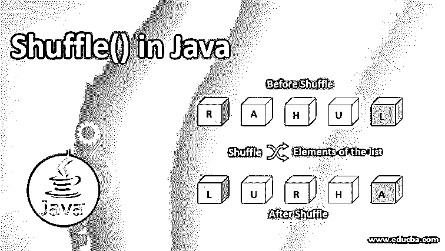

# Java 中的 Shuffle()

> 原文：<https://www.educba.com/shuffle-in-java/>




## Java 中的 Shuffle()简介

Java 有很多内置函数可以对集合或其他数据类型执行不同的操作，其中一个就是 shuffle。Shuffle 函数在很多其他语言中都有，比如 Python。

*   shuffle 函数用于打乱集合元素。
*   它随机排列参数中传递的列表元素。
*   Java 中有两种混洗方法，一种是使用集合混洗方法，另一种是使用随机类。
*   也可以通过两种方式调用 collection shuffle 函数，一种方式使用随机参数来指定随机性，另一种方式不使用参数。
*   洗牌(<list>)</list>
*   无序播放(<list>，<random function="">)</random></list>
*   您需要传递列表，以便我们将数组转换为列表，然后将其传递给集合。

### Java 中 Shuffle()的语法

随机播放方法的声明:

<small>网页开发、编程语言、软件测试&其他</small>

```
public static void shuffle(List<?> list)
```

```
public static void shuffle(List<?> list, Random random)
```

**参数:**

*   **列表:**你将通过的列表会被打乱。
*   **Random:** 传递了种子值的随机函数将成为随机性的来源。

**退货:**

*   shuffle 函数不返回值；它只是打乱了列表。

### Java 中 Shuffle()的例子

在下面的例子中，我们从一个包含一些字母的数组中创建了一个列表，并使用 shuffle 方法来打乱这个数组。每次你跑步，你都会得到不同的洗牌表。

#### 示例#1

**代码:**

```
import java.util.*;
public class CollectionsShuffleExampleWithoutRandom {
public static void main(String[] args) {
List<String> list = Arrays.asList("R", "A", "H", "U", "L");
System.out.println("Before Shuffle : "+list);
Collections.shuffle(list);
System.out.println("After shuffle : "+list);
}
}
```

**输出:**


#### 实施例 2

在下面的例子中，我们创建了一个整数链表，并向其中添加了一些整数。但这里我们传递了另一个论点，那就是随机函数，它将成为随机性的来源。然后我们传递了种子值为 5 的随机函数。这是另一种味道，或者我们可以说使用随机洗牌函数的方法。

**代码:**

```
import java.util.*;
public class CollectionsShuffleWithRandom {
public static void main(String[] args) {
//Create linked list object
LinkedList<Integer> list = new LinkedList<Integer>();
//Add values
list.add(90);
list.add(100);
list.add(1);
list.add(10);
list.add(20);
System.out.println("Before Shuffle = "+list);
//Random() to shuffle the given list.
Collections.shuffle(list, new Random());
System.out.println("Shuffled with Random() = "+list);
//Random(5) to shuffle the given list.
Collections.shuffle(list, new Random(5));
System.out.println("Shuffled with Random(5) = "+list);
}
}
```

**输出:**


### 无洗牌法洗牌

如果你想更好地控制无序播放，那么你可以编写自己的方法，用 random 方法和另一种方法来无序播放列表。这种方法更加灵活，易于在任何应用中使用。你实际上可以理解 shuffle 在 Java 的内置方法内部是如何工作的。

**输入:**一个 int 数组

**输出:**混洗数组(随机排列)

**举例:**

```
public static int[] ShuffleArray(int[] array){
Random rand = new Random();  // Random value generator
for (int i=0; i<array.length; i++) {
int randomIndex = rand.nextInt(array.length);
int temp = array[i];
array[i] = array[randomIndex];
array[randomIndex] = temp;
}
return array;
}
```

上面的函数你只需要传递一个数组整数，它就会返回一个混洗的数组。在函数内部，你可以看到我们正在迭代数组，直到它的长度，并生成一个随机数，它将被视为一个数组索引，它将与另一个数组交换。这就是元素在数组中交换的方式。得到的数组将是一个交换的数组。

从上面的函数中，我们可以得到一个 shuffle 函数的基本概念，其中将发送一个值列表，每次迭代数组中的元素时都会生成一个随机数。该元素将与同一列表中的另一个元素交换，其索引由随机函数随机生成。

### 随机播放功能的要点

*   这个方法的工作原理是随机排列列表元素并对它们进行洗牌。
*   每次执行时，结果都可能不同。
*   该函数不需要太多时间，以线性时间运行。
*   如果你提供了一个没有实现 RandomAccess 接口的列表，那么 shuffle 会先把列表复制到一个数组中，把数组副本混洗，然后再把它复制到一个结果列表中并返回。
*   Shuffle 向后遍历列表，从最后一个元素重复到第二个元素。
*   在遍历时，它随机选择元素并与当前位置交换。
*   随机选择的元素来自列表中从第一个元素到当前元素的部分。

**异常:**

*   **UnsupportedOperationException:**如果传递的列表或列表迭代器不支持集合操作。

### 洗牌的应用

在许多情况下，下面的随机播放功能是一些应用程序:

*   在问答应用程序中打乱问题列表。
*   你想每天向你的应用程序用户展示的语录列表。
*   彩票应用程序，你想分配一个彩票号码给用户。
*   为支付字段生成唯一的交易号。
*   不同用户的生成唯一用户 id 可以作为用户 id 的前缀。
*   它也可以用于加密应用。

### 结论

在上面的文章中，我们了解了 shuffle 的工作原理以及如何使用它。在许多情况下，您可能会使用随机参数的随机函数，而不是随机参数的随机函数，有些应用程序可能需要不同的灵活实现，您可以使用 Java 的随机函数编写自己的随机函数。

### 推荐文章

这是 Java 中 Shuffle()的使用指南。在这里，我们将讨论 Shuffle 函数的介绍和要点，以及不同的例子和代码实现。您也可以看看以下文章，了解更多信息–

1.  [Java 中的 split()函数](https://www.educba.com/split-function-in-java/)
2.  [Java 中的最终类](https://www.educba.com/final-class-in-java/)
3.  [Java 中的文件处理](https://www.educba.com/file-handling-in-java/)
4.  [Java newInstance()](https://www.educba.com/java-newinstance/)


