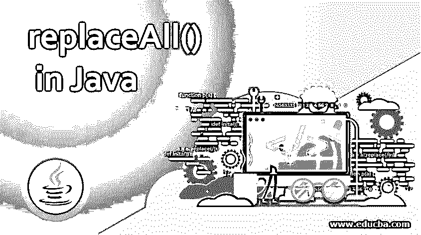

# Java 中的 replaceAll()

> 原文：<https://www.educba.com/replaceall-in-java/>




## Java 中的 replaceAll()简介

ReplaceAll()是 string 类的方法，它替换与它所带参数匹配的所有出现的字符，所有的子字符串都将被我们作为正则表达式传递给该方法的输入所替换，并且给定的替换开始该方法将返回我们 String 对象。它存在于这个包的字符串类(java.lang.String)中。在这个主题中，我们将学习 Java 中的 replaceAll()。

**带参数的语法**

<small>网页开发、编程语言、软件测试&其他</small>

public String replaceAll(字符串正则表达式，字符串替换)

上面是 replaceAll()方法的方法签名。因为 String 类提供了 java in build 方法，所以可以在我们的代码中直接使用它。它接受两个参数作为输入:

*   **regex(正则表达式):**该输入用于在给定的字符串中进行匹配。
*   **替换**:在上面匹配的字符串的地方，作为我们想要的字符串。这是新的内容或字符串，我们可以说，我们希望看到的输出。

这个方法总是返回字符串对象。还有一点，正则表达式也使用一种模式，我们将在下面讨论。

结果字符串:作为输出

### replaceAll()方法在 Java 中是如何工作的？

replaceAll 是 String 类中的方法。它接受两个参数作为输入，即正则表达式和替换。顾名思义，它用于替换字符串的某个部分或整个字符串。

此方法引发下面提到的异常:

#### 1.patternsynctaxexception

这个异常是 java 中未检查的异常，只有当我们作为输入参数传递给方法的正则表达式中有错误时才会发生。像其他类一样，它有一些预定义的或内置的方法来帮助我们识别问题:

*   公共字符串 getMessage():该方法包含异常的描述。
*   public int getIndex():这个方法将返回错误的索引。
*   public String getPattern():这个方法将为我们提供包含错误的正则表达式。
*   public String getDescription():这个方法将为我们提供关于错误的解密。

#### 2.正则表达式细节

我们作为字符串传递给方法参数的正则表达式，但是这个正则表达式是模式类的编译实例。它存在于 java.util.regex.Pattern 包中。

这个正则表达式包含以下内容:

*   模式
*   匹配项

我们还有一个匹配器方法。它符合我们的正则表达式。

*   \t:对于选项卡
*   \a:用于报警
*   \cx:控制字符
*   \e:转义符
*   \n:换行符
*   \f:换页

#### 3.可用的方法

*   split(CharSequence input):这个方法返回 us string[] (string array)并接受代表我们想要拆分的输入。
*   split(CharSequence input，int limit):以同样的方式工作，但是这个方法也接受一个 limit 参数。
*   静态模式编译(String regex，int flags):这个方法接受两个参数，正则表达式和标志，并编译我们的正则表达式。
*   4)字符串模式()
*   5)静态字符串引用(字符串 s)

这个模式类还实现了 Serializable 接口。

这样，replaceAll 就可以在 java 中工作了。它在内部使用模式和匹配来编译正则表达式并用于其他操作。

### Java 中 replaceAll()的示例

下面是一些例子，展示我们如何使用它来替换单个字符，用正则表达式匹配整个字符串，从完整的字符串中删除空格，以及用特殊字符替换字符串。

#### 示例#1

在这个例子中，我们将正则表达式作为(*)java(。*)这将替换从头到尾子字符串都是 java 的整个字符串。

**代码:**

```
import java.io.*;
public class DemoReg {
public static void main(String args[]) {
String str = new String("Example to show replace in java string.");
System.out.print("Resulted string after replace is  :" );
System.out.println(str.replaceAll("(.*)java(.*)", "replaced"));
}
}
```

**输出:**


#### 实施例 2

在这个例子中，我们用一个特殊字符替换字符串的一部分。这意味着我们可以传递任何可以被当作字符串的东西。我们也可以传递数字。

**代码:**

```
public class DemoReg {
public static void main(String args[]) {
String s1="In this we are going to replace the string with some character. (repeat sequence)";
String str=s1.replaceAll("t*"," ***** ");
System.out.println("Ouptut is ::: ");
System.out.println(str);
}
}
```

**输出:**


#### 实施例 3

在这个 java 类中，我们用一些其他内容替换字符串的一部分。示例:“替换成功完成”，这是我们的例子。

**代码:**

```
public class DemoReg {
public static void main(String args[]) {
String str="Now the demo is for replacing string with some another substring";
String result=str.replaceAll("string"," replacement done successfully");
System.out.println("Result after replace is :::: ");
System.out.println(result);
}
}
```

**输出:**


#### 实施例 4

在这个例子中，我们试图删除给定字符串中的空格。我们有很多带斜线的关键字(“\\”)，可以用来执行给定字符串的操作。

**代码:**

```
public class DemoReg {
public static void main(String args[]) {
String str="Now we are going to replace the spaces present in the given string.";
System.out.println("String before replace performed :::: ");
System.out.println(str);
String result=str.replaceAll("\\s","");
System.out.println("Result after replace is :::: ");
System.out.println(result);
}
}
```

**输出:**


#### 实施例 5

在这个 java 例子中，我们只用一个字符替换字符串。这意味着当给定的字符每次出现在字符串中时，它将被方法替换。

**代码:**

```
public class DemoReg {
public static void main(String args[]) {
String str="Replacing single character from the whole string demo.";
System.out.println("String before replace performed :::: ");
System.out.println(str);
String result=str.replaceAll("e"," X");
System.out.println("Result after replace is :::: ");
System.out.println(result);
}
}
```

**输出:**


在替换中我们可以有任何东西，就是一个字符串。但是我们的正则表达式必须有效。否则，对于 replaceAll()方法中包含正则表达式的错误，它将抛出一个未检查的异常。

### 结论

Replace 方法是 java 的 string 类方法，带两个参数。我们可以传入的任何类型的正则表达式都会替我们替换字符串，除非它匹配。所以上面的例子会让你理解我们如何使用它。

### 推荐文章

这是 Java 中 replaceAll()的指南。这里我们讨论 Java 中的 replaceAll()的例子，以及这个方法在 Java 中是如何工作的。您也可以看看以下文章，了解更多信息–

1.  [Java 中的字符串](https://www.educba.com/string-in-java/)
2.  [Java 时期](https://www.educba.com/java-period/)
3.  [Java 中的最终类](https://www.educba.com/final-class-in-java/)
4.  [Java 中的嵌套类](https://www.educba.com/nested-class-in-java/)


