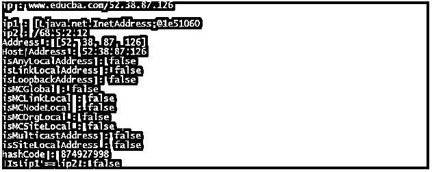

# Java 目录地址

> 原文：<https://www.educba.com/java-inetaddress/>


## Java InetAddress 简介

java InetAddress 用于指定一个 IP 地址。IP 地址是分配给网络中机器的唯一数字标签。对于 IPv4，IP 地址指定为 32 位，对于 IPv6 地址指定为 128 位。InetAddress 的一个实例根据在创建过程中是否执行了主机名解析来指定一个作为主机名的 IP 地址。有两种类型的地址，单播和组播。单个接口由单播地址标识，一组接口由组播地址标识。

java 中的 InetAddress 类内置在 java 的 java.net.InetAddress 包中。

<small>网页开发、编程语言、软件测试&其他</small>

InetAddress 类可用于获取任何主机的 IP 地址，如 www.educba.com、www.google.com 等。常用的 IP 地址是“版本 4”的 IPv4。考虑一个 IP 地址的例子，它可能看起来像

65.172.248.170

上述地址包含四个数字，每个数字由三个数字组成，用“.”分隔(单点)。这四个数字的范围是从 0 到 255。

### InetAddress 类成员函数

InetAddress 类不包含任何构造函数，但包含一些函数作为 InetAddress 类的成员函数。

**Java 的成员** **函数** **InetAddress** **类****–**

1.  **public static InetAddressgetByAddress(String host，byte[] addr)抛出 unknown hostexception**——这个静态函数返回 InetAddress 的对象，该对象包含参数传递的主机名和 IP 地址。主机参数可以是字符串格式的 IP 地址或机器名，如 www.educba.com。
2.  **public static InetAddressgetByName(String host)**–这个静态函数返回指定主机的 InetAddress 的对象。其中参数 host 是指定的主机名。
3.  **public static InetAddress[]getAllByName(String host)**–该静态函数返回指定主机的 inet address 对象数组。
4.  **public static InetAddressgetLoopbackAddress()**–该静态函数返回 loopback 类型的 InetAddress 的对象。
5.  **public static InetAddressgetLocalHost()抛出 UnknownHostException**——这个静态函数返回 LocalHost 的 InetAddress 的对象。
6.  **public byte[]get address()**–该函数以数组形式返回 InetAddress 对象的 IP 地址。按字节顺序排列的数组存储 ip 地址出现在 IP 地址中。
7.  **public String getHostAddress()**–该函数返回字符串格式的 IP 地址。
8.  **public boolean is reachable(int timeout)抛出 io exception**–如果 IP 地址是可达的，则该函数返回 true，而 time out 参数指定在该时间之后调用将被中止并导致 false 值。
9.  **public boolean isReachable(NetworkInterfacenetif，intttl，int timeout)抛出 io exception**–该函数是 is reachable()函数的重载。其中，netif 表示用于检查可达性的网络接口，ttl 表示在退出网络之前回声分组进行的跳数，并且由于超时参数指定在此之后的时间，呼叫将被中止。
10.  **public String get hostname()**–该函数返回 IP 地址的主机名。
11.  **public String getcanonical hostname()**–该函数返回 IP 地址的完全限定域名。
12.  **public String toString()–**该函数以字符串格式表示 IP 地址。
13.  **public boolean isAnyLocalAddress()**–如果 InetAddress 对象地址是本地地址，则该函数返回 true。
14.  **public boolean isLinkLocalAddress()**–如果 InetAddress 对象地址是链接本地地址，则该函数返回 true。
15.  **public boolean is loopbackaddress()**–如果 InetAddress 对象地址是回送地址，则该函数返回 true。
16.  **public boolean isMCGloabal()**–如果 IP 多播地址具有全局范围，则该函数返回 true。
17.  **public boolean isMCLinkLocal()**–如果 IP 多播地址有链接范围，则该函数返回 true。
18.  **public boolean isMCNodeLocal()**–如果 IP 组播地址有节点作用域，此函数返回 true。
19.  **public boolean isMCOrgLoacal()**–如果 IP 多播地址具有组织范围，则该函数返回 true。
20.  **public boolean isMCSiteLocal()**–如果 IP 多播地址具有站点范围，则该函数返回 true。
21.  **public boolean is multicast address()**–如果 IP 地址是组播地址，其前四位为 1110，则该函数返回 true。
22.  **public boolean isSiteLocalAddress()**–如果 IPaddress 是站点本地地址，则该函数返回 true。
23.  **public int hashCode()**–该函数返回 IP 地址 hashCode。
24.  **public boolean equals(Object obj)**–如果 IP 地址与传递的 IP 地址相同，则该函数返回 true。

### java 中 InetAddress 类的示例

接下来，我们编写 java 代码来更清楚地理解 InetAddress 类，在下面的示例中，我们通过使用 URL 和上面讨论的该对象中的一些函数来创建 InetAddress 对象

#### 示例#1

**代码:**

```
import java.io.IOException;
import java.util.Arrays;
import java.net.InetAddress;
public class Demo
{
public static void main( String[] arg) throws IOException
{
InetAddress ip = InetAddress.getByName("www.educba.com");
byte addr[] = { 65, 2, 0, 1};
System.out.print("iptoString : " + ip.toString());
System.out.print("\ngetAllByName : " + ip.getAllByName("www.educba.com"));
InetAddress ips[] = InetAddress.getAllByName("www.educba.com");
System.out.println("IP Address");
for (InetAddress add:ips)
System.out.println(add.getHostAddress());
// function getByName()
System.out.print("\ngetByName : " + ip);
// function getByAddress()
System.out.print("\ngetByAddress : " +InetAddress.getByAddress(addr));
// function getLocalHost()
System.out.print("\ngetLocalHost : " +InetAddress.getLocalHost());
// function getLoopbackAddress()
System.out.print("\ngetLoopbackAddress : " +InetAddress.getLoopbackAddress());
// function getAllByName() which returns all ip addresses of google.com
System.out.print("\nGoogleip addresses : " + Arrays.toString(InetAddress.getAllByName("www.google.com")));
// function isReachable()
System.out.print("\nip address isReachable : " +ip.isReachable(50));
// function getHostname()
System.out.print("\nip address hostname :" +ip.getHostName());
// function getCanonicalHostname()
System.out.print("\nip address CanonicalHostname : " + ip.getCanonicalHostName());
}
}
```

**输出:**


接下来，我们为 InetAddress 类编写 java 代码，在这里我们对 InetAddress 对象应用剩余的布尔函数

#### 实施例 2

**代码:**

```
import java.net.Inet4Address;
import java.util.Arrays;
import java.net.InetAddress;
public class Demo
{
public static void main(String[] arg) throws Exception
{
InetAddress ip =  Inet4Address.getByName("www.educba.com");
InetAddress ip1[] = InetAddress.getAllByName("www.educba.com");
byte addr[]={68, 5, 2, 12};
System.out.println("ip : "+ip);
System.out.print("\nip1 : "+ip1);
InetAddress ip2 =  InetAddress.getByAddress(addr);
System.out.print("\nip2 : "+ip2);
System.out.print("\nAddress : " +Arrays.toString(ip.getAddress()));
System.out.print("\nHost Address : " +ip.getHostAddress());
System.out.print("\nisAnyLocalAddress : " +ip.isAnyLocalAddress());
System.out.print("\nisLinkLocalAddress : " +ip.isLinkLocalAddress());
System.out.print("\nisLoopbackAddress : " +ip.isLoopbackAddress());
System.out.print("\nisMCGlobal : " +ip.isMCGlobal());
System.out.print("\nisMCLinkLocal : " +ip.isMCLinkLocal());
System.out.print("\nisMCNodeLocal : " +ip.isMCNodeLocal());
System.out.print("\nisMCOrgLocal : " +ip.isMCOrgLocal());
System.out.print("\nisMCSiteLocal : " +ip.isMCSiteLocal());
System.out.print("\nisMulticastAddress : " +ip.isMulticastAddress());
System.out.print("\nisSiteLocalAddress : " +ip.isSiteLocalAddress());
System.out.print("\nhashCode : " +ip.hashCode());
System.out.print("\n Is ip1 == ip2 : " +ip.equals(ip2));
}
}
```

**输出:**




### 结论

InetAddress 是 java 中的内置类，可从 java.net.InetAddress 包中获得。它用于指定机器在网络中的 IP 地址。我们讨论过的上述方法可以用来获取更多关于 IP 地址的信息。

### 推荐文章

这是一个 Java 编程指南。这里我们讨论 InetAddress 类的成员函数和例子，以及代码和输出。您也可以看看以下文章，了解更多信息–

1.  [Java min()](https://www.educba.com/java-min/)
2.  [Java 中的 copy()](https://www.educba.com/copy-in-java/)
3.  [Java max()](https://www.educba.com/java-max/)
4.  [JavaScript entries()](https://www.educba.com/javascript-entries/)


