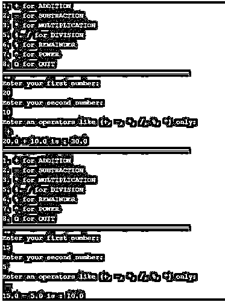
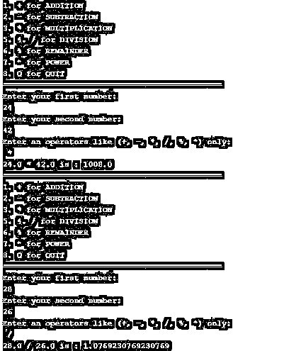
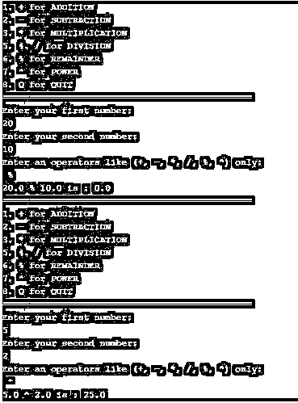
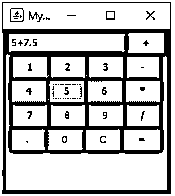
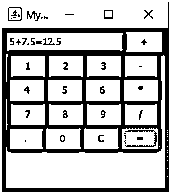

# Java 中的计算器

> 原文：<https://www.educba.com/calculator-in-java/>


## Java 计算器简介

Java 中的计算器用于计算加、减、乘、除、模、数的幂等。我们可以使用一个简单的 Java switch case 和 Java swing 独立应用程序来完成这个计算器操作。在普通的 Java 计算器操作中，我们不需要任何额外的库，但是在 swing 应用的情况下，我们必须需要 java.awt.event。*、javax.swing.*、java.awt. *包。

### 方法

计算器的摆动方法:

<small>网页开发、编程语言、软件测试&其他</small>

*   **add(Component 组件):**用于将组件添加到容器中。
*   **setSize(int x，int y):** 用于根据给定的尺寸设置容器的大小。
*   **setText(String 字符串):**用于设置字符串文本。
*   **getText():** 用来获取容器的文本。
*   **addactionlistener listener(action listener action listener):**用于设置对容器的动作。
*   **设置背景(颜色颜色):**用于设置背景颜色。

### 如何用 Java 创建计算器？

我们可以用两种方法创建计算器:

*   使用 Switch Case 语句。
*   使用摇摆图形。

#### 1.使用 Switch Case 语句

**第一步:**用户输入要进行操作的字符，如**“+”、“-”、“*”、“/”、“%”、**等。

**步骤 2:** 在 switch 案例中，我们已经为每个字符实现了逻辑。

**步骤 3:** 基于字符运算，如加、减、乘、除、模(求余数)和数的幂。

**语法:**

```
public class CalculatorSwitchCase
{
//Ask input from user
switch(character)
{
case '+'://addition operation
case '-'://subtraction operation
case '*'://multiplication operation
case '/'://division operation
case '%'://modulus operation
case '^'://power operation
}
//display output
}
```

##### 示例 1–开关盒计算器功能

**代码:**

```
package com.calculator;

import java.util.Scanner;

public class CalculatorSwitchCase {
	public static void main(String[] args) {

		// declaring varibales
		double firstNumber, secondNumber;
		double result_operation_output;
		// Creating scanner for object for allow input
		Scanner scannerObject = new Scanner(System.in);
		do {
			System.out.println("==============================================");
			System.out.println("1\. + for ADDITION");
			System.out.println("2\. - for SUBTRACTION");
			System.out.println("3\. * for MULTIPLICATION");
			System.out.println("5\. 4\. / for DIVISION");
			System.out.println("6\. % for REMAINDER");
			System.out.println("7\. ^ for POWER");
			System.out.println("8\. Q for QUIT");
			System.out.println("==============================================");

			// ask the user to enter first number
			System.out.print("Enter your first number:\n");
			firstNumber = scannerObject.nextDouble();
			// ask the user to enter second number
			System.out.print("Enter your second number:\n");
			secondNumber = scannerObject.nextDouble();

			System.out.print("Enter an operators like (+, -, *, /, %, ^) only:\n ");
			// storing the operator in char object
			char operator = scannerObject.next().charAt(0);

			switch (operator) {
			case '+':
				result_operation_output = firstNumber + secondNumber;
				break;

			case '-':
				result_operation_output = firstNumber - secondNumber;
				break;

			case '*':
				result_operation_output = firstNumber * secondNumber;
				break;

			case '/':
				result_operation_output = firstNumber / secondNumber;
				break;

			case '%':
				result_operation_output = firstNumber % secondNumber;
				break;

			case '^':
				result_operation_output = Math.pow(firstNumber, secondNumber);
				break;

			case 'Q':
				System.exit(0);

			default:
				System.out.printf("Please enter specified operator only");
				return;
			}
			System.out.println(firstNumber + " " + operator + " " + secondNumber + " is : " + result_operation_output);
		} while (result_operation_output != 'Q');
		scannerObject.close();
	}
}
```

**输出:**

加法和减法的 o/p




乘法和除法的 o/p




剩余部分和功率的 o/p




#### 2.使用 Swing 图形

**Step1:** 创建一个类，从 JFrame，ActionerListener 扩展。

**第二步:**创建 0-9 的数字按钮和字符按钮，如+、-、*、*、%等。

第三步:为所有的按钮编写一个动作监听器。

**步骤 4:** 将所有这些组件添加到屏幕上。

##### 示例 2–摆动计算器

**代码:**

```
package com.calculator.swing;
//Java program to create a simple calculator 

//with basic +, -, /, * using java swing elements 

import java.awt.Color;
import java.awt.event.ActionEvent;
import java.awt.event.ActionListener;

import javax.swing.JButton;
import javax.swing.JFrame;
import javax.swing.JPanel;
import javax.swing.JTextField;
import javax.swing.UIManager;

@SuppressWarnings("serial")
public class CalculatorSwing extends JFrame implements ActionListener {
	// create a frame
	static JFrame frameToDisplay;

	// create a textfield
	static JTextField labeTextField;

	// it store the operands and operators
	String string0, string1, string2;

	// constructor
	CalculatorSwing() {
		string0 = string1 = string2 = "";
	}

	// main function to java application
	public static void main(String args[]) {
		// create the frame to display the screen
		frameToDisplay = new JFrame("My Calculator");

		try {
			// used to set the look and feel for the application
			UIManager.setLookAndFeel(UIManager.getSystemLookAndFeelClassName());
		} catch (Exception exception) {
			System.err.println(exception.getMessage());
		}

		// create the class object
		CalculatorSwing calculatorSwing = new CalculatorSwing();

		// create text field
		labeTextField = new JTextField(16);

		// set to the non editable
		labeTextField.setEditable(false);

		// declaring numbers buttons and operators buttons
		JButton button_0, button_1, button_2, button_3, button_4, button_5, button_6, button_7, button_8, button_9,
				button_add, button_subtract, button_div, button_mul, button_dot, button_equal1, button_equal2;
		// creating numbers buttons
		button_0 = new JButton("0");
		button_1 = new JButton("1");
		button_2 = new JButton("2");
		button_3 = new JButton("3");
		button_4 = new JButton("4");
		button_5 = new JButton("5");
		button_6 = new JButton("6");
		button_7 = new JButton("7");
		button_8 = new JButton("8");
		button_9 = new JButton("9");
		// creating equals buttons
		button_equal2 = new JButton("=");
		// creating operators like +,-,*,/ buttons
		button_add = new JButton("+");
		button_subtract = new JButton("-");
		button_div = new JButton("/");
		button_mul = new JButton("*");
		button_equal1 = new JButton("C");
		// creating dot(.) buttons
		button_dot = new JButton(".");
		// creating panel
		JPanel jPanel = new JPanel();
		// adding action listeners to the buttons
		button_mul.addActionListener(calculatorSwing);
		button_div.addActionListener(calculatorSwing);
		button_subtract.addActionListener(calculatorSwing);
		button_add.addActionListener(calculatorSwing);
		button_9.addActionListener(calculatorSwing);
		button_8.addActionListener(calculatorSwing);
		button_7.addActionListener(calculatorSwing);
		button_6.addActionListener(calculatorSwing);
		button_5.addActionListener(calculatorSwing);
		button_4.addActionListener(calculatorSwing);
		button_3.addActionListener(calculatorSwing);
		button_2.addActionListener(calculatorSwing);
		button_1.addActionListener(calculatorSwing);
		button_0.addActionListener(calculatorSwing);
		button_dot.addActionListener(calculatorSwing);
		button_equal1.addActionListener(calculatorSwing);
		button_equal2.addActionListener(calculatorSwing);
		// add all elements to the panel
		jPanel.add(labeTextField);
		jPanel.add(button_add);
		jPanel.add(button_1);
		jPanel.add(button_2);
		jPanel.add(button_3);
		jPanel.add(button_subtract);
		jPanel.add(button_4);
		jPanel.add(button_5);
		jPanel.add(button_6);
		jPanel.add(button_mul);
		jPanel.add(button_7);
		jPanel.add(button_8);
		jPanel.add(button_9);
		jPanel.add(button_div);
		jPanel.add(button_dot);
		jPanel.add(button_0);
		jPanel.add(button_equal1);
		jPanel.add(button_equal2);
		// set background of the panel
		jPanel.setBackground(Color.darkGray);
		// add the panel to the frame
		frameToDisplay.add(jPanel);
		frameToDisplay.setSize(210, 230);
		frameToDisplay.show();
	}
	//action listener implementation
	public void actionPerformed(ActionEvent e) {
		String input = e.getActionCommand();
		// check if the given  value is number
		if ((input.charAt(0) >= '0' && input.charAt(0) <= '9') || input.charAt(0) == '.') {
			// if operand is present then add to second no
			if (!string1.equals(""))
				string2 = string2 + input;
			else
				string0 = string0 + input;
			// set the value to the text
			labeTextField.setText(string0 + string1 + string2);
		} else if (input.charAt(0) == 'C') {
			// clearing
			string0 = string1 = string2 = "";
			// set the value of the text
			labeTextField.setText(string0 + string1 + string2);
		} else if (input.charAt(0) == '=') {
			double equalsInput;
			// store the value in the first index
			if (string1.equals("+"))
				equalsInput = (Double.parseDouble(string0) + Double.parseDouble(string2));
			else if (string1.equals("-"))
				equalsInput = (Double.parseDouble(string0) - Double.parseDouble(string2));
			else if (string1.equals("/"))
				equalsInput = (Double.parseDouble(string0) / Double.parseDouble(string2));
			else
				equalsInput = (Double.parseDouble(string0) * Double.parseDouble(string2));
			// set the value of the text
			labeTextField.setText(string0 + string1 + string2 + "=" + equalsInput);
			// converting int to string
			string0 = Double.toString(equalsInput);
			string1 = string2 = "";
		} else {
			// if no operand is there
			if (string1.equals("") || string2.equals(""))
				string1 = input;
			else {
				double te;
				// store the value in the first index
				if (string1.equals("+"))
					te = (Double.parseDouble(string0) + Double.parseDouble(string2));
				else if (string1.equals("-"))
					te = (Double.parseDouble(string0) - Double.parseDouble(string2));
				else if (string1.equals("/"))
					te = (Double.parseDouble(string0) / Double.parseDouble(string2));
				else
					te = (Double.parseDouble(string0) * Double.parseDouble(string2));
				// converting int to string
				string0 = Double.toString(te);
				// put the operator
				string1 = input;
				// take the operand as blank
				string2 = "";
			}
			// set the value of the text
			labeTextField.setText(string0 + string1 + string2);
		}
	}
} 
```

**输出:**

**

** 







### 结论

Java 计算器用于计算操作，如加、减、除、乘、模和幂。这可以通过两种方式实现:使用 switch case 语句和 swing API。

### 推荐文章

这是一个 Java 计算器指南。在这里，我们讨论 Java 计算器的介绍及其不同的方法和示例以及代码实现。您也可以浏览我们推荐的其他文章，了解更多信息——

1.  [具有特征的 Java 8 收集器](https://www.educba.com/java-8-collectors/)
2.  Java 中的对象类是如何工作的？
3.  [Java 目录(示例)](https://www.educba.com/java-directories/)
4.  [Java 重画简介](https://www.educba.com/repaint-in-java/)


