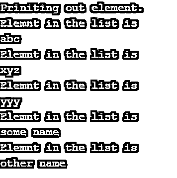

# Java 数组列表类

> 原文：<https://www.educba.com/java-arraylist-class/>


## Java 数组列表类的定义

ArrayList 是 List 接口的实现，它在 java 的集合框架下，允许我们动态地增加数组的大小，即在运行时。这个类在 java.util.package 内部可用，它使用数组数据结构。ArrayList 在 java 中只允许包装类，用户定义类。

**语法:**

<small>网页开发、编程语言、软件测试&其他</small>

```
ArrayList<T> list = new ArrayList<>();
```

```
List<T> list = new ArrayList<>();
```

我们可以直接使用 ArrayList 的一个实例，或者把它赋给一个列表引用。

**构造函数:**

在数组列表中，我们有三个可用的构造函数，如下所示:

*   **ArrayList(int initial capacity):**在这里，我们可以指定数组列表的初始长度。但是如果大小超过了提到的 initialCapacity，ArrayList 类会处理它。
*   这样，我们可以创建一个没有初始容量的空列表，所以在这种情况下，默认的 initial capacity 是 10。
*   **ArrayList(收藏<？扩展 E > c):** 集合的列表。

### Java 数组列表类的方法

以下是 java ArrayList 类的方法:

*   **void trimToSize():** 这个方法会将列表修剪到当前的列表大小。
*   **Object[] toArray():** 返回对象的数组。
*   **boolean remove(Object o):** 此方法用于移除对象，但它将移除第一个出现的对象，因为列表中包含重复的对象。
*   **布尔 removeAll(收藏<？> c):** 这个方法用来移除列表中的所有元素。
*   **布尔 removeIf(谓词<？super E > filter):** 这个方法用来移除传递过来的谓词。用作过滤器。
*   Add (E e): 这个方法用于向列表中添加元素。
*   **Void add(int index，E element):** 它采用两个参数，将元素 t 添加到我们提到的特定索引。
*   **布尔 addAll(收藏<？extends E>c:**这将一个列表作为参数，并将所有元素添加到当前列表的末尾。
*   **布尔 addAll(int index，Collection <？扩展 E > c):** 这个方法将所有元素添加到当前列表中我们传递的指定索引处。
*   **Get (int index):** 这个方法用来获取元素。它将返回列表中指定位置的元素。
*   **Int indexOf(Object o):** 这个方法用于获取元素的索引。它总是将元素的第一个匹配项返回到列表中，因为列表可能包含重复的元素。
*   **list iterator<E>list iterator(int index):**该方法返回具有特定索引的迭代器。
*   **Remove (int index):** 这个方法移除元素。它将移除传递了相应索引的元素。
*   **Protected void remove range(int from index，int toIndex):** 这将从指定的范围中删除元素。
*   **布尔零售(收藏<？> c):** 该方法将保留指定集合中包含的所有元素。
*   **Set (int index，E element)** :该方法将元素设置为指定的索引。
*   **Void sort(比较器<？super E > c):** 这个方法用于对集合元素进行排序。
*   **List<E>subList(int from index，int toIndex):** 该方法将用于返回指定索引的子列表。
*   **Void clear():** 这个是用来清除列表中的元素。
*   **Object clone():** 这些方法创建列表的副本。
*   **Boolean contains(Object o):**该方法用于检查传递的对象是否在列表中。
*   **Void ensure capacity(int minCapacity):**该方法用于增加数组列表的容量。
*   **Boolean isEmpty():** 该方法用于检查数组列表是否为空。
*   **迭代器< E >迭代器():**这个方法返回迭代器。
*   **int lastIndexOf(Object o):** 这个方法返回传递的对象的最后一个索引。如果该对象不在列表中，它将返回-1。
*   **list iterator<E>list iterator():**这个方法返回迭代器。

### Java ArrayList 类的例子

下面给出了 Java ArrayList 类的例子:

#### 1.在 ArrayList 中添加元素

下面的例子将展示如何添加一个元素到一个数组列表中。

**代码:**

```
package com.cont.article;
import java.util.ArrayList;
public class ArratListTest {
public static void main(String[] args) {
ArrayList<String> list = new ArrayList<>();
list.add("abc");
list.add("xyz");
list.add("yyy");
list.add("some name");
list.add("other name");
System.out.println("list is :: " + list);
}
}
```

**输出:**


#### 2.将列表一的元素复制到另一个列表

**代码:**

```
import java.util.ArrayList;
public class Main {
public static void main(String[] args) {
ArrayList<String> list = new ArrayList<>();
list.add("abc");
list.add("xyz");
list.add("yyy");
list.add("some name");
list.add("other name");
ArrayList<String> list2 = new ArrayList<>();
list2.addAll(list);
System.out.println("Elements in list one : " + list);
System.out.println("Elements in list two :  " + list2);
}
}
```

**输出:**


#### 3.从数组列表中移除元素

**代码:**

```
import java.util.ArrayList;
public class Main {
public static void main(String[] args) {
ArrayList<String> list = new ArrayList<>();
list.add("abc");
list.add("xyz");
list.add("yyy");
list.add("some name");
list.add("other name");
System.out.println("Size of list before remove ::" + list.size());
System.out.println("Elements in list are before remove " + list);
list.remove(4);
System.out.println("Size of list after removinf element :: " +list.size());
System.out.println("Elements in list are after remove" + list);
}
}
```

**输出:**


#### 4.清除 ArrayList 中的所有元素

**代码:**

```
import java.util.ArrayList;
public class Main {
public static void main(String[] args) {
ArrayList<String> list = new ArrayList<>();
list.add("abc");
list.add("xyz");
list.add("yyy");
list.add("some name");
list.add("other name");
list.clear();
System.out.println("Clering all elements of list " +list.size());
}
}
```

**输出:**


#### 5.迭代 ArrayList 的所有元素

**代码:**

```
import java.util.ArrayList;
public class Main {
public static void main(String[] args) {
ArrayList<String> list = new ArrayList<>();
list.add("abc");
list.add("xyz");
list.add("yyy");
list.add("some name");
list.add("other name");
System.out.println("Priniting out element.");
for (String string : list) {
System.out.println("Elemnt in the list is");
System.out.println(string);
}
}
}
```

**输出:**




java 中的数组列表不包含重复的元素。此外，插入顺序保存在一个列表中，这意味着我们将元素放在列表中，这些元素将以相同的顺序生成输出。java 中数组列表需要记住的一些细节点如下:

它实现了各种接口:

*   可序列化，
*   可迭代的<e>，</e>
*   可克隆的，
*   收藏<e>，</e>
*   列表<e>，</e>
*   随机存取

类的层次结构如下:

```
java.lang.Object  >> java.util.AbstractCollection<E> >> java.util.AbstractList<E> >> java.util.ArrayList<E>
```

默认情况下，数组列表本质上不是同步的，也不是线程安全的，但是我们可以使用 collections 类 synchronized 方法使它们同步。语法描述如下，以供参考:

```
List arrList = Collections.synchronizedList (new ArrayList(...));
```

### 推荐文章

这是一个 Java 数组列表类的指南。这里我们还讨论了 Java ArrayList 类的介绍和方法，以及不同的例子和代码实现。您也可以看看以下文章，了解更多信息–

1.  [在 Java 中反转字符串](https://www.educba.com/reverse-string-in-java/)
2.  [Java 中的函数接口](https://www.educba.com/functional-interface-in-java/)
3.  [JavaFX 组合框](https://www.educba.com/javafx-combobox/)
4.  [Java 中的关联](https://www.educba.com/association-in-java/)


