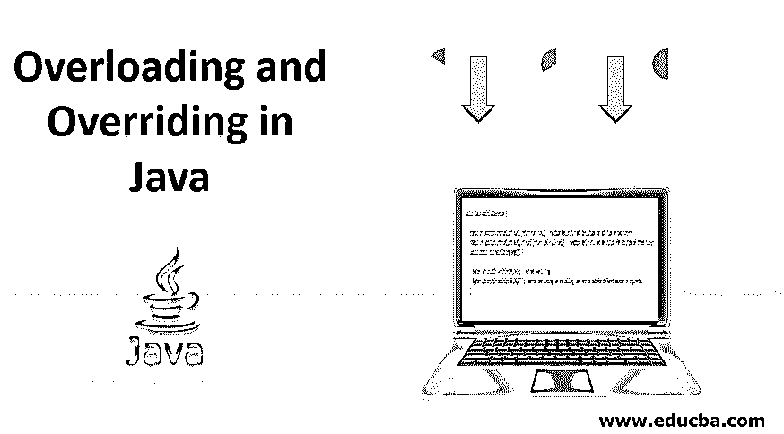

# Java 中的重载和重写

> 原文：<https://www.educba.com/overloading-and-overriding-in-java/>




## Java 中的重载和重写介绍

让我们先来看看这个名字乍一看意味着什么。“过载”意味着:给任何人的原始功能增加额外的负担，对吗？而“覆盖”意味着:在任何人的原有功能之外提供新的功能。在本文中，我们将详细研究 Java 中的重载和[覆盖。是的，在 Java 中，它们也是以同样的方式编程实现的。让我们一个一个地看看。](https://www.educba.com/overriding-in-java/)

### Java 中的重载

当一个 java 类有多个同名但参数不同的方法时，我们称之为[方法重载](https://www.educba.com/method-overloading-in-python/)。通过保持名称不变，我们只是增加了程序代码的可读性。例如，假设我们需要对一些给定的数字执行一些加法运算。假设我们的方法名为“addition()”。这里，加法可以在两个数、三个数或更多个数之间进行。因此，根据额外操作中涉及的数字数量，我们可以改变函数的参数。但是，如果你为不同数量的参数编写不同的方法，这将很难识别，因为名字会不同。因此，通过重载，我们获得了更好的代码可读性。所以现在的问题是，我们将如何实现超载？

<small>网页开发、编程语言、软件测试&其他</small>

让我们一个接一个地看那些例子代码。

#### 方法 1–通过修改参数的数量

所以在这里，我们会对一些数字做额外的运算。为此，让我们创建一个名为“AdditionOperation”的类。在该类中，我们有两个名为“addition()”的方法。在其中一种方法中，我们将执行两个数的加法。在另一个例子中，我们将执行三个数的加法。这将通过简单地改变这些方法中的参数数量来实现，但是我们将保持名称不变。这样，我们在这里重载了方法“addition()”。

**代码:**

```
public class AdditionOperation {
static int addition(int num1,int num2){return num1+num2;} //function declarationand definition for addition of two numbers
static int addition(int num1,int num2,int num3){return num1+num2+num3;} //function declarationand definition for addition of three numbers
public static void main(String args[]) {
system.out.printin(addition(35,36)); //method overloading
system.out.printin(addition(35,36,37)); //method overloading, we are calling same methods but for different number of arguments.
}
}
```

**输出:**


#### 方法 2——通过修改数据类型

这里，我们将对不同的类型进行加法运算，例如，在整数类型和双精度类型之间。为此，让我们创建一个名为“AdditionOperation”的类。在该类中，我们有两个名为“addition()”的方法。在其中一种方法中，我们将执行两个整数的加法。在另一个例子中，我们将执行两个 double 的加法。这将通过简单地改变这些方法中的参数类型来实现，但是我们将保持名称不变。这样，我们在这里重载了方法“addition()”。

**代码:**

```
public class additionOperation {
static int addition(int num1,int num2){return num1+num2;} //function declarationand definition for addition of two numbers
static double addition(double num1,num2){return num1+num2;} //function declarationand definition for addition of three numbers
public static void main(String args[]) {
system.out.printin(addition(35,36)); //method overloading
system.out.printin(addition(35.5,36.6)); //method overloading, we are calling same methods but for different type of arguments.
}
}
```

**输出:**


**超载注意事项**

*   java 中的重载基本上是“C# orphism 中的编译时 polym [方法重载”。java](https://www.educba.com/method-overloading-in-c-sharp/) 中的编译时[多态性也被称为“静态方法分派”或“早期绑定”。那么我说的行话是什么意思呢？](https://www.educba.com/polymorphism-in-java/)
*   顾名思义，多态性基本上是一种采取多种形式的能力(poly: many，morph: form)。所以，被覆盖的函数和对象的链接或绑定是在编译时完成的。因此，它被称为编译时多态性。
*   基本上，函数到对象的绑定是在运行之前(即编译期间)完成的；因此，它也被称为“早期绑定”。
*   静态分派是一种多态或方法分派，它告诉 java 如何选择方法的哪些功能将在编译时使用。(我的意思是，在我们的编码示例中，它将执行两个数字的加法还是三个数字的加法)。所以这个名字也被称为静态方法分派。

### 在 Java 中覆盖

*   当一个 java 子类或子类有一个方法与其父类或超类中的方法同名，并且包含相同的参数和相似的返回类型时，那么我们可以调用子类的方法作为其父类的方法的重写方法。
*   例如，假设我们需要根据它的类类型执行一些显示操作。如果我调用一个父类的方法，它将显示一个在父类中定义的消息。但是，当我们调用子类的方法时，它将覆盖其父类的显示消息，并显示在子类的方法中定义的显示消息。因此，根据我们需要显示的内容，我们可以调用相关的类(父类或子类)。这里我们不改变方法名、参数和返回类型。我们只是改变了子类中方法的功能。但是，与此相反，如果我们不做覆盖，也就是说，我们不给出子方法的具体实现，那么当调用该方法时，它将显示与父类中相同的消息。
*   在编写代码时，我们将在要被覆盖的方法之前使用 **@** Override annotation。@Override 批注告诉编译器，该方法应该重写在超类中声明的方法。虽然不强制使用它，但它有助于防止错误。如果用@Override 注释的方法无法重写某个方法，编译器会生成一个错误。

### Java 方法覆盖的规则

1.  该方法必须与父类中的名称相同
2.  该方法必须具有与父类中相同的参数。
3.  必须有一个 IS-A 关系(继承)。

**代码:**

```
//Parent or Super class
class Parent {
public void display() {
system.out.printin("Hello, I am from parent class");
}
}
//Child or sub class
class Sub extends Parent {
//Below method overrides the Parent display() method
// @override
public void display() {
system.out.printin("Hello, I am from child class");
}
}
//Driver class
public class Overriding {
public static void main?(String args[])
{
Parent superObject = new Parent ();
superObject.display(); // Super class method is called
Parent subObject = new Sub();
subObject.display(); //Child class method is called by a parent type reference: this is functionality of method overriding
Sub subObject2 = new Sub(); //Child class method is called by a child type reference
subObject2.display();
}
}
```

**输出:**


**方法覆盖的限制:**

1.  父类的私有方法不能被重写。
2.  最终方法不能被重写
3.  静态方法不能被重写

**超越注意事项**

*   java 中的覆盖基本上是“运行时多态性”。java 中的运行时多态性也称为“动态方法分派”或“后期绑定”。那么这个行话是什么意思呢？
*   顾名思义，多态性基本上是一种采取多种形式的能力(poly: many，morph: form)。所以，这里调用一个重载的函数是在运行时完成的。因此称为运行时多态性。
*   基本上，函数到对象的绑定是后期完成的，也就是在编译之后(也就是在运行时)；因此，它也被称为“后期绑定”。
*   动态分派是一种多态或方法分派，它告诉 java 如何选择在运行时使用方法的哪些功能。所以这个名字也被称为动态方法调度。

### 结论

我们对主题“Java 中的重载和重写”的学习到此结束。在 java 编译器中编写上述示例中提到的代码，并检查输出。如果你不亲自动手，提高你的编码技能，对代码的学习将是不完整的。编码快乐！！

### 推荐文章

这是一个关于 Java 中重载和重写的指南。这里我们讨论重载的方法，以及 Java 重写的规则和限制。您也可以浏览我们推荐的其他文章，了解更多信息——

1.  [在 JavaScript 中覆盖](https://www.educba.com/overriding-in-javascript/)
2.  [在哎呀中覆盖](https://www.educba.com/overriding-in-oops/)
3.  [在 PHP 中覆盖](https://www.educba.com/overriding-in-php/)
4.  [Python 重载](https://www.educba.com/python-overloading/)


