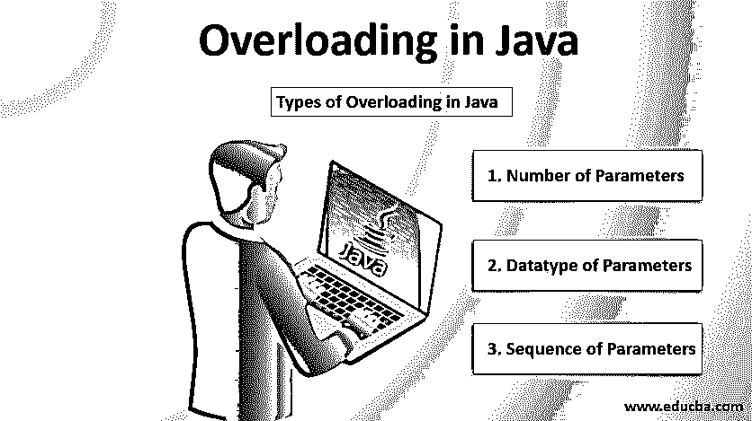
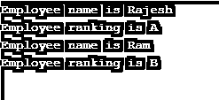

# Java 中的重载

> 原文：<https://www.educba.com/overloading-in-java/>




## Java 中的重载介绍

Java 是一种面向对象的编程语言，它遵循基本的 OOPs 概念。重载是 Java 中的重要概念之一。重载允许不同的方法在一个类中具有相同的名称，但是具有不同的签名。签名包括参数的数量、参数的数据类型和方法中传递的参数序列。在 Java 中，方法和构造函数都可以重载。方法的重载是在编译时完成的，因此它被称为编译时多态性。在类中重载方法是为了增加程序的可读性，这样程序员可以为不同的场景编写任何方法的增强实现。

考虑这样一个场景，其中程序员想要找出各种几何图形(如立方体、圆柱体和矩形棱柱)的体积，因为它们中的三个具有不同的体积计算公式和不同数量的参数。立方体的体积只需要一个参数，圆柱体需要两个参数，矩形棱柱需要三个参数。但主要目的只是求数字的体积。因此，我们可以为名称相同的不同图形创建不同的体积方法。这样，[方法重载](https://www.educba.com/method-overloading-in-python/)在实际场景中使用。

<small>网页开发、编程语言、软件测试&其他</small>

### Java 中重载是如何工作的？

用一个例子解释了方法重载的工作原理:

**代码:**

```
class Main{
int volume(int side)
{
return side * side * side;
}
int volume(int length, int breadth, int height)
{
return length*breadth*height;
}
double volume(int radius, int height)
{ return 3.14 * (radius * radius)* height / 3;
}
public static void main(String[] args)
{
Main oe = new Main();
System.out.println("Volume of Cube " +oe.volume(10));
System.out.println("Volume of Rectangular prism " +oe.volume(10,12,30));
System.out.println("Volume of Cone "+oe.volume(5,10));
} }
```

**输出:**


**上面代码的解释:**在上面的例子中，我们需要求 3 个几何图形的体积，所以我们创建了 3 个单独的重载方法，与' volume '同名，但是所有的方法都有不同数量的参数。所以在主方法中，当 one.volume(10)运行时，调用具有单个参数的 volume 方法，即 int volume(int side)。同样，对于卷的其他方法，基于参数的数量，调用和处理不同的方法。

在这个例子中，方法根据参数的数量被重载，但是它们也可以根据参数的数据类型和参数序列被重载，因此只能根据参数的数据类型和参数序列被调用。

### Java 中重载的类型

Java 中的方法重载基本上有三种方式:

#### 1.参数数量

Java 方法可以通过方法中传递的参数数量来重载。例如，如果 volume 的 1 个方法有 2 个参数，而另一个方法有 3 个参数，那么它会根据参数的数量在重载的情况下出现[。](https://www.educba.com/python-overloading/)

**代码:**

```
class Multiplication
{
int mult(int a,int b)  // method mult having 2 parameters
{
return a*b;
}
//Method Overloading on number of parameters
int mult(int a,int b,int c)   // method mult having 3 parameters
{
return a*b*c;
}
}
class Main
{
public static void main(String[] args)
{
Multiplication M = new Multiplication();
System.out.println(M.mult(10,9));
System.out.println(M.mult(10,9,8));
}
}
```

**输出:**


#### 2.参数的数据类型

方法中传递的参数的数据类型非常重要，因此，如果 2 个或 2 个方法具有相同的名称，具有相同或不同数量的参数，但不同方法中参数的数据类型不同，则可以认为方法是重载的。

**代码:**

```
class Multiplication
{
int mult(int a,int b)  // method mult having 2 parameters
{
return a*b;
}
//Method Overloading on datatype of parameters
double mult(double a,double b)   // method mult overloaded
{
return a*b;
}
}
class Main
{
public static void main(String[] args)
{
Multiplication M = new Multiplication();
System.out.println(M.mult(10,9));
System.out.println(M.mult(10.5,9.8));
}
}
```

**输出:**


#### 3.参数序列

[方法重载也可以通过改变 2 个或更多重载方法的参数顺序来完成](https://www.educba.com/method-overloading-in-php/)。例如，如果一个方法的参数是(String x，char y ),而另一个方法是(char x，String y ),但两者具有相同的名称，则上述两个方法被视为由不同的参数序列重载。

**代码:**

```
class Employee
{
void details(String name, char rank)  // method details having 2 parameters
{
System.out.println("Employee name is "+name);
System.out.println("Employee ranking is "+rank);
}  //Method Overloading on sequence of parameters
void details(char rank, String name)     // method details overloaded
{
System.out.println("Employee name is "+name);
System.out.println("Employee ranking is "+rank);
}
}
class Main
{
public static void main(String[] args)
{  Employee emp = new Employee();
emp.details("Rajesh", 'A');  // calls the first method (details(String, char))
emp.details("Ram", 'B');    //  calls the second method (details(char, String))
}
}
```

**输出:**




**上面代码的解释:**在上面的例子中,‘details’的两个方法都是基于 sequence if 参数重载的。当调用语句 emp.details('Rajesh '，' A ')时，调用并处理具有顺序为(String，char)的参数的方法，即 void details (String name，char rank)。

### Java 中的重载规则

以下是 java 重载中应该记住的规则:

*   方法重载的首要[规则是方法需要在一个类中有相同的名字。](https://www.educba.com/method-overloading-in-c-plus-plus/)
*   一个类中的两个或多个方法可以基于不同的签名被重载，签名包括参数的数量、参数的数据类型、参数的顺序，如上所述。
*   方法的返回类型不是签名的一部分，所以永远不能基于返回类型进行重载，如果重载了，就会产生编译时错误。

### 结论

重载是 Java 中的一个重要概念，方法和构造函数都可以重载。在编程中实现重载之前，应该记住一些重载规则。

### 推荐文章

这是一个 Java 重载指南。这里我们讨论一些重载的规则，在实现 Java 中的重要概念、方法和构造函数之前应该考虑这些规则。您也可以浏览我们的其他相关文章，了解更多信息——

1.  [c++中的重载](https://www.educba.com/overloading-in-c-plus-plus/)
2.  [Java 中的继承](https://www.educba.com/inheritance-in-java/)
3.  [PHP 中的重载](https://www.educba.com/overloading-in-php/)
4.  [Java 中的方法重载](https://www.educba.com/method-overloading-in-java/)


