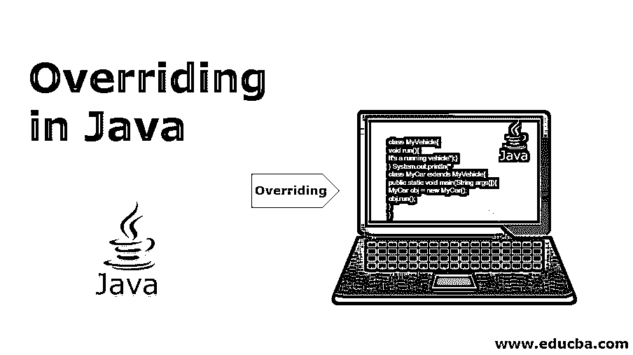

# 在 Java 中覆盖

> 原文：<https://www.educba.com/overriding-in-java/>




## Java 重写简介

*   Java 是一种众所周知的通用语言，它是面向对象的，本质上是基于类的，还有原始数据类型，已知它们包含很少的与实现相关的依赖性，这使得应用程序开发人员的工作非常容易，因为它为他们提供了一次编写和随处读取的便利。在详细讨论重写的概念之前，应该彻底了解父类和子类的概念。
*   父类是超类，即位于顶部并具有一组独特的个体特征和实体的类，而子类或基类是位于父类下端并具有一组不同但相似的特征的类。此外，Java 中的 Overriding 通过 IS-A 关系扩展自身以获得父类特性，因此被称为继承。
*   这种编程语言的一个这样的特征是覆盖特征，根据该特征，在任何面向对象的编程语言中，[覆盖变成利用子类或子类的特征](https://www.educba.com/overriding-in-python/),以便提供已经由父类或超类之一就位的程序方法的特定实现。例如，如果子类方法具有相同的名称、相同的签名或参数以及相似的返回类型或在超类中用作方法的子类型，那么子类方法覆盖超类方法。
*   换句话说，如果一个子类或基类或子类获得了与父方法相同的方法名，那么它就被称为 Java 中的[方法覆盖。更好地说，如果一个子类提供了已经被任何父类声明的方法实现，它也可以被认为是 Java 中的方法覆盖。](https://www.educba.com/method-overriding-in-java/)

Java 方法覆盖的主要用途有:

1.  它用于提供一个方法的特定实现，该方法的相应超类已经提供了该方法。
2.  方法覆盖的概念也扩展到了运行时多态性。

### 重写在 Java 中是如何工作的？

在方法覆盖的情况下，只要子类中的任何方法与其父方法具有相同的名称，并且来自运行时的调用是这样生成的，即它指向方法名称，这对于两者是共同的，并且当方法覆盖被认为存在时，其中一个方法执行。这样做的主要挑战是，当父类和子类使用相同的方法名时，在运行时，调用必须对应于子类或父类。该语言的编译器然后通过考虑参数的数量、参数的类型等来决定这一点。基于此确定要调用的函数名。[方法重载](https://www.educba.com/method-overloading-in-c-sharp/)和方法覆盖已经成为核心 java 领域的关键概念。它具有重要意义，因为编译器需要清楚要调用哪个方法。

<small>网页开发、编程语言、软件测试&其他</small>

### Java 中覆盖的示例

只要函数名与父类名同名，这个特性就存在，尤其是在运行时机制中。这里有一个简单的例子来详细解释这个概念。首先，我们将讨论这个问题，而不是推翻它，其次，为什么它会存在。

**第一个例子:**

```
class MyVehicle{
void run(){
System.out.println("It's a running vehicle");}
}
class MyCar extends MyVehicle{
public static void main(String args[]){
MyCar obj = new MyCar();
obj.run();
}
}
```

**输出:**


输出是:这是一个运行的车辆。我必须提供子类中提供的 run()方法的具体实现。因此，我们可以在将来使用方法覆盖特性。

**第二个例子:**

```
class MyVehicle{
void run(){System.out.println("My vehicle is running");}
}  class MyCar2 extends MyVehicle{
void run(){System.out.println("My car is running");}
public static void main(String args[]){
MyCar2 obj = new MyCar2();
obj.run();
}
}
```

**输出:**


我的车在跑就是上面问题例子的输出。

**解释:**现在，如果你仔细观察两个例子中发生的事情，第一个例子谈到用父类扩展子类，第二个例子也是这种情况。但是在这个例子中，MyCar2 扩展了 MyVehicle，正如方法覆盖的定义所定义的，调用的决定是在运行时做出的，即在调用 run()方法的时候。因此，当调用此方法时，调用首先进行到子类或基类，因为它已经扩展了父类的所有属性，因此是完全足够的。然后，一旦它到达基类部分并确保继承是一个 IS-A 关系以及关键字 extends，它就成功地打印出输出:我的汽车正在运行。

### Java 中方法重写的规则

1.  父类和子类的方法名应该相同。
2.  基类的参数应该与父类的参数相同。
3.  该关系必须是子类和父类之间的关系。

### 结论

Java 是一种非常古老的编程语言，今天，它几乎被应用于技术的各个领域。因此，人们必须非常清楚这种健壮的编程语言中使用的类型和概念。Java 语言通常分为两个部分，即核心 Java 和高级 Java。方法覆盖的概念形成了核心 Java 的一部分，它利用了面向对象编程技术[的特性，比如继承](https://www.educba.com/inheritance-in-python/)。如果你想用这种语言工作，这是一个非常重要的话题，你一定要详细了解。我希望你喜欢我们的文章。请继续关注我们，阅读更多类似的文章。

### 推荐文章

这是一个用 Java 重写的指南。这里我们讨论 Java 中覆盖的介绍，Java 中覆盖的类型以及 Java 中方法覆盖的规则。您也可以浏览我们推荐的其他文章，了解更多信息——

1.  [Java 注释](https://www.educba.com/java-annotations/)
2.  [在哎呀中覆盖](https://www.educba.com/overriding-in-oops/)
3.  [Java 中的方法](https://www.educba.com/methods-in-java/)
4.  [Java 中的方法重载](https://www.educba.com/method-overloading-in-java/)


