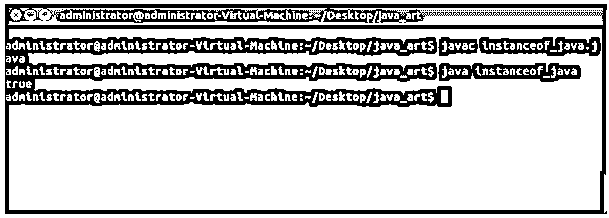

# Java 中的 instanceOf

> 原文：<https://www.educba.com/instanceof-in-java/>


## Java 中的 instanceOf 简介

当继承概念在 Java 代码片段中实现时，Java 中的 InstanceOf 用于确定对象与其类的关系。instanceOf 类通常适用于允许继承的面向对象编程语言，它以布尔结果的形式返回输出值，即 true 或 false。如果类变量的 instanceOf 的值为空，则该类将输出返回为“false”。由于该类用于比较目的，因此也称为“类型比较运算符”。

**语法:**

<small>网页开发、编程语言、软件测试&其他</small>

class 的 instanceOf 用于检查对象是否属于任何类。

```
obj instanceOf object
```

以上是 instanceOf 类的标准语法。在这里，obj 是之前已经创建的对象的名称(引用)。instanceOf 是关键字，object 是我们用来匹配 obj 对象的类或者接口。

在各种情况下，instanceOf 可以被证明有很大用处，比如我们有一个对象集合，而你不确定它指的是哪个对象。这种情况的一个例子可以是具有许多控件的简单表单。

此外，如果我们使用带有空值变量的 instanceOf，它肯定会返回 false。

### 工作有多快？

java 中的 instanceOf 操作符处理简单的 is-a 关系。简单地说，is-a 关系是一个面向对象的概念，在这里我们比较或者说处理抽象之间的关系，其中 A 类是 b 类的子类。这是一个完全基于继承的关系[。换句话说，就像说“X 是 Y 型的”。](https://www.educba.com/what-is-inheritance-in-programming/)

现在，让我们理解 instanceOf 的工作原理，以及相应的代码。

首先，我们将创建一个名为 Parent 的类。

**代码:**

```
class Parent{
}
//Then let’s add a simple main class.
public static void main(String args[]) {
}
```

然后，我们将创建父类的一个实例。

```
Parent child = new Parent();
```

最后，我们将使用 instanceOf 操作符来检查子节点和父节点之间的关系。它是这样的:父对象的子实例

现在，如前所述，instanceOf 的语法从必须检查的对象开始，然后是 instanceOf 关键字，然后是测试给定对象的类/接口。

我们在类声明中遇到关键字“extends”或“implements”的任何地方，都清楚地表明使用了 is-a 关系。

### Java 中的 instanceOf 示例

下面的示例演示了 instanceOf 的单行用法。

```
class instanceof_java{
public static void main(String args[]) {
instanceof_java s = new instanceof_java();
System.out.println(s instanceOf instanceof_java);
}
}
```

**代码解释:**从创建一个简单的类 instanceof_java 开始。在 java 的类 instanceof_java 中，我们有一个主类，在主类中，我们创建了一个对象。该对象属于 instanceof_java 类型。然后，为了实现 instanceOf 的工作，我们提供了一个带有对象 s 的 output 语句。执行时，代码将返回“true ”,因为对象 s 属于 instanceof 类型。




进一步来说，如果我们有一个已知类或接口的对象，但是没有给同一个对象赋值，那么它必然会返回 false，即使我们是同一个类。

```
class instanceof_sample{
public static void main(String args[]) {
instanceof_sample new = null;
System.out.println(new instanceOf instanceof_sample);
}
}
```

这里我们有一个与前面的例子相似的代码，但是有一个空值对象。执行时，此代码将返回 false。正如我们所看到的，对象 new 是 instanceof_sample 的实例，但是 new 被赋予了一个空值，该值返回 false。


### 运算符实例的规则

基于对象 ref 是否不为空以及被引用类型的实例。当 X 是引用对象的简单类，Y 是接口类型的解析类或数组时。

*   当 X 是一个简单的类时，那么:
*   如果 Y 是一个类类型，那么 X 必须是 Y 的子类，或者 X 必须和 Y 是同一个类。
*   如果 Y 是接口类型，那么 X 类必须实现接口 t。
*   当 X 是接口类型时，则:
*   如果 Y 是一个类类型，那么 Y 必须是一个对象。
*   如果 Y 是接口类型，则 Y 可以与接口 as X 相同，也可以是 X 的超级接口。
*   如果 X 是一个类，表示数组类型 SC[]，它是一个类型 SC 组件的数组，则:
*   如果 Y 是类类型，那么 Y 必须是对象。
*   如果 Y 是接口类型，那么 Y 必须是由数组实现的接口类型。

最后，我们将演示一个 instanceOf 程序来理解父对象不能是子类的实例。

**程序**

```
class Subject {  }
class Topic extends Subject { }
class instanceof_java
{
public static void main(String[] args)
{
Subject history = new Subject ();
if (history instanceof Topic)
System.out.println("history is instance of Topic");
else
System.out.println("history is NOT instance of Topic");
}
}
```

**代码解释:**为了理解不同场景下的 instanceOf 运算符，我们编写了上面的代码。我们创建了一个简单的 class Subject，然后创建了另一个 class Topic，它扩展了 class Subject，使 class Topic 成为这里的 child，class Subject 成为 Parent。然后另一个类用[主法](https://www.educba.com/python-main-method/)。在 main 方法中，我们创建了父类 Subject 的一个新实例。在 IF ELSE 循环中，我们用父类 Subject 检查了实例对象的条件。如果条件满足，它将返回“历史是主题的实例”，如果条件不满足，它将返回“历史不是主题的实例”。

在执行上述代码时，输出将是“history NOT a instance of Topic”，这意味着如果失败，则传递条件。这是因为我们试图用类主题检查对象“history”的父对象。我们知道类主题扩展了类主题，意味着主题是主题的子类。而当我们试图用 class Topic 检查历史的类型时，它返回 false (NOT)。这意味着父对象不能是类的实例。

**输出:**


### 结论

我们已经学习了 Java 中的 instanceOf 类，它简单地决定对象是否是给定的类型。我们了解 is-a 关系如何影响运算符的实例。instanceOf 也称为比较运算符，它基于继承。

### 推荐文章

这是 Java 中 InstanceOf 的指南。这里我们讨论 Java 中的 InstanceOf 是如何工作的，规则与代码解释。您也可以看看以下文章，了解更多信息–

1.  [Java 关键字](https://www.educba.com/java-keywords/)
2.  [Java 注释](https://www.educba.com/java-annotations/)
3.  [Java 中断异常](https://www.educba.com/java-interruptedexception/)
4.  [Java InputStreamReader](https://www.educba.com/java-inputstreamreader/)


