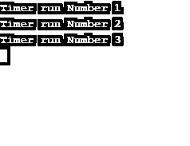

# Java 中的定时器

> 原文：<https://www.educba.com/timer-in-java/>


## Java 中的定时器是什么？

java 中的定时器在 Java 中可用。util 包扩展了 Object 类并实现了可序列化和可克隆的接口。timer 类包含用于执行计时相关活动的方法。Java 中的 Timer 类用于执行与时间相关的任务调度。Java 线程使用 Timer 类的方法来调度任务，比如在某个时刻后执行一段代码，在某个预定义的时间后重复执行代码。每个定时器对象被绑定到一个单独的后台运行线程，该线程负责执行与该线程相关联的所有任务。需要注意的是，java 中的 timer 类是线程安全的；也就是说，一次只有一个线程可以执行 Timer 类方法。Timer 类也使用二进制堆作为底层数据结构来存储任务。

### Java 中定时器的语法

下面是在 java 中如何使用 Timer 类的基本语法:

<small>网页开发、编程语言、软件测试&其他</small>

**语法:**

```
// create a class extending TimerTask
class TimerHelper extends TimerTask
{
//define run method
public void run()
{
// Write Code to be executed by Timer
}
}
class MainClass{
public static void main(String[] args)
{
//create timer instance
Timer timer = new Timer();
// create Timer class instance
TimerTask task = new TimerHelper ();
// call timer method
timer.schedule(task, 3000,6000);
//first argument is timer object
// second argument is time in milliseconds after which the code will be first executed
// Third argument is time in milliseconds after which the code will be executed regularly.
}
}
```

**上述语法的解释:**语法展示了 java 中如何使用 Timer 类。使用 timer 类包括创建一个扩展 TimerTask 的类，并在其中定义 run 方法。run 方法包含需要在时间驱动的基础上执行的逻辑。下面是计时器类声明:

```
public  class Timer extends Object
implements Serializable, Cloneable
```

### Java 中定时器类的方法

现在我们将看到 java Timer 类中有哪些不同的可用方法和字段。下面是 Timer 类中可用的常用方法列表:

| **方法名** | **描述** |
| 公共无效计划(TimerTask 任务，日期日期) | 计划在定义的日期执行任务。 |
| 公共无效计划(计时器任务，第一次日期，长时间周期) | 第一个参数是要执行的 TimerTask 第二个参数是第一次执行任务之前的时间，第三个参数是以毫秒为单位的秒数，在此之后将定期执行任务。 |
| public int purge() | 用于从计时器队列中删除所有已取消的任务。 |
| public void 取消() | 取消定时器。 |
| 公共无效计划(时间任务任务，长时间延迟) | 安排任务在指定时间后执行，以毫秒为单位。 |
| 公共无效计划(时间任务、长延迟、长周期) | 第一个参数是要执行的 TimerTask 第二个参数是以毫秒为单位的时间，在此之后任务第一次被执行，第三个参数是以毫秒为单位的秒，在此之后任务将被定期执行。 |
| public void scheduleAtFixedRate(TimerTask 任务，第一次日期，长时间周期) | 第一个参数是要执行的 TimerTask 第二个参数是第一次执行任务之前的时间，第三个参数是以毫秒为单位的秒，在此之后任务将定期执行。 |
| public void scheduleAtFixedRate(time task 任务，长延迟，长周期) | 第一个参数是要执行的 TimerTask 第二个参数是以毫秒为单位的时间，在此之后任务第一次被执行，第三个参数是以毫秒为单位的秒，在此之后任务将被定期执行。 |

从上述方法中，我们发现了两种工作原理相似但名称不同的方法；它们是 schedule 和 scheduleAtFixedRate。两者的区别在于，在固定速率执行的情况下，每次执行都是按照初始执行来调度的。如果在执行中有延迟，那么两个或更多的执行将快速连续发生以克服延迟。

### 计时器类中的构造函数

timer 类包含四个用于实例化 timer 对象的构造函数。

*   **Timer():** 创建新的定时器对象。
*   **Timer(boolean isDaemon):** 创建一个 Timer 对象，并指定相应的线程作为守护进程运行。
*   **Timer(字符串名):**用对应的线程名创建一个 Timer 对象。
*   **Timer(String name，boolean isDaemon):** 这个方法是上面两个构造函数的组合。

根据我们的需求，可以调用上面列出的四个构造函数中的一个。

### 用 Java 实现定时器的例子

下面是 Java 中定时器的例子:

#### 示例#1

首先，让我们看一个定时器类的基本例子。在这个例子中，我们将演示 Timer 类的 schedule 方法的使用。

**代码:**

```
package com.edubca.timer;
import java.util.Timer;
import java.util.TimerTask;
class TimerHelper extends TimerTask
{
public static int counter = 0;
public void run()
{
counter++;
System.out.println("Timer run Number " + counter);
}
}
public class Main
{
public static void main(String[] args)
{
Timer timer = new Timer();
TimerTask timerhelper = new TimerHelper();
timer.schedule(timerhelper, 3000, 2000);
}
}
```

**上面代码的解释:**上面的代码会在第一个参数为 3000 时，3 秒后第一次执行 run 方法，之后每隔 2 秒，会定时执行 run 方法。下面是将要显示的输出:

**输出:**




#### 实施例 2

在这个例子中，我们将看到如何在给定次数的计时器运行后终止计时器线程。

**代码:**

```
package com.edubca.timer;
import java.util.Timer;
import java.util.TimerTask;
class TimerHelper extends TimerTask
{
public static int counter = 0;
public void run()
{
counter++;
if(counter ==3){
this.cancel();
System.out.println("Now Cancelling Thread!!!!!");
return;
}
System.out.println("Timer run Number " + counter);
}
}
public class Demo
{
public static void main(String[] args)
{
Timer timer = new Timer();
TimerTask helper = new TimerHelper();
helper.schedule(task, 3000, 2000);
}
}
```

在上面的示例中，在使用 timer 类的 cancel 方法调用三次 run 方法后，timer 将取消。

**输出:**


### 推荐文章

这是一个 Java 定时器指南。这里我们讨论什么是 java 中的 Timer，Java 中可用的不同方法，有四个构造函数和例子。您也可以浏览我们的其他相关文章，了解更多信息——

1.  [Java 中的字符串比较](https://www.educba.com/string-comparison-in-java/)
2.  [Java 密码术](https://www.educba.com/java-cryptography/)
3.  [Java 中的这个关键字](https://www.educba.com/this-keyword-in-java/)
4.  [Java 中的阿姆斯特朗数](https://www.educba.com/armstrong-number-in-java/)


