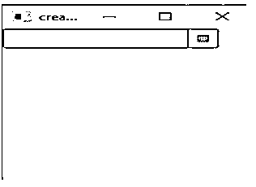
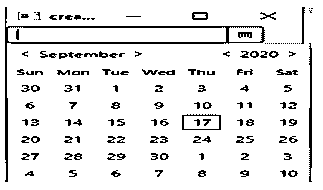
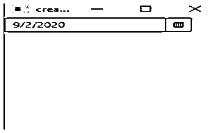
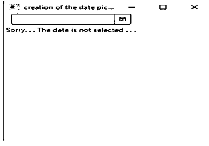
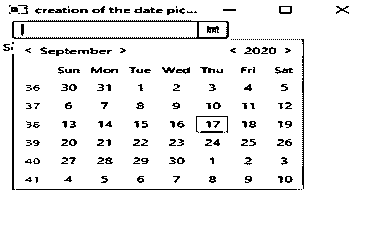
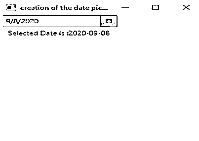

# Java 日期选择器

> 原文：<https://www.educba.com/java-date-picker/>


## Java 日期选择器的定义

在 JavaFX 中，DatePicker 控件是 JavaFx 包的一部分，用于使用户能够从类似向导的弹出对话框中选择日期或输入日期。由于弹出对话框只显示有效的日期，因此用户可以更容易地选择日期，并确保日期选择器的文本字段中给出的日期和日期格式是有效的。JavaFx 中的 DatePicker 由 Java FX . scene . control . date picker 类表示，它是 ComboBox 类的子类。让我们在接下来的章节中看到更多关于这个主题的内容。

**语法:**

<small>网页开发、编程语言、软件测试&其他</small>

下面是语法。

```
DatePicker dp = new DatePicker();
```

### Java 日期选择器的方法

下面是 java 日期选择器中常用的方法。

*   **getEditor():** 将为日期选择器返回文本编辑器。
*   **getChronology():** 将检索年表属性的值。
*   **isshoweeknumbers():**检查周数是否显示。
*   **setChronology(年表 c):** 将设置年表属性的值。
*   **setShowWeekNumbers(boolean b):**如果传递的参数为 true 值，则通过设置日期选择器显示周数。

### 如何用 Java 创建日期选择器？

让我们用一个例子来看看 java 日期选择器的工作。

*   首先，设置阶段标题

```
st.setTitle( "creation of the date picker : " ) ;
```

*   然后，创建平铺窗格

```
TilePane tp = new TilePane() ;
```

*   接下来，创建日期选择器，如下所示。

```
DatePicker dp = new DatePicker();
```

*   使用 tilepane 和 datepicker 添加标签和按钮

```
tp.getChildren().add(dp);
```

*   接下来，创建场景。

```
Scene sc = new Scene(tp, 200, 200);
```

*   一旦创建了场景，就必须进行场景的设置。

```
st.setScene(sc);
```

*   最后，显示结果

```
st.show();
```

### Java 日期选择器示例

如上所述，让我们看看 java 日期选择器的一些示例程序。

#### 示例#1

演示日期选择器工作的 Java 程序

**代码:**

```
// Java Program to demonstrate the working of date picker
import javafx.application.Application;
import javafx.scene.control.Button;
import javafx.scene.layout.*;
import javafx.stage.Stage;
import java.time.LocalDate;
import javafx.event.EventHandler;
import javafx.scene.Scene;
import javafx.event.ActionEvent;
import javafx.scene.control.*;
import javafx.scene.control.Alert.AlertType;
//main class
public class datepickerpgm extends Application
{
// Application starts  here
public void start( Stage st )
{
// set stage title
st.setTitle("creation of the date picker : ") ;
// Tile pane creation
TilePane tp = new TilePane() ;
// Date picker creation
DatePicker dp = new DatePicker();
// add both label and button
tp.getChildren().add(dp);
// scene creation
Scene sc = new Scene(tp, 200, 200);
// setting of the scene
st.setScene(sc);
//display the stage
st.show();
}
//main method
public static void main(String args[])
{
// application launches here
launch(args);
}
}
```

**输出:**




在这个程序中，所有必需的类都必须被导入。然后，设置舞台标题并创建平铺窗格。完成后，使用上面提到的语法创建日期选择器。然后，使用在上述步骤中创建的 tilepane 和 datepicker 添加标签和按钮。之后，用必要的参数创建场景。一旦场景被创建，场景的设置必须完成。执行代码时，结果将如上所示。

单击日历图标后，当月的所有日期都会显示如下。




选择日期后，它将显示在文本字段中，如下所示。




#### 实施例 2

Java 程序演示了日期选择器和标签的工作

**代码:**

```
import javafx.application.Application;
import javafx.scene.Scene;
import javafx.scene.control.Button;
import javafx.scene.layout.*;
import javafx.event.ActionEvent;
import javafx.event.EventHandler;
import javafx.scene.control.*;
import javafx.stage.Stage;
import javafx.scene.control.Alert.AlertType;
import java.time.*;
import java.time.chrono.*;
public class datepickerpgm extends Application {
// launch the application
public void start(Stage st)
{
// Title setting for the stage
st.setTitle( "creation of the date picker" );
// creation of a tile pane
TilePane tp = new TilePane();
// label for displaying the date
Label lb = new Label(" Sorry. . . The date is not selected . . . ");
// creation of a date picker
DatePicker dp = new DatePicker();
// action event . .
EventHandler<ActionEvent> ev = new EventHandler<ActionEvent>()
{
//handling the event
public void handle(ActionEvent ent)
{
// Retrieve the value of date picker
LocalDate ld = dp.getValue();
// Retrieve the chosen date
lb.setText("Selected Date is :" + ld);
}
};
// display the week numbers by setting the value as true
dp.setShowWeekNumbers(true);
// even on pressing the datePicker
dp.setOnAction(ev);
// add label as well as button
tp.getChildren().add(dp);
// add label as well as button
tp.getChildren().add(lb);
// creation of a scene
Scene scn = new Scene(tp, 300, 300);
// set up the scene
st.setScene(scn);
//display the stage
st.show();
}
//main method
public static void main(String args[])
{
// application launches here
launch(args);
}
}
```

**输出:**




在这个程序中，所有必需的类都必须被导入。然后，可以设置阶段标题 st，并且可以创建平铺窗格 tp。完成后，用必要的标题设置标签 lb，并使用上述语法创建日期选择器 dp。为了显示选定的日期，还必须使用一个动作事件。为了显示周数，请将该值设置为 true。然后，使用在上述步骤中创建的 tilepane tp 和 datepicker dp 添加标签和按钮。之后，用基本参数创建场景 sc。一旦创建了场景 sc，就必须完成场景的设置。执行代码时，结果将如上所示。由于没有选择任何日期，将显示一条消息“对不起..日期未被选择”。

单击日历图标后，当月的所有日期都会显示如下。




选择日期后，它将显示在文本字段中，并带有一个标签，如下所示。




### 推荐文章

这是一个 Java 日期选择器的指南。在这里，我们还讨论了定义和如何在 java 中创建日期选择器？以及不同的示例及其代码实现。您也可以看看以下文章，了解更多信息–

1.  [Java 矢量类](https://www.educba.com/java-vector-class/)
2.  [JavaScript 对象符号](https://www.educba.com/javascript-object-notation/)
3.  [JavaFX 后台](https://www.educba.com/javafx-background/)
4.  [Java URL 类](https://www.educba.com/java-url-class/)


