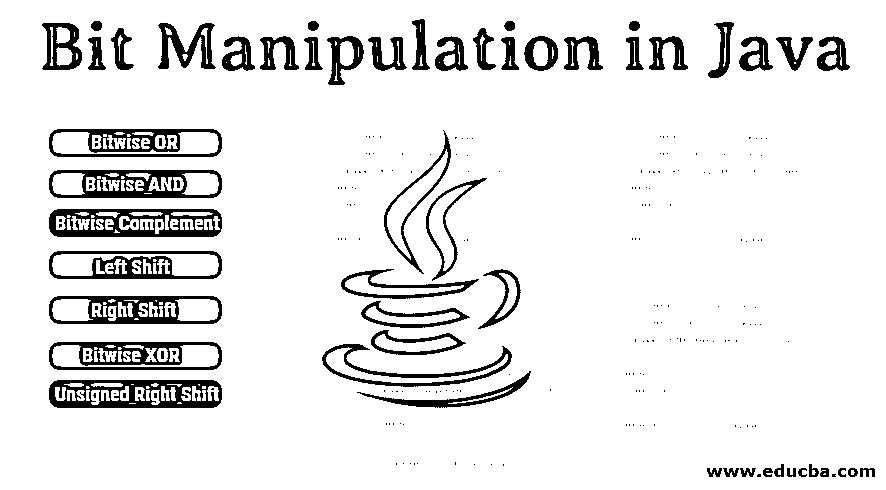
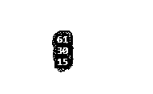
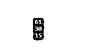

# Java 中的位操作

> 原文：<https://www.educba.com/bit-manipulation-in-java/>




## 比特操作简介

通常，程序员处理数据类型的变量，如 int、float、double、String 或数组、List、ArrayList 等集合。在某些情况下，程序员需要在字节和位级别更深入地研究数据，以提取和操作数据。像 Java 和 C#这样的语言允许您在位级别操作数据，这意味着您可以访问一个字节中的特定位。在这个主题中，我们将学习 Java 中的位操作。

当处理数据压缩和数据加密时，经常需要 Java 中的位操作，其中程序员需要在位级提取数据以编码、解码或压缩原始数据。在本文后面，我们将看到位操作的许多其他应用。

<small>网页开发、编程语言、软件测试&其他</small>

Java 支持 3 位移位和 4 位运算符来执行位级运算。这些运算符可用于整型(int、short、long 和 byte)以执行位级运算。

### Java 按位和位移运算符

以下是运算符:

| **操作员** | **描述** |
| & | 按位 AND |
| &#124; | 按位或 |
| ~ | 逐位补码 |
| << | 左移 |
| >> | 右移 |
| ^ | 按位异或 |
| >>> | 无符号右移 |

### Java 中的位操作运算符

让我们更详细地看看操作符。

#### 1.按位或

这是一个二元运算符，有两个操作数，用符号“|”表示。按位运算符比较两个操作数的相应位。如果任一操作数位为 1，则输出为 1；如果没有，则为 0。

**例子**

15 = 00001111(二进制)
27 = 00011011(二进制)
15 和 27 的按位或运算
00001111
| 00011011
_ _ _ _ _ _ _ _
0001111 = 31(十进制)

**Java 程序**

```
public class BitwiseOR {
public static void main(String[] args) {
int operand1 = 15, operand2 = 27, output = operand1 | operand2;
System.out.println(output);
}
}
```

**输出:** 


#### 2.按位 AND

这也是一个按位运算符，它接受两个操作数，用符号“&”表示。按位运算符比较两个操作数的相应位。如果两个操作数位都是 1，则输出是 1；否则，0。

**例子**

15 = 00001111(二进制)
27 = 00011011(二进制)
15 和 27 的按位与运算
00001111
| 00011011
_ _ _ _ _ _ _ _
00001011 = 11(十进制)

**Java 程序**

```
public class BitwiseAND {
public static void main(String[] args) {
int operand1 = 15, operand2 = 27, output = operand1 & operand2;
System.out.println(output);
}
}
```

**输出:** 


#### 3.逐位补码

与我们到目前为止讨论的其他两个操作符不同，它只接受一个操作数，并表示符号“~”。该运算符反转操作数的位。如果操作数位是 0，那么它将其转换为 1，反之亦然。

**例子**

15 = 00001111(二进制)
15
~ 00001111
_ _ _ _ _ _ _ _
11110000 = 240(十进制)

**Java 程序**

```
public class BitwiseComplement {
public static void main(String[] args) {
int operand= 15, output;
output= ~operand;
System.out.println(output);
}
}
```

**输出:** 


**Note:** When you run the Java program, you will get -16 as an output instead of 240 because the compiler shows 2’s complement of that number, i.e. negative notion of the binary number.
2’s complement of any number is equivalent to -(n+1), where n is the number whose 2’s complement is to be calculated. In our case, the 2’s complement of operand 15 is -16, which is the program’s output.

#### 4.按位异或

按位异或是一个二元运算符，它采用两个操作数，并用符号“^".”表示如果两个操作数的对应位不同，则该运算符比较两个操作数的对应位，如果不同，则输出 1，否则输出 0。

按位 XOR 运算符等效于(按位 OR +按位补码)

**例子**

15 = 00001111(二进制)
27 = 00011011(二进制)
15 和 27 的按位异或运算
00001111
^ 00011011
_ _ _ _ _ _ _ _
00010100 = 20(十进制)

**Java 程序**

```
public class BitwiseXor {
public static void main(String[] args) {
int operand1= 15, operand2 = 27, output;
output = operand1 ^ operand2;
System.out.println(output);
}
}
```

**输出:** 


#### 5.有符号左移

左移按位运算符将位模式左移操作数中指定的次数。左移运算符由符号“<

**例子**

123(二进制:01111011)
123 < < 1 计算结果为 246(二进制:011110110)
123 < < 2 计算结果为 492(二进制:0111101100)
123 < < 3 计算结果为 984(二进制:01111011000)

**Java 程序**

```
public class LeftShiftOperator {
public static void main(String[] args) {
int operand = 123;
System.out.println(operand << 1);
System.out.println(operand << 2);
System.out.println(operand << 3);
}
}
```

**输出:** 


#### 6.有符号右移位

有符号右移位运算符的工作方式与左移位运算符完全相同，只是它增加了 0 位，并被移位到高位。

**例子**

123(二进制:01111011)
123 > > 1 的计算结果为 61(二进制:00111101)
123 > > 2 的计算结果为 30(二进制:00011110)
123 > > 3 的计算结果为 15(二进制:0001111)

**Java 程序**

```
public class RightShiftOperator {
public static void main(String[] args) {
int operand = 123;
System.out.println(operand >> 1);
System.out.println(operand >> 2);
System.out.println(operand >> 3);
}
}
```

**输出:** 




#### 7.无符号右移

右移位运算符将零移位到操作数中指定的特定位数的最左边。

**Java 程序**

```
public class UnSignedRightShiftOperator {
public static void main(String[] args) {
int operand = 123;
System.out.println(operand >>> 1);
System.out.println(operand >>> 2);
System.out.println(operand >>> 3);
}
}
```

**输出:**




### 结论 Java 中的位操作

既然我们已经到了文章的结尾，让我们总结一下我们在这篇文章中讨论的要点。我们已经看到了什么是位操作及其不同的用例。我们还学习了不同类型的按位运算符(按位 AND、按位 OR、按位补码和按位 XOR)和位移运算符(有符号左移运算符、有符号右移运算符和无符号右移运算符)，以及解释各个运算符的示例和示例 Java 程序。

### 推荐文章

这是 Java 中的位操作指南。在这里，我们通过例子和 Java 程序及其输出来详细讨论 Java 按位和位移位操作符。您也可以阅读以下文章，了解更多信息——

1.  [什么是 Java 接口？](https://www.educba.com/what-is-java-interface/)
2.  [Java 工具](https://www.educba.com/java-tools/)
3.  [Python 框架](https://www.educba.com/python-frameworks/)
4.  [Java 中的布尔运算符](https://www.educba.com/boolean-operators-in-java/)


