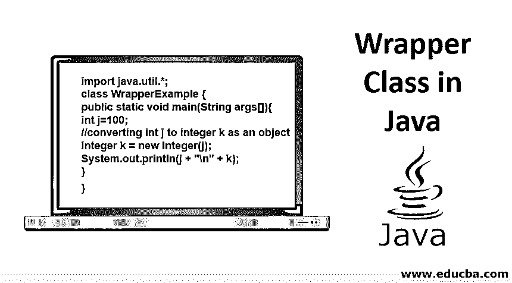
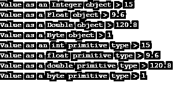

# Java 中的包装类

> 原文：<https://www.educba.com/wrapper-class-in-java/>




## Java 中包装类的介绍

包装类是 java.lang 库的一个重要类。包装器类对象为原始数据类型创建包装器。创建包装类的对象时，会在存储原始数据类型的内存中创建空间。包装类提供了一些将对象转换为原始数据和原始数据转换为对象的特性，例如装箱/拆箱。从对象到原始数据的转换&原始数据到对象的转换自动发生。原始数据类型指的是 int、float、char、double、byte 等。

**语法:**

<small>网页开发、编程语言、软件测试&其他</small>

下面给出的声明显示了包装类在 java 程序中是如何工作的。

**举例:**

```
int i = 100;
```

在下面的例子中，我们可以看到 I 是一个整数数据类型。有时在 java 中整数需要作为一种类型的对象来传递。在这种情况下，我们可以使用包装类将整数转换为对象。

**代码:**

```
Integer intVal = new Integer(i);
```

在上面给出的语法中，我们可以看到如何使用整数类对象将原始数据类型转换为对象。同样，我们可以说原始数据类型被包装成一个对象。

### Java 中包装类的使用

下面给出了包装类的几种用法:

*   包装类可用于将对象转换为原始数据类型，反之亦然。
*   包装类的使用提高了程序的性能。
*   包装类有助于对象的序列化，反之亦然。它可以将原始数据转换为对象。有时我们需要流式传输对象；在这种情况下，包装类可以将它们转换成序列化格式。
*   包装类提供了一些重要的方法，用于在集合中执行搜索和排序。
*   减法&加法，这些类型的操作不能修改包装类原始整数的旧值；这就是包装类被称为不可变的原因。
*   包装类用于多线程处理中，因为多线程处理需要一个对象来同步处理。包装类将不同的数据类型转换为一个对象。

在 JavaAPI 的基础上，包装类层次结构将 Object 放在不同原语类的顶部。数字、字符&布尔型出现在对象之后的第二层。Byte、Short、Int、Long、Float、Double 属于第三级的 Number 数据类型。

包装类使用以下两种[机制自动装箱&取消装箱](https://www.educba.com/autoboxing-and-unboxing-in-java/)，用于数据类型的转换/包装或将对象转换为原始数据类型。

*   **自动装箱:**自动装箱是指使用包装类将原始数据类型自动转换为对象。这就是所谓的自动装箱。在下面给出的例子中，int 被转换成整数对象&在例子 c 中，一个不同的原始数据类型被转换成相应的对象。
*   **拆箱:**拆箱是自动装箱的逆过程。将包装类对象自动转换为相应的原始数据类型称为拆箱。在下面给出的例子 b 中，Integer 对象被转换为 int 原始数据类型。

### Java 中包装类的例子

以下是 Java 中包装类的不同示例:

#### 示例#1

在下面给出的例子中，我们可以看到如何通过包装类从 int i 到 object k 进行手动转换。

**代码:**

```
import java.util.*;
class WrapperExample {
public static void main(String args[]){
int j=100;
//converting int j to integer k as an object
Integer k = new Integer(j);
System.out.println(j + "\n" + k);
}
}
```

**输出:**


在上面给出的例子中，我们可以清楚地看到转换是如何发生的。

#### 实施例 2

在下面给出的例子中，我们可以看到这种转换过程有时会自动发生，即所谓的自动装箱。

**代码:**

```
import java.util.*;
class AutoboxingUnboxingExample {
public static void main(String args[]){
int j = 500;
ArrayList<Integer> arrValues = new ArrayList();
arrValues.add(j);  // autoboxing takes place implicitly
System.out.println(arrValues.get(0));
}
}
```

**输出:**

<u>

</u> 

在上面给出的例子中，int 值作为一个对象被隐式地转换成一个对象。此外，这个值可以从 ArrayList 中获得。

#### 实施例 3

在这个例子中，我们将完成拆箱的实现。拆箱是自动装箱的反向过程。

**代码:**

```
import java.util.*;
class AutoboxingUnboxingExample {
public static void main(String args[]){
ArrayList<Integer> arrValues = new ArrayList();
arrValues.add(250);
//unboxing here as int data type from Integer object
int k = arrValues.get(0);
//value printed is in primitive data type
System.out.println(k);
}
}
```

**输出:**


在上面给出的例子中，ArrayList 对象字段被转换成 k 原始数据类型，即 int k

#### 实施例 4

下面给出的例子包含了自动装箱和取消装箱的所有细节。

**代码:**

```
import java.util.*;
class WrapperConversionExample {
public static void main(String args[]){
int i = 15;
float j = 9.6f;
double k = 120.8;
byte l = 1;
//creating instance of Integer object
Integer iObj = new Integer(i);
//creating instance of Float object
Float fObj = new Float(j);
//creating instance of Double object
Double dObj = new Double(k);
//creating instance of Double object
Byte bObj = new Byte(l);
//value printed is in object
System.out.println("Value as an Integer object > " + iObj);
System.out.println("Value as a Float object > " + fObj);
System.out.println("Value as a Double object > " + dObj);
System.out.println("Value as a Byte object > " + bObj);
//primitive data type from the object
int m = iObj;
float n = fObj;
double o = dObj;
byte p = bObj;
//value printed is in primitive data type
System.out.println("Value as an int primitive type > " + m);
System.out.println("Value as a float primitive type > " + n);
System.out.println("Value as a double primitive type > "+ o);
System.out.println("Value as a byte primitive type > " + p);
}
}
```

**输出:**




在上面给出的程序中，我们可以看到包装类的实现。包装类将原始数据类型转换为 object & object 原始数据类型。包装类为每个原始数据类型提供了单独的类。

### 结论

通过包装器类，我们可以很容易地理解自动装箱和取消装箱是如何从原语到对象进行转换的，反之亦然，这可以通过包装器类很容易地理解。对于每一种原始数据类型，java 中都有一个专用的类。

### 推荐文章

这是一个 Java 包装类的指南。这里我们讨论 Java 中包装类的语法和用法，以及不同的例子和代码实现。您也可以浏览我们推荐的其他文章，了解更多信息——

1.  [Java 中的 Case 语句](https://www.educba.com/case-statement-in-java/)
2.  [Java 中什么是泛型？](https://www.educba.com/what-is-generics-in-java/)
3.  [Java 中的序列化](https://www.educba.com/serialization-in-java/)
4.  [Java 8 大面试问题](https://www.educba.com/java-8-interview-questions/)


