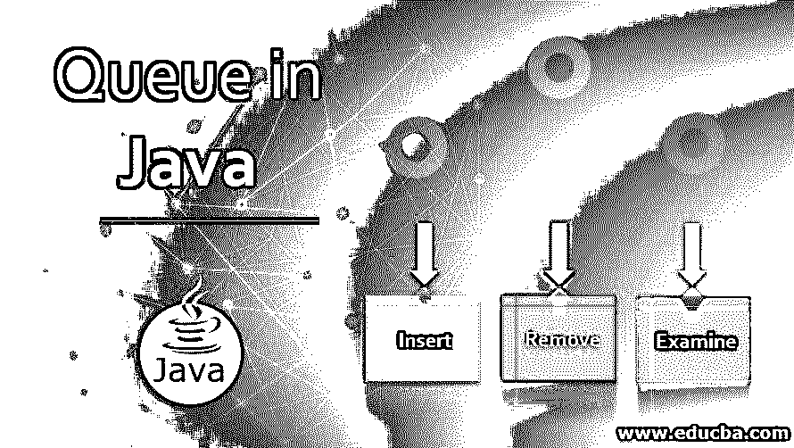

# Java 中的队列

> 原文：<https://www.educba.com/queue-in-java/>




## Java 中队列的介绍

队列是一种基于先进先出(FIFO)原则的数据结构。它用于按照对象到达的顺序保存要处理的对象；这和排队的人排的队很像。由于 Java 以集合接口的形式为数据结构提供了大量的[支持，因此队列是集合接口中可用的接口。它扩展了集合接口。它在 java.util 包中可用，支持所有在](https://www.educba.com/what-is-data-structure/)[集合接口中可用的操作，以及一些额外的](https://www.educba.com/collection-interface-in-java/)提取、插入和检查操作。

**语法:**

<small>网页开发、编程语言、软件测试&其他</small>

```
Interface Queue<E>
```

由于 Queue 是一个接口，而不是一个类，它不能被直接实例化。从声明中可以看出，队列接受与集合类似的泛型值，我们可以向它传递任何类型的对象。Java 有多个队列接口的[实现，我们可以在使用队列时使用它们。它们是 LinkedList 和 PriorityQueue。](https://www.educba.com/java-queue-interface/)

队列可以声明如下:

```
Queue< Object > q = new LinkedList<>();
```

```
Queue< Object > q = new PriorityQueue<>();
```

### Java 中队列是如何工作的？

*   如前所述，队列接口扩展了集合接口；因此，它支持其中所有可用的基本操作方法。
*   LinkedList 、 [PriorityQueue 等实现](https://www.educba.com/priorityqueue-in-java/)[实现了](https://www.educba.com/linkedlist-in-java/)特定于队列的方法，这些方法在队列接口中声明。
*   LinkedList 将元素作为 LinkedList 的标准，即按照插入顺序。而 PriorityQueue 保持插入元素的自然顺序。
*   注意，这两个实现都不是线程安全的，[为此，Java 提供了](https://www.educba.com/what-is-java/)另一个名为 PriorityBlockingQueue 的实现，它是线程安全的。

**Java 中的队列成员类型**

*   由于队列是一个接口，它只包含所有抽象方法，不包含任何数据成员。
*   队列只提供了一种定义操作的方法，这些操作是在子类中实现的。

### Java 中的队列函数

*   由于队列支持 FIFO 结构，它允许从一端插入元素，并从另一端(前端)移除元素。
*   这是队列支持的两个基本操作。
*   队列中所有可用的方法可以分为两类；第一种类型的方法在操作失败的情况下抛出异常，例如没有找到元素，而在第二种类型的方法中，在操作失败的情况下返回任何特定的值，例如 null 或 false，而不是 exception。
*   队列概念中有一个头，它总是代表队列中的第一个元素；拆除时，将首先拆除该头元件。

**以下是队列中所有可用的方法:**

|  | **返回特殊值** | **抛出异常** |
| 插入 | 要约(e) | 添加(e) |
| 去除 | 投票() | 移除() |
| 考试 | peek() | 元素() |

如前所述，有两种方法会抛出异常并返回特殊值。这种操作有三种类型:一是插入，二是移除，三是检索或检查。在 remove 操作的情况下，对象将实际上从队列中移除，但是在 examine 操作的情况下，对象将被返回，而不是实际上从队列中移除。

### Java 中队列的例子

下面给出了 Java 中不同的队列示例:

#### 示例# 1–使用 LinkedList 实现添加操作

**代码:**

```
import java.util.LinkedList;
import java.util.Queue;
public class QueueOperations {
public static void main(String[] args) {
Queue<Integer> q = new LinkedList<Integer> ();
q.add(5);
q.add(2);
q.add(1);
q.add(4);
q.add(3);
System.out.println(q);
}
}
```

**输出:**


请注意，插入的顺序与从左到右输出的顺序相同。

#### 例 2–让我们一个接一个地删除添加的元素

**代码:**

```
import java.util.LinkedList;
import java.util.Queue;
public class QueueOperations {
public static void main(String[] args) {
Queue<Integer> q = new LinkedList<Integer> ();
q.add(5);
q.add(2);
q.add(1);
q.add(4);
q.add(3);
System.out.println(q);
while (!q.isEmpty()) {
System.out.print(q.remove() + " ");
}
System.out.println("");
System.out.println(q);
}
}
```

**输出**:


这里，我们使用函数 isEmpty()来检查删除元素后队列何时变空。移除顺序与插入顺序相同。我们已经打印了删除所有元素后的队列；这就是为什么我们最终会得到一个空括号。

#### 示例# 3–优先级队列上的插入和移除操作

**代码**:

```
import java.util.PriorityQueue;
import java.util.Queue;
public class QueueOperations {
public static void main(String[] args) {
Queue<Integer> q = new PriorityQueue<Integer> ();
q.add(5);
q.add(2);
q.add(1);
q.add(4);
q.add(3);
System.out.println(q);
while (!q.isEmpty()) {
System.out.print(q.remove() + " ");
}
System.out.println("");
System.out.println(q);
}
}
```

**输出**:


这里，我们使用了 PriorityQueue，它将根据元素的自然顺序或比较器(如果有传递的话)保存并返回元素。注意插入顺序和移除顺序不同。移除完全基于元素的值。

#### 示例 4–检查 LinkedList 上的操作

**代码:**

```
import java.util.LinkedList;
import java.util.Queue;
public class QueueOperations {
public static void main(String[] args) {
Queue<Integer> q = new LinkedList<Integer> ();
q.add(5);
q.add(2);
q.add(1);
q.add(4);
q.add(3);
System.out.println(q);
System.out.println( q.peek() );
System.out.println(q);
}
}
```

**输出**:


请注意，我们使用了 peek()函数，该函数将返回队列的头部，而不会实际删除它。我们在 peek 操作后打印了队列，可以看到 head 元素(即 5)没有从队列中删除。

#### 示例 5–检查 PriorityQueue 上的操作

**代码:**

```
import java.util.PriorityQueue;
import java.util.Queue;
public class QueueOperations {
public static void main(String[] args) {
Queue<Integer> q = new PriorityQueue<Integer> ();
q.add(5);
q.add(2);
q.add(1);
q.add(4);
q.add(3);
System.out.println(q);
System.out.println( q.peek() );
System.out.println(q);
}
}
```

**输出**:


这类似于上一个示例的 LinkedList 操作，但是注意 head 元素是 1，因为它是 PriorityQueue。

### 结论

队列是 Java 中的一个特殊接口，用于按照插入顺序保存元素。它支持插入、检索和删除等操作。所有方法都有可供选择的方法。我们已经看到了队列操作中最常用方法的例子。

### 推荐文章

这是一个 Java 中的队列指南。这里我们讨论 java 中队列的介绍、功能、工作和不同的例子。您也可以看看以下文章，了解更多信息–

1.  [Java 中的 StringBuffer 类](https://www.educba.com/stringbuffer-class-in-java/)
2.  [Java 适配器类](https://www.educba.com/java-adapter-classes/)
3.  [Java 中的 Else-If 语句](https://www.educba.com/else-if-statement-in-java/)
4.  [c#中的队列](https://www.educba.com/queue-in-c-sharp/)


