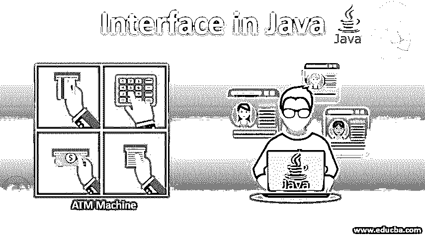

# Java 接口

> 原文：<https://www.educba.com/interface-in-java/>




## Java 中的接口介绍

接口是用户和系统设备之间交互的媒介。举个例子，在我们的现实生活中，如果我们考虑要举例的接口是空调、自行车、ATM 机等。同样，在 Java 中，接口也起着同样的作用；它被认为是系统和终端用户之间的交互媒介。然而，java 中接口的主要目标是通过对用户隐藏实际的实现来实现 100%的抽象，从而使应用程序对用户友好。因此，它基本上由静态、抽象和最终方法组成。

**语法:**

<small>网页开发、编程语言、软件测试&其他</small>

```
interface <interface name> {
// declare constant variables
// declare abstract methods
// declare default modifier
// by default
}
```

### 我们为什么需要它？

我们需要它有三个主要原因。

*   第一个需求是使应用程序非常用户友好，这可以通过使两个不同的系统通过接口平稳地相互通信来实现[即，使一个 java 应用程序与大型机系统接口对话。
*   应用程序将得到增强、优化和简化，因为其内部实施与最终用户无关。
*   最重要的是，应用程序变得安全了，因为抽象后的实现对外界是隐藏的，因此也保持了安全性。
*   多重继承的功能也变得可支持。
*   因为它通常被定义为是一种关系，所以它被用来实现松散耦合。

**Note:** JAVA SE 8 brings some improvisation in a way that the compiler adds some more keywords before the interface method. As an add on it adds public and abstract keywords before the interface method. Also, it adds static, public (by default), and final keywords before data members.

### Java 中的接口是如何工作的？

如果我们从更大的角度来看 java，那么接口在任何服务需求规范被认为是接口的过程中扮演着关键的角色。期望将一组服务交付给最终用户的客户端观点被称为接口，而从服务提供者的角度来看，所提供的一组服务被称为接口。

因此，正如前面提到的真实例子，java 中的接口只不过是客户端和服务提供者之间的契约。抽象类由抽象类和普通方法或非抽象类组成，但接口的情况不同。它确实帮助应用程序的主框架使它们变得安全，并且变得对用户友好。它维护 IS-A-Relationship，这也有助于使类之间的继承和扩展成为可能，从而提供可见性。

**Note:** There is a special type of [interface also used](https://www.educba.com/php-interface/) known as Marker Interface. A Marker interface is nothing but a type of interface which does not have any member. They are just used to give relevant information provided by the JVM to the methods or the variables at the time of need. An example of a Marker interface Is Serialization, cloning, Remote, etc., and it is also known as Taggable Interface.

嵌套接口是另一种类型的接口，我们可以通过它的名字来暗示它是接口中的接口，它也是嵌套类的[部分。](https://www.educba.com/nested-class-in-java/)

### 如何在 Java 中声明接口？

通过声明接口关键字:我们可以用接口关键字声明一个接口，用实现关键字实现它。

**举例:**

```
interface Interf
{
void m1();   // by default public abstract void m1();
voidm2();
}
```

**Note:** Whether we are declaring or not, every method by default is public or abstract.

#### 接口在 Java 中的实现

java 中的接口实现是通过使用 implements 关键字来执行的。

```
interface Interfc
{
void m1();
void m2();
}
abstract class ServiceProvider implements Interfc
{
public void m1()
{
}
}
```

因此，如果一个类强制实现一个接口，我们应该为该接口的每个方法提供一个实现；否则，该类必须声明为抽象类。如果一个接口被实现，它必须声明这个接口是公共的；否则，它会抛出一个错误，说是编译时错误。

然后，接口声明和实现还有一个更重要的方面要遵循。

**Note:** At a time, a class can implement any number of interfaces simultaneously and can extend only one class.

### 用 Java 实现接口的例子

以下是在不同场景下用 java 实现接口的示例:

#### 示例#1

**代码:**

```
public class Cat implements Animal {
public interface Animal
{
public void animalRuns ();
public void Sleep ();
}
public void animalRuns ()
{
System.out.println("The cat says meow meow");
}
public void Sleep()
{
System.out.println("cat sleeps");
}
public static void main(String[] args)
{
Cat myCat = new Cat();
myCat.animalRuns();
myCat.Sleep();
}
}
```

**输出:**


上面的输出试图证明接口必须由另一个类使用 implements 关键字而不是 extends 关键字来实现。

#### 实施例 2

**多个接口的实现:**

**代码:**

```
public class DemoClass implements frstInterface, secInterface {
public interface frstInterface
{
public void myMethod ();
}
public interface secInterface
{
public void scnInterface();
}
public void scnInterface () {
System.out.println("Some random Text");
}
public void myMethod() {
System.out.println("Some useful Text");
}
public static void main (String[] args) {
DemoClass myDemo = new DemoClass();
myDemo.myMethod();
myDemo.scnInterface();
}
}
```

**输出:**


#### 实施例 3

一旦一个类可以实现一个接口，一个接口也可以扩展另一个接口。

**代码:**

```
public class TestImpl4 implements showble
{
public interface Printable
{
void print();
}
public interface showble extends Printable
{
void show();
}
public void print()
{
System.out.println("Hello");
}
public void show()
{
System.out.println("Welcome to the project");
}
public static void main(String[] args)
{
TestImpl4 obj = new TestImpl4();
obj.print();
obj.show();
}
}
```

**输出:**


### 结论

很多时候，人们会混淆抽象类和接口，但它们是不同的。一个接口只包含一个抽象方法，但是 java 8 可以容纳默认和静态方法，就像附加组件一样。接口给出了它的 100%并且可以实现完全抽象，但是抽象类却不是这样，它只提供部分抽象。

### 推荐文章

这是一个 Java 界面指南。这里我们讨论 java 中的介绍和接口如何工作，以及实现接口的例子。您也可以阅读以下文章，了解更多信息——

1.  [Java 接口 vs 抽象类](https://www.educba.com/java-interface-vs-abstract-class/)
2.  [Java 中的对象克隆](https://www.educba.com/object-cloning-in-java/)
3.  [Java 持续时间](https://www.educba.com/java-duration/)
4.  [Java 流过滤器](https://www.educba.com/java-stream-filter/)


