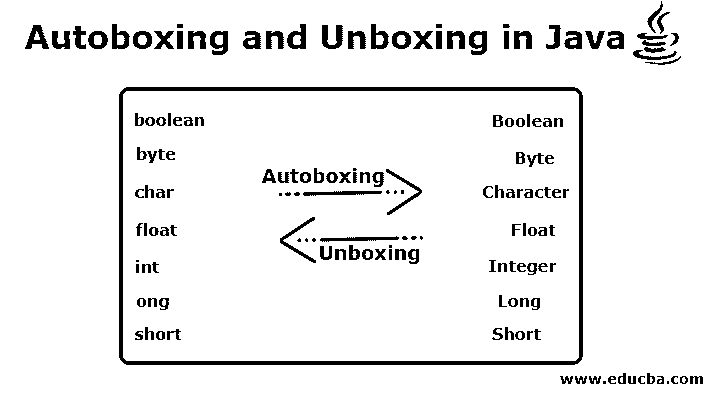

# Java 中的自动装箱和拆箱

> 原文：<https://www.educba.com/autoboxing-and-unboxing-in-java/>




## Java 自动装箱和拆箱简介

自动装箱是 Java 编译器在原语类型和它们对应的对象包装类之间的自动转换，即从 int 到 Integer、double 到 Double 等的转换。拆箱是从包装类对象到它们的等价原语的自动转换[，即从整数到整数。这个特性是在 java 的 1.5 版本中引入的，autoboxing 和 unboxing 是由 JRE 处理的自动进程；这里最重要的一点是编写适当的代码，不要在图片中添加过多的、不必要的对象。](https://www.educba.com/wrapper-class-in-java/)

### Java 中自动装箱和拆箱是如何工作的？

编译器使用 valueOf()方法在内部将原语转换为相应的包装对象(即自动装箱)，反之亦然，它使用 intValue()、doubleValue()等。比如拆箱的范例。

<small>网页开发、编程语言、软件测试&其他</small>

作为参考，下面提到了 java 中的包装器和原语映射

| **原始类型** | **包装类** |
| 布尔型 | 布尔代数学体系的 |
| 字节 | 字节 |
| 茶 | 字符 |
| 漂浮物 | 浮动 |
| （同 Internationalorganizations）国际组织 | 整数 |
| 长的 | 长的 |
| 短的 | 短的 |
| 两倍 | 两倍 |

### 例子

现在让我们获取一个整数数组列表，然后利用取消装箱的概念。

```
import java.util.ArrayList;
public class MyClass {
public static void main(String args[]) *{*
ArrayList<Integer> intlist = new ArrayList<Integer>();
//wrapper Integer objects being added here
intlist.add(1);
interest.add(2);
//auto-unboxing is happening here
int x = intlist.get(0);
System.out.println(x);
}
}
```

因此，在上面的例子中，当把值加到 x 上时，我们看到 x 看起来是原始的，所以在这个赋值完成时，取消装箱在这里自动发生。

```
public class MyClass {
public static void main(String args[]) {
Integer sum =0;
for(int i=0;i<10;i++)
{
sum = sum + i;
}
System.out.println(sum);
}
}
```

*   就在上面，我们已经展示了在这种情况下的示例 2，其中已经呈现了典型的场景。如果您熟悉 java 中的对象创建，您可以看到“Integer sum =0”声明了一个对象，当我们在 for 循环中进行计算时，我们可以看到原始值“I”被添加到包装器“sum”中。
*   因此，可以发现，首先将发生从包装器到原语的转换，因为“+”操作符只对原语起作用，因此对象拆箱将首先发生，然后计算将发生，然后对象自动装箱将再次发生，然后值将被赋给变量“sum”。
*   这给 JVM 带来了不必要的开销，因为许多中间整数对象将被创建和销毁(稍后将被垃圾收集)，从而可能会出现速度变慢，因此应该小心处理这些逻辑。
*   现在让我们看看不同于一般理解的条件，并且将有一些代码，在这些代码中，理解自动装箱和取消装箱变得非常重要—

考虑下面的代码片段；你认为这会产生什么结果？

```
public class Main
{
public static void main(String[] args) {
Integer m = 34123;
Integer x = 34123;
System.out.println(x==m);
}
}
```

*   如果你说“真”，那么你就是“假”，因为输出也是“假”，这是因为我们可以像这样比较从-128 到 127 的整数范围，对于超出这个范围的值，它们将被取消装箱。
*   因此我们需要比较上述整数的 int value()；目前，编译器使用 valueOf()属性来完成这项工作。
*   很可能，如果这在上面引用的范围内，那么上面的代码将给出 true，因为它将首先引用 integer literal 池进行比较。

```
public class Main
{
public static void main(String[] args) {
Integer m = 100;
Integer x = 100;
System.out.println(x==m);
}
}
```

这将评估为“真”值，因为 100 存在于文字池中。

### Java 中方法重载的自动装箱和拆箱

*   在我们将自动装箱和取消装箱标记为方法重载之前，我们假设读者熟悉方法重载的概念；我们将只给出一点点见解，要了解更多信息，请参考 Oracle 的相关文档。
*   方法重载是一个过程，其中相同的方法名与不同数量的输入参数、不同数据类型的同名变量等一起使用。通常用于表示任何计算方法多种变型。
*   让我们举一个例子来更深入地理解它，我们也将呈现这次出现在图片中的输出—

```
public class Main
{
public static void main(String[] args) {
Overload obj =  new Overload();
int i =5;
obj.printval(5);
Integer m = i;
obj.printval(m);
}
}
class Overload
{
public void printval(int i)
{
System.out.println("printing the unboxed value "+ i);
}
public void printval(Integer i)
{
System.out.println("printing the autoboxed value "+ i);
}
}
```

**输出:**


**Note:** You can execute the above program in any of the IDEs to have the above-placed output.

*   因此，上述行为清楚地表明了自动装箱技术在重载概念中的重要用途，并且在编码时应该小心使用[。](https://www.educba.com/what-is-coding/)

### Java 中自动装箱和取消装箱的优势

*   适当的转换由编译器自动完成。
*   开发人员应该编写更少的代码，从而更干净的代码。
*   不需要手动类型转换表达式。

### 结论

我们看到了自动装箱和取消装箱的用例，这个概念是如何隐含的，以及它在哪里可以产生优点和缺点。编码时必须小心使用；否则，它会增加不必要的计算转换开销；因此，转换应该在原语中完成，以避免过多的垃圾收集开销和过多的临时对象创建。我们还看到了使用 java 重载概念的自动装箱用例；除此之外，您还可以检查更多的约束。

### 推荐文章

这是 Java 中自动装箱和拆箱的指南。这里我们也讨论一下什么是 java 中的自动装箱和拆箱？它是如何通过一些示例代码在内部工作的？您也可以浏览我们推荐的其他文章，了解更多信息——

1.  什么是 JDBC？
2.  [Java 中什么是泛型？](https://www.educba.com/what-is-generics-in-java/)
3.  [Groovy vs Java](https://www.educba.com/groovy-vs-java/)
4.  [什么是 Java 继承？](https://www.educba.com/what-is-java-inheritance/)


