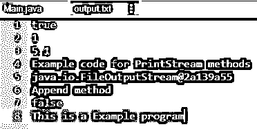

# Java PrintStream

> 原文：<https://www.educba.com/java-printstream/>


## Java PrintStream 简介

Java PrintStream 能够打印许多数据值的描述，并为不同的输出流添加了功能。打印流的特点是，它不像其他输入流那样抛出 IOException，而是在内部设置一个标志来指示发生了异常，可以使用 checkError 方法对其进行测试(这仅在异常情况下发生)。它也可以被创建为自动冲洗。

字符被转换为 PrintStream 使用平台的内置字符编码生成的字节。因此，这个 PrintWriter 类用于需要为 int、long 等写字符而不是字节的地方。

<small>网页开发、编程语言、软件测试&其他</small>

**语法:**

```
public class PrintStream
extends FilterOutputStream
implements Appendable, Closeable
```

如图所示，PrintStream 从 FilterOutputStream 类继承而来，从该类实现的接口是可追加和可关闭的。

### Java PrintStream 的构造函数

以下是 PrintStream 函数使用的构造函数和描述:

*   **PrintStream(File file，String csn):** 用给定的文件和字符集创建一个新的打印流，不进行任何自动刷新。
*   **print stream(File File):****这也用指定的文件创建了一个新的打印流。这也没有自动冲洗。**
***   **PrintStream(OutputStream out，boolean autoFlush):** 这也创建了一个新的打印流。*   **print stream(output stream out):**只接受一个参数，创建一个新的打印流。*   **PrintStream(字符串文件名):** 接受文件名作为输入参数，并创建一个新的打印流，无需提供自动行刷新。*   **PrintStream(OutputStream out，boolean autoFlush，String encoding):**
    它接受如图所示的 3 个输入参数，并创建一个新的打印流。*   **PrintStream(String fileName，String chs):** 这也创建了一个新的打印流，它没有使用给定的文件名和字符集进行自动行刷新。**

 **#### 使用的方法列表

**1。PrintStream append(char a):** 这个方法用于将给定的字符附加到输出流中

**语法:**

```
public PrintStream append(char a)
```

必需的参数:它将输入参数作为字符类型 a-追加到 16 位字符。
Returns:输出流

**2。PrintStream appfin(char sequence CHS，int st，int fin):** 这个函数需要 3 个参数，并且将给定的字符序列附加到这个输出流中。

**语法:**

```
public PrintStream appfin(CharSequence chs,
int st,
int fin)
```

**所需参数:**

*   **chs:** 输入字符序列由此取出，这里会追加一个子序列。
*   st: 表示子序列中第一个字符的索引。
*   **fin:** 表示子序列中最后一个字符的索引。
*   **返回:**输出流。
*   **抛出:**类似 IndexOutOfBoundsException 的异常。

**3。PrintStream append(char sequence CHS):**这个方法用于将给定字符序列的子序列附加到这个输出流中。
**语法:**

```
public PrintStream append(CharSequence chs)
```

**所需参数:**

*   **chs:** 需要追加的字符序列。
*   **返回:**输出流。

**4。Boolean checkError():** 这用于刷新流并获取其错误状态。

**语法:**

```
public boolean checkError()
```

**返回参数:**仅当该流遇到 IOException
时返回布尔值 true，如果遇到任何其他异常，如 InterruptedIOException，或者调用了 setError 方法，则返回 false。

**5。protected void clearError():** 这个方法用于清除流的任何内部错误状态。
语法:

**6。受保护的 void clearError()**

**7。void flush():** 另一个没有返回参数的函数，用于刷新流。
语法:

**8。public void flush():** 这个方法覆盖了 FilterOutputStream 类的 flush 函数

**9。void close():** 用于关闭流的基本方法。

**语法:**

```
public void close()
```

此方法覆盖 FilterOutputStream 类的 close()函数

10。PrintStream format(Locale loc，String fr，Object… arg): 该函数用于写入一个字符串，该字符串使用给定的格式字符串和参数格式化为输出流。

**语法:**

```
public PrintStream format(Locale loc,
String fr,
Object... arg)
```

**所需参数:**

*   **loc:** 我们在格式化过程中使用的语言环境。如果该值为空，则无需应用本地化。
*   **arg:** 所有的形式说明符都将这些参数用作格式字符串中的引用。这里传递的参数可以从零到很多。
*   **返回参数:**输出流。抛出两种异常 IllegalFormatException 和 NullPointerException

**11。PrintStream format(String for，Object… args):** 用于使用给定的格式字符串和参数将格式化字符串写入输出流。

**语法:**

```
public PrintStream format(String for,
Object... args)
```

**所需参数:**

*   **for:** 根据语法格式化字符串
*   **args:** 输入如上所述的参数，它们的范围可以从零到许多
*   **返回参数:**输出流。抛出两种异常 IllegalFormatException 和 NullPointerException

### 实现 Java PrintStream 的示例

下面是一个 Java PrintStream 的例子。首先，让我们举一个基本的例子来理解上面讨论的 PrintStream 的不同方法。

**代码:**

```
import java.io.*;
import java.util.Locale;
//Java code to display different methods of Printstream
public class Main
{
public static void main(String args[]) throws FileNotFoundException
{
// Creating an output file to write the output
FileOutputStream file=new FileOutputStream("output.txt");
// Creating object of PrintStream
PrintStream op=new PrintStream(file);
String str="Example";
// Writing below to output.txt
char a[]={'F','I','R','S','T'};
// Example for print(boolean b) method
op.print(true);
op.println();
// Example for print(int a) method
op.print(1);
op.println();
// Example for print(float f) method
op.print(5.10f);
op.println();
// Example for print(String str) method
op.print("Example code for PrintStream methods");
op.println();
// Example for print(Object ob) method
op.print(file);
op.println();
// Example for append(CharSequence chs) method
op.append("Append method");
op.println();
//Example for checkError() method
op.println(op.checkError());
//Example for format() method
op.format(Locale.US, "This is a %s program", str);
//Example for flush method
op.flush();
//Example for close method
op.close();
}
}
```

**输出:**




**解释:**这个例子生成一个输出文件，我们通过将所有方法相关的输出写入 output.txt 文件来显示它们。如果文件不存在，这会创建一个文件，因此输出在 IDE 中不可见。我们首先在这里创建一个 PrintStream 对象，然后使用它来展示所有方法的功能，如 print(boolean b)、print(int I)、print(float f)、print(String s)和代码中显示的其他方法。

### 结论

因此，如上所述，java 中的 PrintStream 主要用于将格式化数据写入输出流。命名是根据它的功能完成的，它将原始值(如 int、long)格式化为文本，就像它们在屏幕上显示时的外观一样。

### 推荐文章

这是一个 Java PrintStream 的指南。这里我们讨论 Java PrintStream 及其不同构造函数的介绍，并给出一个例子。您也可以浏览我们推荐的其他文章，了解更多信息——

1.  [JavaScript 数学函数](https://www.educba.com/javascript-math-functions/)
2.  [Java 中的布局](https://www.educba.com/layout-in-java/)
3.  [Java 编译器](https://www.educba.com/java-compilers/)
4.  [Java 中的合并排序](https://www.educba.com/merge-sort-in-java/)


**