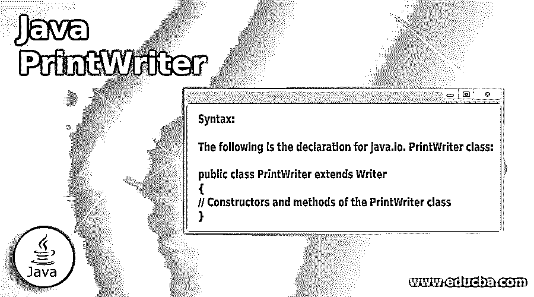
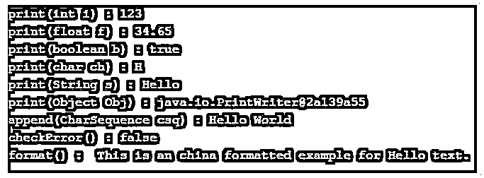

# Java PrintWriter

> 原文：<https://www.educba.com/java-printwriter/>




## Java PrintWriter 简介

java PrintWriter 类用于将格式化表示中的对象打印到文本输出流中。PrintWriter 类是 java 中的内置类，它定义了 java.io.PrintWriter 包。Writer 类是 PrintWriter 的超类。PrintWriter 类允许将格式化对象写入底层 Writer 类，例如，将 int、double、long 和其他原始对象或数据写入文本中，而不是写入字节值中。PrintWriter 类将所有打印方法实现为 PrintStream，但写入原始字节的方法除外。由于 PrintWriter 类旨在编写文本，因此生成混合数字和文本的报告非常有用。

**语法:**

<small>网页开发、编程语言、软件测试&其他</small>

以下是 java.io. PrintWriter 类的声明:

```
public class PrintWriter extends Writer
{
// Constructors and methods of the PrintWriter class
}
```

以上是 PrintWriter 的语法，这里扩展到了 Writer 类。

### Java PrintWriter 类的构造函数

下面给出了提到的构造函数:

*   **PrintWriter(File file):** 这些构造使用指定的文件创建 PrintWriter 的新实例，并且该实例不是 automat 行刷新。
*   **PrintWriter(File file，String ch):** 这些构造使用指定的文件 charset 创建 PrintWriter 的新实例，而不是自动行刷新。
*   **PrintWriter(OutputStream out):**这些构造从现有的 output stream 创建 PrintWriter 的新实例，并且它不是 automat 行刷新。
*   **PrintWriter(OutputStream out，booleanautoFlush):** 这些构造从现有的 OutputStream 创建 PrintWriter 的新实例。
*   **PrintWriter(String fName):**这些构造使用指定的文件名创建 PrintWriter 的新实例，该实例不是 automat line flush。
*   **PrintWriter(String fileName，String csn):** 这些构造用指定的文件名和字符集创建 PrintWriter 的新实例，它不是 automat 行刷新。
*   **PrintWriter(Writer out):** 这些构造创建了 PrintWriter 的新实例，这不是自动的行刷新。
*   **PrintWriter(Writer out，booleanautoFlush):** 这些构造创建了 PrintWriter 的新实例。

### Java PrintWriter 类的方法

下面给出了一些方法:

*   **public void print(Object obj):**这个方法打印一个对象。
*   **public void println(boolean x):**这个方法打印布尔值。
*   **public void println(char[]x):**这个方法打印一个字符数组。
*   **public void println(int x):** 这个方法打印一个整数。类似的方法打印所有不同的图元对象。
*   **public printwriterappand(char ch):**该方法将传递字符追加到编写器。
*   **public PrintWriterappend(CharSequencechseq):**这个方法将指定的字符序列追加到编写器中。
*   **public printwriterapend(CharSequencech，int start，int end):** 该方法将传递字符的子序列追加到编写器中。
*   **public booleancheckError():**该方法检查其错误状态并刷新流。
*   **public protected void clear error():**此方法清除流的内部错误状态。
*   **public protected void setError():**这个方法表示发生了错误。
*   **public PrintWriterformat(字符串格式，对象..args):** 此方法使用传递的格式字符串和参数将格式化字符串写入此编写器。
*   **public void flush():** 这个方法刷新流。
*   **public void close():** 这个方法关闭流。

### Java PrintWriter 的示例

下面是提到的例子:

#### 示例#1

这里，我们使用 PrintWriter 类构造函数创建一个 PrintWriter 对象，并传递要写入其中的文件名。

**代码:**

```
package p1;
import java.io.File;
import java.io.PrintWriter;
public class Demo
{
public static void main( String[] arg) {
try {
//create the new instance of PrintWriter with the specified file
PrintWriter pw =null;
pw = new PrintWriter(new File("D:\\data.txt"));
pw.write("This ia an example text for PrintWriter."+"\n");
pw.write("This ia an example number for PrintWriter :" +(int)563+ ".");
pw.flush();
pw.close();
System.out.println("Print writer done. you can open the file.");
}catch(Exception e)
{
System.out.println(e);
}
}
}
```

**输出:**


当我们打开文件时，我们可以看到文件的内容如下:


和上面的代码一样，在 PrintWriter 类及其构造函数的帮助下，打开文件“data.txt”写入一些数据。

#### 实施例 2

这里我们使用 PrintWriter 类构造函数创建一个控制台的 PrintWriter 对象，该对象是 System.out，并在控制台上写入。

**代码:**

```
package p1;
import java.io.File;
import java.io.PrintWriter;
import java.util.Locale;
public class Demo
{
public static void main( String[] arg) {
String str="Hello";
String str2=" World";
char ch='H';
try {
//create the new instance of PrintWriter to System.out
PrintWriter pw =null;
pw = new PrintWriter(System.out);
pw.print("print(inti) : "+ 123);
pw.println();
pw.print("print(float f) : " +34.65f);
pw.println();
pw.print("print(boolean b) : " +true);
pw.println();
pw.print("print(char ch) : "+ch);
pw.println();
pw.print("print(String s) : "+str);
pw.println();
pw.print("print(Object Obj) : " +pw);
pw.println();
pw.print("append(CharSequencecsq) : ");
pw.append(str);
pw.append(str2);
pw.println();
pw.println("checkError() : " +pw.checkError());
pw.print("format() : ");
pw.format(Locale.CHINA, " This is an china formatted example for %s text.",str);
pw.flush();
pw.close();
}catch(Exception e)
{
System.out.println(e);
}
}
}
```

**输出:**




就像上面的代码一样，用 PrintWriter 类的构造函数和方法将一些我们可以在输出中看到的数据写到 out 控制台(System.out)中。

### 结论

PrintWriter 类是 java 中的内置类，在 java.io.PrintWriter 包中定义，用于将格式化表示形式的对象打印到文本输出流中。PrintWriter 类是 Writer 类的子类。

### 推荐文章

这是一个 Java PrintWriter 的指南。这里我们讨论 java PrintWriter 的介绍，构造函数，方法和例子，以便更好的理解。您也可以看看以下文章，了解更多信息–

1.  [终于在 Java 中](https://www.educba.com/finally-in-java/)
2.  [爪哇的 EJB](https://www.educba.com/ejb-in-java/)
3.  [Java min()](https://www.educba.com/java-min/)
4.  [Java 中的 copy()](https://www.educba.com/copy-in-java/)


