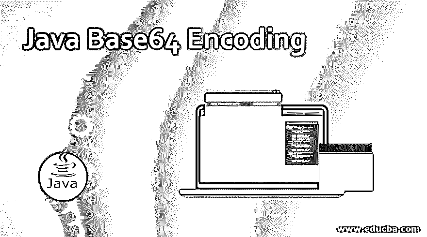
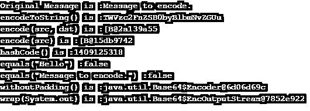

# Java Base64 编码

> 原文：<https://www.educba.com/java-base64-encoding/>




## Java Base64 编码简介

用于执行加密的 Base64 java 类。Java 8 引入了 Base64 类，该类在 java.util.Base64 中可用。Base64 是一种将二进制数据编码为编码文本格式的策略或方案，可以轻松地通过互联网发送，而不会被破坏和安全地丢失数据。Base 64 技术是将二进制数据映射到[A-za-z0-9+/]字符集。该类提供了用于执行内置类 Base64 提供的 java 编码和解码的方法。这个类还提供了三种不同的编码和解码技术，可以在不同的级别使用。静态 Base64。encoder 类是 Base64 的嵌套类。

### Java Base64 编码的类型

有三种类型

<small>网页开发、编程语言、软件测试&其他</small>

1.  **简单编码—**在这里，通过映射到“A-Za-z0-9+/”中的字符集对数据进行编码，并且在输出中不添加任何行分隔符。如果在任何字符之外包含 base64 以外的内容，那么解码器会拒绝它。
2.  **URL 和文件名编码—**这里通过映射到“A-Za-z0-9+ _”中的字符集对数据进行编码，并且不在输出中添加任何行分隔符。如果在任何字符之外包含 base64 以外的内容，那么解码器会拒绝它。编码输出是 URL 和文件名安全的。
3.  **MIME 编码—**这里通过映射到 MIME 友好格式对数据进行编码。编码的输出指定每行 76 个字符，每个字符不超过它，使用“\r”作为回车符，后跟“\n”作为行分隔符，在输出的末尾，不添加行分隔符。在解码操作中，base64 中没有的所有行分隔符和其他字符都将被忽略。

### Java Base64 类的方法

以下是一些方法:

**1。get encoder()–**这是 Base64 类的一个方法，它给出了 Base64。编码器对象，该对象由基本类型 base64 编码进行编码。

**语法:**

```
public static Base64.Encoder getEncoder()
```

**2。getUrlEncoder()–**这是 Base64 类的一个方法，它给出了 Base64。编码器对象，由 URL 和文件名 base64 编码进行编码。

**语法:**

```
public static Base64.Encoder getUrlEncoder()
```

**3。getmime encoder()–**这是 Base64 类的一个方法，它给出了 Base64。编码器对象，它由 MIME type base64 编码进行编码。

**语法:**

```
public static Base64.Encoder getMimeEncoder()
```

**4。getMimeEncoder(int lineLength，byte[]line separator)–**这是 base64 类的一个方法，它给出了编码器对象，该对象通过 MIME 类型 Base64 编码，使用给定的行长度和行分隔符进行编码。

**语法:**

```
public static Base64.Encoder getMimeEncoder(int lineLength, byte[] lineSeparator)
```

**5。encode(byte[]src)–**该方法使用 Base64 编码返回给定所有字节数组的编码字节数组。

**语法:**

```
public byte[] encode(byte[] src)
```

**6。encode(byte[] src，byte[]dst)–**此方法通过使用 Base64 编码，从偏移量 0 开始，将给定所有字节数组的编码字节数组写入给定的输出字节数组。

**语法:**

```
public int encode(byte[] src, byte[] dst)
```

**7。encodeToString(byte[]src)–**该方法使用 Base64 编码将编码的字节数组返回到字符串中。

**语法:**

```
public String encodeToString(byte[] src)
```

**8。encode(byte Buffer buffer)–**该方法使用 Base64 编码将位置为零的 buffer 和来自给定缓冲区字节的所有剩余字节的结果编码字节数的长度返回到新分配的 ByteBuffer 中。

**语法:**

```
public ByteBuffer encode(ByteBuffer buffer)
```

**9。wrap(output stream OS)–**该方法使用 Base64 编码返回编码字节数据的输出流。

**语法:**

```
public OutputStream wrap(OutputStream os)
```

10。without padding()–该方法返回编码器的对象，该对象被编码，但没有在末尾添加任何字符进行填充。

**语法:**

```
public Base64.Encoder withoutPadding()
```

### Java Base64 编码的示例

下面举几个例子

#### 示例#1

java 中不同类型的 Base64 编码示例:

接下来，我们编写 java 代码，通过下面的例子更清楚地理解 Base64 编码器类，在这个例子中，我们使用所有三种不同类型的编码对字符串消息进行编码，如下所示

**代码:**

```
package p1;
import java.util.Base64;
import java.util.UUID;
public class Demo {
public static void main( String[] arg) {
try {
// Simple string message to encode
String message = "Message to encode.";
// display original message
System.out.println("Original Message is :"+message);
// Encode message to basic Base64 format
String EncodeBasicBase64 = Base64.getEncoder().encodeToString(message.getBytes());
// display Basic or simple encoded message
System.out.println("Encoded Message by Simple Base64 is :"+EncodeBasicBase64);
// Encode message to URL Base64 format
String EncodeUrlBase64 = Base64.getUrlEncoder().encodeToString(message.getBytes("utf-8"));
System.out.println("Encoded Message by URL Base64 is :" +EncodeUrlBase64);
// Encode message to MIME Base64 format
String EncodeMimeBase64 = Base64.getMimeEncoder().encodeToString(message.getBytes("utf-8"));
System.out.println("Encoded Message by MIME Base64 is :" +EncodeMimeBase64);
}catch(Exception e)
{
}
}
}
```

**输出:**


#### 实施例 2

接下来，我们编写 java 代码，通过下面的例子更清楚地理解 Base64 编码器类的所有方法，如下所示

**代码:**

```
package p1;
import java.util.Base64;
public class Demo {
public static void main( String[] arg) {
// Simple string message to encode
String message = "Message to encode.";
// display original message
System.out.println("Original Message is :"+message);
// Encode message to basic Base64 format
String EncodeBasicBase64 = Base64.getEncoder().encodeToString(message.getBytes());
// Encode message to basic Base64 format
System.out.println("encodeToString() is :" +EncodeBasicBase64);
byte src[]= {10,20};
byte dst[]= new byte[4];
Base64.getEncoder().encode(src, dst);
System.out.println("encode(src, dst) is :" +dst);
System.out.println("encode(src) is :" +Base64.getEncoder().encode(src));
System.out.println("hashCode() is :" +EncodeBasicBase64.hashCode());
System.out.println("equals(\"Hello\") :" +EncodeBasicBase64.equals("Hello"));
System.out.println("equals(\"Message to encode.\") :" +EncodeBasicBase64.equals("Message to encode."));
System.out.println("withoutPadding() is :" +Base64.getEncoder().withoutPadding());
System.out.println("wrap(System.out) is :" +Base64.getEncoder().wrap(System.out));
}
}
```

**输出:**




### 结论

java 8 中引入了 Base64 类，它包含两个嵌套类，编码器和解码器。这个 Base64 编码器类可用于对字节数据执行加密，这在 Java API 的 java.util.Base64 包中是可用的。

### 推荐文章

这是 Java Base64 编码的指南。这里我们讨论 Java Base64 编码的类型和方法，以及相应的例子。您也可以阅读以下文章，了解更多信息——

1.  [Java 中的聚合](https://www.educba.com/aggregation-in-java/)
2.  [Java 中的可比](https://www.educba.com/comparable-in-java/)
3.  [JavaFX 场景](https://www.educba.com/javafx-scene/)
4.  [JavaScript find()](https://www.educba.com/javascript-find/)


