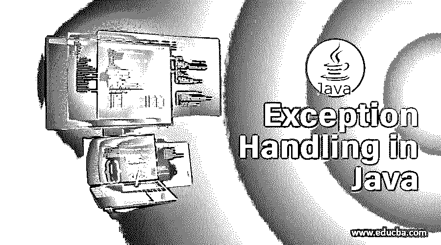

# Java 中的异常处理

> 原文：<https://www.educba.com/exception-handling-in-java/>




## Java 异常处理简介

异常处理是防止程序执行过程中出现异常的强大机制。它使程序能够完成执行，即使程序中出现异常。异常是在程序执行过程中发生的不想要的事件。这些事件会破坏程序执行的简单流程。java 中的异常处理不同于错误处理。错误是一个非常严重的问题，在程序执行过程中无法试图捕获，而异常可以使用语句的 try-catch 块来处理。

如果任何 try 块语句创建了一个异常，就可以在 catch 节块中捕获它。异常处理的语法如下所示:

<small>网页开发、编程语言、软件测试&其他</small>

****语法:****

```
//syntax for try...catch block statement
try {
// code block to track for the exception
}
catch (Exception eObj) {
// exception handler for exception
}
finally {
// finally block code statement executes after try block
}
```

### 为什么 Java 会出现异常？

由于多种原因，java 程序中出现异常。其中一些列举如下:

*   当在[算术运算](https://www.educba.com/arithmetic-operators-in-java/)中出现异常条件时，出现异常。
*   当通过异常索引访问程序中的数组时，就会发生这种情况。
*   输入/输出操作中断。
*   当类没有指定成员时。
*   线程化处理时，休眠、等待被中断。
*   当访问空对象的成员时。
*   当在指定位置发现请求的文件不可用时。
*   JVM 内存不足。
*   用户传递无效信息。

#### 流控制

异常处理 ****、**** 时，程序控制执行流程如下:

*   一旦 try 块代码被执行而没有任何异常，那么程序执行跳过 catch 块并转到 finally 块，即 catch 块执行后的代码。
*   如果 try 块发生任何异常，那么程序执行转移到 catch 块语句& try 块中的剩余代码永远不会执行。如果 finally 块出现在 catch 块之后，那么执行 finally 块。
*   如果 try 块包含任何 return 语句，仍然最终执行块。在执行完 finally 块程序后，控制执行转移到 try 块&然后执行 return 语句。如果 finally 块也包含 return 语句，它将覆盖 try 块的 return 语句。

### Java 中异常处理的例子

下面是 Java 中异常处理的不同例子。

#### 示例#1

在这个例子中，给出了内置异常。内置异常是 java 库已知的异常。内置类处理这些异常。Catch 块使用这些类来捕获这些异常。

**代码:**

```
//importing io package to use the File & IOException class
import java.io.File;
import java.io.FileReader;
import java.io.FileNotFoundException;
public class ExceptionHandlingExample{
private static String file = "D:/Program/Sample.txt";
public static void main(String[] args) {
//exception handling example when file not found at the specified location
try {
File fileObj = new File(file);
FileReader frObj = new FileReader(fileObj);
}
catch (FileNotFoundException fnfException) {
System.out.println("\nFileNotFound Exception => " + fnfException);
}
//exception handling example when null pointer exception occurred
try {
String title = null;
System.out.println(title.charAt(0));
} catch(NullPointerException e) {
System.out.println("\nNullPointer Exception => " + e);
}
//exception handling example when null pointer exception occurred
try {
int boxWidth  = 30;
int boxHeight = 20;
int boxDepth  = 20;
int itemVol   = 15;
int volume = boxWidth * boxHeight * boxDepth;
float itemCount = volume/0;
System.out.println ("output = " + itemCount);
}
catch(ArithmeticException e) {
System.out.println ("\nArithmetic Exception => " + e);
}
}
}
```

**输出:**


#### 实施例 2

在此示例中，实现了一个自定义用户异常处理类。该类用于处理自定义异常。

**代码:**

```
////user defined exception example
class ExceptionExample{
public static void main(String args[]){
try{
//using throw method to throw a custom exception
throw new CustomException("Custom Exception Message!");
}
catch(CustomException customExc){
System.out.println("Catch block");
System.out.println(customExc);
}
}
}
//custom exception class
class CustomException extends Exception{
String excStr;
CustomException(String paramString) {
excStr = paramString;
}
public String toString(){
return ("Custom Exception Found: " + excStr) ;
}
}
```

**输出:**


#### 实施例 3

在这个例子中，如果一个程序 trys 块包含多个异常，那么它也可以由一个 catch 语句来处理。java 7 中增加了多个异常处理。

**代码:**

```
//user-defined exception example
class MultipleExceptionHandlingExample{
public static void main(String args[]){
System.out.println(monitorAction());
}
public static String monitorAction(){
//try..catch block statement
try{
int num[] = new int[4];
num[2] = 15 / 0;
}
catch(ArrayIndexOutOfBoundsException | ArithmeticException ex){
ex.printStackTrace();
}
return "Program execution completed!";
}
}
```

**输出:**

上面程序的输出如下所示；在给定的程序中，我们可以看到一个异常发生在一种算术异常中。


在上面给出的程序中，如果修改如下:

**发件人:**

```
num[2] = 15 / 0;
```

**至:**

```
num[6] = 15;
```

**输出:**

如果代码按上面指定的方式更新，在那种情况下，程序中发生的异常是 ArrayIndexOutOfBoundException。


在上面给出的程序中，我们可以看到在一个 catch 块中可以处理多种类型的异常。

### 结论

在上面给出的文章中，我们获得了关于异常和异常处理的信息。我还看到了异常处理是如何工作的。上一节还演示了可用于在 java 中添加异常处理的类和语句。还描述了如何使用单个 catch 块完成多个异常处理。

### 推荐文章

这是一个 Java 异常处理的指南。这里我们讨论 Java 中异常发生的基本概念和原因，以及实例和代码实现。您也可以看看以下文章，了解更多信息–

1.  [Java 中的类加载器](https://www.educba.com/classloader-in-java/)
2.  [Java 中的 Strictfp](https://www.educba.com/strictfp-in-java/)
3.  [抛出 Java 中的关键字](https://www.educba.com/throw-keyword-in-java/)
4.  [Java RuntimeException](https://www.educba.com/java-runtimeexception/)


