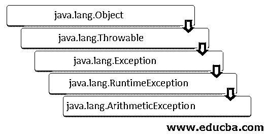

# Java 算法异常

> 原文：<https://www.educba.com/java-arithmeticexception/>


## Java 算法异常简介

Java 算术异常是一种在运行时代码中出现错误的算术或数学运算时抛出的未经检查的错误或异常代码结果。运行时问题，也称为异常，发生在分母为整数 0 时，JVM 无法计算结果，因此程序的执行被终止，并引发异常。异常引发的点程序终止，但执行之前的代码，并显示结果。

java 算术异常的基类是 lang。位于 java.lang.RuntimeException 下的 ArithmeticException。

<small>网页开发、编程语言、软件测试&其他</small>

### Java 中算术异常的结构

基类算术异常的结构:




#### 算术异常的构造函数

**1。ArithmeticException():** 定义一个算术异常，不传递任何参数或者没有任何详细消息。

**2。ArithmeticException(String s):**定义一个传递了一个参数的 arithmetic exception。

**s:** s 是详细消息**T3】**

### 算术异常在 Java 中是如何工作的？

下面是可能导致 Java 算术异常的两种情况:

*   将一个数除以一个未定义的零和一个整数。
*   大十进制无终止长十进制数。

#### 1.将一个数除以一个整数零

当我们试图用零除一个数时，java 中会抛出一个算术异常。下面是说明操作的 java 代码:

##### 示例#1

**代码:**

```
package com.java.exception;
public class ArithmeticException
{
void division(int a,int b)
{
int c=a/b;
System.out.println("Division has been successfully done");
System.out.println("Value after division: "+c);
}
public static void main(String[] args)
{
ArithmeticException ex=new ArithmeticException();
ex.division(10,0);
}
}
```

**输出:**


*   郎。算术异常:java 语言在除法运算时抛出的异常
*   / by zero:这是在生成 ArithmeticException 实例时给类 ArithmeticException 的详细消息。

当我们将 10 除以 0 时，其中 0 是一个整数并且是未定义的，它抛出上述算术异常。

##### 实施例 2

**代码:**

```
//package com.java.exception;
public class ArithmeticException
{
void division(int a,int b)
{
int c=a/b;
System.out.println("Division of a number is successful");
System.out.println("Output of division: "+c);
}
public static void main(String[] args)
{
ArithmeticException ex=new ArithmeticException();
ex.division(10,5);
}
}
```

**输出:**


#### 2.大十进制无终止长十进制数

Java 有一个 BigDecimal 类，它表示十进制数，最大为大量的精确数字。这个 java 类也有一些原始数据类型中没有的功能，例如整数、双精度和浮点。这些功能提供了十进制数的舍入

下面是示例代码:

##### 示例#1

**代码:**

```
//package com.java.exception;
import java.math.BigDecimal;
public class ArithmeticException
{
public static void main(String[] args)
{
BigDecimal a=new BigDecimal(1);
BigDecimal b=new BigDecimal(6);
a=a.divide(b);
System.out.println(a.toString());
}
}
```

**输出:**


在上面编写的 java 代码中，由于 big decimal 类不知道如何处理 division 输出，因此它会在输出控制台中抛出或显示一个算术异常。

它抛出一个异常，并给出一条详细的消息“非终止的十进制展开，没有精确的表示”

上面的大小数类的一个可能的解决方法是，从一个大小数开始陈述我们需要的小数位数，然后将值限制在一个确定的小数位数。例如，通过将数字向上舍入到第 7 个<sup>十进制精度值，c 应限制为 7 个小数位。</sup>

##### 实施例 2

**代码:**

```
//package co.java.exception;
import java.math.BigDecimal;
public class ArithmeticException
{
public static void main(String[] args)
{
BigDecimal a=new BigDecimal(1);
BigDecimal b=new BigDecimal(6);
a=a.divide(b,7,BigDecimal.ROUND_DOWN);// limit of decimal place
System.out.println(a.toString());
}
}
```

**输出:**


输出控制台将结果显示为带有第 7 个<sup>小数点的数字，这意味着舍入工作正常。</sup>

### 如何避免或处理 Java ArithmeticException？

处理 java 虚拟机抛出的异常称为异常处理。异常处理的优点是代码的执行不会停止。

通过结合使用 try 和 catch 来处理异常。try/catch 块放在可能生成异常的代码中。在 try/catch 块中编写的代码被称为受保护的代码。

**语法:**

```
try
{
set of statements//protected code
}
catch (exceptionname except)
{
// Catch set of statements---can contain single catch or multiple.
}
```

#### 使用 try & Catch 块的算法异常处理

*   编写可以用 try 和 catch 块引发 ArithmeticException 的语句。
*   当异常发生时，执行从异常的发生点落到 catch 块。它执行 catch 块语句，并继续执行 try 和 catch 块之后出现的语句。下面是一个例子:

**代码:**

```
public class ExceptionHandled
{
public static void main(String args[])
{
int x =100, y = 0;
int z;
System.out.println("Hello world");
try
{
z = x/y;
System.out.println(z);
}
catch(ArithmeticException except)
{
System.out.println("Avoid dividing by integer 0" + except );
}
System.out.println("Hello class");
System.out.println("Hello there");
}
}
```

**输出:**


除了 Hello world 之外，Hello class 和 Hello 也打印在输出控制台上。这是异常处理机制的结果。

**说明:**

1.  Try 和 catchblocks 是 Java 中的异常处理关键字，完全用于处理代码中出现的异常或未检查的错误，而不会停止代码的执行。
2.  检测创建语句的问题，并将它们放在 try 块中。当 try 块抛出异常时，catch 块处理该异常，程序执行到最后一条语句。
3.  如果 try 块没有抛出异常，catch 块就会被忽略。
4.  在 catch 块中运行适当的异常处理程序或语句，以成功处理或检测 try 块引发的异常。

### 结论

本文学习了 java 算术异常以及如何在 try and catch 块下处理异常。由于一个数被整数 0 除，大多数情况下都会发生算术异常。在本文中，我使用了单个 catch 进行单次尝试，但是我们也可以使用多个 catch 进行单次尝试。

### 推荐文章

这是一个 Java 算法异常的指南。在这里，我们讨论了介绍以及如何避免或处理 Java 算术异常，并附有示例。您也可以浏览我们推荐的其他文章，了解更多信息——

1.  [JavaScript 数学函数](https://www.educba.com/javascript-math-functions/)
2.  [Java 编译器](https://www.educba.com/java-compilers/)
3.  [Java 中的合并排序](https://www.educba.com/merge-sort-in-java/)
4.  [Java 8 中的可选类](https://www.educba.com/optional-class-in-java-8/)


