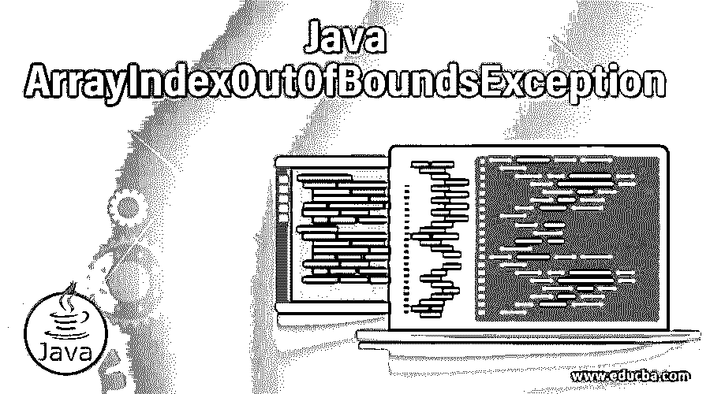

# Java ArrayIndexOutOfBoundsException

> 原文：<https://www.educba.com/java-arrayindexoutofboundsexception/>




## Java ArrayIndexOutOfBoundsException 简介

当访问超过预定义长度的数组元素时，会产生 Java ArrayIndexOutOfBoundsException。数组是在确认的时候被估计的，它们本质上是静态的。当我们定义一个数组时，元素的个数是固定的，从 0 开始。例如，如果有 10 个元素，数组将第 10 个<sup>元素识别为第 11 个<sup>元素，因为第一个元素是第 0 个<sup>元素。起初，每个程序员都认为程序一旦执行，输出就有保证。但是系统会提出一些问题，阻止程序在运行时执行，这些问题被称为异常。因此，当这个 IndexOutOfBoundsException 在运行时发生时，它是由 RuntimeException 类产生的，而 runtime Exception 类又是主异常类的子类，所有这些都是从 java.lang 包派生的。</sup></sup></sup>

### 构造器

构造函数是在从 ArrayOutOfBoundsException 实现接口时形成的。有 3 种类型的 ArrayIndexOutOfBoundsException 构造函数，

<small>网页开发、编程语言、软件测试&其他</small>

*   **ArrayIndexOutOfBoundsException():**它构造 ArrayIndexOutOfBoundsException，不需要来自控制台的任何细节。
*   **ArrayIndexOutOfBoundsException(int index):**index 变量表示另一个不合法的索引，因此它构造了一个 ArrayIndexOutOfBoundsException。
*   **ArrayIndexOutOfBoundsException(Strings):**ArrayIndexOutOfBoundsException 由任何适当的消息构成。

### 实现 Java ArrayIndexOutOfBoundsException 的示例

下面是提到的例子:

#### 示例#1

创建 ArrayOutOfBoundsException

**代码:**

```
public class Main
{
public static void main (String[] args)
{
String[] veggies = {"Onion", "Carrot", "Potato", "Tomato", "Cucumber", "Radish"};
for (int i=0; i<=veggies.length; i++)
{
System.out.print (veggies[i] + " ");
}
}
}
```

**输出:**


在上面的程序中，我们看到名为 veggies 的数组由 6 个元素组成。一旦 for 循环被迭代，它就考虑条件 I 的第<=veggies.length, which means that the array considers the elements from 0<sup>个</sup>位置，直到第 6 个<sup>个</sup>位置，最后，在最后一次迭代期间，值 i=6 超过了数组大小，因此，实现了 ArrayoutOfBoundsException。

#### 实施例 2

访问负索引的 ArrayOutOfBoundsException

**代码#1**

```
public class Main {
public static void main (String[] args)
{
Integer[] intArray = {5, 7, 9, 11, 13, 15};
System.out.println ( "First element: " + intArray[0]);
System.out.println ( "Last element: " + intArray[-8]);
}
}
```

**输出:**


这里，我们首先声明一个整数数组，然后研究如何访问数组中的单个元素。一旦完成，我们通过给出 Array[0]中的命令来打印出第一个元素。这将识别第 0 个<sup>元素，即 5，并打印出来。另一方面，我们还提供了一个命令，将负索引打印为-8。因此，系统无法识别该索引，从而在输出中输出 ArrayOutOfBoundsException。</sup>

**代码#2**

```
public class MyClass {
int x;
public MyClass () {
x = 5;
}
public static void main (String[] args) {
MyClass myObj = new MyClass ();
System.out.println (myObj.x);
}
}
```

**输出:**


### 如何避免 ArrayIndexOutOfBoundsException？

每个程序员在实现数组索引和元素时都会犯错误。由于这些原因，出现了 ArrayIndexOutOfBoundsException。我们可以按照下面的步骤来避免这些错误。

#### 1.增强 for 循环

一个增强的循环像数组一样在相邻的内存区域上迭代，并且只到达合法的索引。从现在开始，当增强的 for 循环被实现时，我们不必担心被误导或非法的索引。

**代码:**

```
class Main {
public static void main (String[] args)
{
String[] fruits = {"Apple", "Mango", "Banana", "Watermelon", "Papaya"};
System.out.println ( "");
for (String strval:fruits)
{
System.out.print (strval + " ");
}
}
}
```

**输出:**


我们在上面的程序中使用了一个增强的 for 循环来迭代水果数组。首先，我们描述数组中的 5 个元素，然后实现增强的 for 循环。这个循环迭代直到到达数组的末尾，我们不需要单独定义每个数组。因此，它只检查有效的索引或元素，并最终提供我们正在寻找的准确输出。因此，我们可以通过使用这个增强的 for 循环来避免 ArrayIndexOutOfBoundsException。

#### 2.正确的开始和结束索引

数组可靠地从列表 0 而不是列表 1 开始。此外，数组中的最后一部分可以使用记录“arraylength-1”而不是“arraylength”来获取。编程工程师在使用超出许多人认为可能的情况时应该小心，因此，保持一个远离 ArrayIndexOutOfBoundsException 的关键好方法。

#### 3.类型安全迭代器

当类型安全迭代器强调一个分类并在描述分类和推出改进时对分类进行修改时，它们不会抛出异常。

**代码:**

```
import java.util.HashMap;
public class MyClass {
public static void main (String[] args) {
HashMap<String, String> countries = new HashMap<String, String> ();
countries.put ( "India", "Delhi");
countries.put ( "Switzerland", "Bern");
countries.put ( "France", "Paris");
countries.put ( "Belgium", "Brussels");
System.out.println (countries);
}
}
```

**输出:**


**解释:**在上面的程序中，我们声明了城市和国家的字符串，并将其声明到散列表中。然后系统识别这种分类，迭代代码，最后产生输出，而不抛出 ArrayIndexOutOfBoundsException。

### 结论

Java 中的 ArrayIndexOutOfBoundsException 通常发生在我们试图访问大于数组长度的元素时。这些异常可以通过使用增强的 for 循环或适当的索引来避免。还有一些名为 NullPointerExceptions 的异常未被检查，并且超出了 RuntimeException 它并不敦促软件工程师利用捕捉方来处理它。因此，我们应该记住，我们不应该超越数组限制，也要避免 NegativeArraySizeException。

### 推荐文章

这是一个 Java ArrayIndexOutOfBoundsException 的指南。在这里，我们讨论如何使用适当的语法和相应的编程示例来避免 ArrayIndexOutOfBoundsException。您也可以浏览我们的其他相关文章，了解更多信息——

1.  [Java 中的 copy()](https://www.educba.com/copy-in-java/)
2.  [Java 中的 For 循环](https://www.educba.com/for-loop-in-java/)
3.  [JavaScript findIndex ()](https://www.educba.com/javascript-findindex/)
4.  [JavaScript 中的 linked list](https://www.educba.com/linkedlist-in-javascript/)


