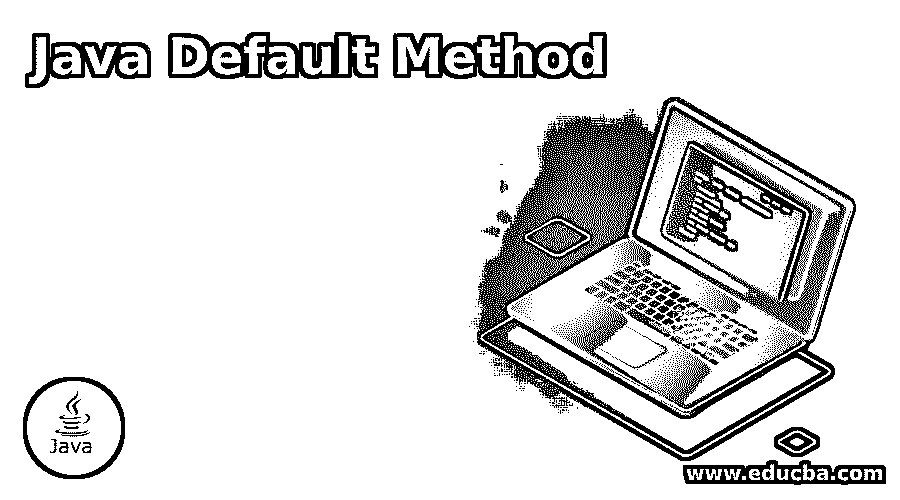

# Java 默认方法

> 原文：<https://www.educba.com/java-default-method/>




## Java 默认方法介绍

在 Java 8 中，引入了一个名为 default method 的新概念，以执行通过旧接口控制 lambda 表达式的向后兼容性。此外，允许接口具有带有实现的功能，而不会给接口将要实现的类带来任何问题。在 Java 8 引入之前，接口只允许抽象方法。此外，函数必须在不同的类中提供。在下面的部分中，将解释默认方法的语法、工作原理和示例。

**语法**

<small>网页开发、编程语言、软件测试&其他</small>

下面是默认方法的语法。

```
public interface animal {
default void sound() {
System.out.println("This is a sample default method. . .!");
}}
```

### Java 中的默认方法是如何工作的？

正如我们所知，像 List 和 collections 这样的接口没有 forEach 方法。如果添加它，集合的框架实现将会中断。因为默认方法是在 Java 8 中引入的，所以可以为方法 forEach 实现一个默认实现。除此之外，还可以创建一个类来实现两个具有相同默认功能的接口。让我们看看代码的模糊性是如何解决的。

```
public interface livingthings
{
default void sound()
{     . . .
System.out.println("Living things too make noise . . .") ;
}
}
public interface animals
{
default void sound()
{          . . .
System.out.println("animals too make noise . . .") ;
}
}
```

对于这种模糊性有两种解决方案。

**1。**要覆盖默认的方法实现，创建您自己的方法。

```
public class dogs implements livingthings,animals
{
default void sound()
{          . . .
System.out.println("dogs bark . . .") ;} }
```

**2。**使用 super，调用默认方法

```
public class dogs implements livingthings,animals
{
default void sound()
{          . . .
livingthings.super.print("dogs bark . . .") ; } }
```

在 Java 中，通常一个类可以实现 n 个接口。此外，一个接口可以被另一个接口扩展。假设一个类有两个接口，并且实现了一个默认方法；特定的类在选择调用哪个方法时可能会感到困惑。为了解决这些冲突，可以做以下几点。

*   匹配并调用类中的重写方法。
*   如果提供了相同方法的方法，将选择最合适的方法。假设有两个接口，A 和 B 用于一个特定的类。如果 A 扩展了 B，那么 A 在这里是最具体的，默认的方法会从 A 中选择，如果 A 和 B 是独立的接口，就会出现严重的冲突情况，编译器会提出无法选择的抱怨。在这种情况下，用户必须通过提供额外的细节来帮助编译器选择默认方法。例如

```
A.super.demo() ;
```

或者

```
B.super.demo() ;
```

### 正常方法和默认方法的区别

现在，让我们看看普通方法和默认方法之间的一些区别

*   与普通方法不同，默认方法带有一个默认修饰符。
*   对于默认方法，接口的参数没有任何特定的状态。
*   普通方法可以使用也可以改变方法和类字段的参数。
*   新的功能可以添加到现有的接口中，而不是破坏这些特定接口的先前实现。

在扩展由默认方法组成的接口时，可以执行以下操作。

*   默认方法不会被覆盖，它将被继承。
*   默认方法将被覆盖，这类似于在子类中被覆盖的方法。
*   默认方法应该再次声明为抽象方法，这迫使子类被覆盖。

### 实现 Java 默认方法的示例

下面是提到的示例程序:

#### 示例#1

实现默认方法的 Java 程序

**代码:**

```
//Java program to implement default method
public class DefExample {
//main method
public static void main(String args[]) {
//create an object for the interface animal
Animals obj = new Dog();
//call the print method
obj.print( );
}
}
//create an interface animal
interface Animals {
//default method
default void print( ) {
System.out.println("I have four legs. . . ! !");
}
static void sound() {
System.out.println("I used to bark alot!!!") ;
}
}
//create an interface <u>carnivores</u>
interface Carnivores {
//default method
default void print( ) {
System.out.println("I eat non veg. . .! !") ;
}
}
//class that implements the other two interfaces
class Dog implements Animals, Carnivores {
public void print( ) {
//call the print method of Animals  using super
Animals.super.print( ) ;
//call the print method of Carnivores  using super
Carnivores.super.print( );
//call the sound method of Animals
Animals.sound();
System.out.println("I am a Dog . . .!");
}
}
```

**输出:**


**解释:**在这个程序中，两个接口，动物和食肉动物，有相同的默认方法 print()，它们被称为 using super。

#### 实施例 2

实现默认方法的 Java 程序

**代码:**

```
//Java program to implement default method
interface Sampleinterface{
// Since this is declared as a default method, this has to be implemented in the implementation classes
default void sammethod(){
System.out.println("a default method which is newly added to the program");
}
// existing public as well as abstract methods has to be implemented in the implementation classes
void oldmethod(String s);
}
public class DefExample implements Sampleinterface{
//  abstract method implementation
public void oldmethod(String s){
System.out.println("The string given is: "+ s);
}
public static void main(String[] args) {
DefExample obj = new DefExample();
//call the default method
obj.sammethod();
//call the abstract method
obj.oldmethod("I am the old method in the program");
}
}
```

**输出:**


**说明:**在这个程序中，有一个接口 Sampleinterface，它有一个默认的方法 sammethod()，它被调用。

### 结论

在 Java 8 中，提供了一个名为 default method 的新概念来执行向后兼容，其中旧接口控制 lambda 表达式。此外，接口参数对于默认方法没有任何特定的状态。在本文中，将详细解释默认方法的语法、工作原理和示例。

### 推荐文章

这是一个 Java 默认方法的指南。这里我们讨论 java 默认方法的介绍，默认方法在 Java 中是如何工作的，和例子之间的区别。您也可以浏览我们的其他相关文章，了解更多信息——

1.  [Python 主方法](https://www.educba.com/python-main-method/)
2.  [Python 中的方法重载](https://www.educba.com/method-overloading-in-python/)
3.  [Python 中的列表方法](https://www.educba.com/list-method-in-python/)
4.  [Java 中的方法](https://www.educba.com/methods-in-java/)


