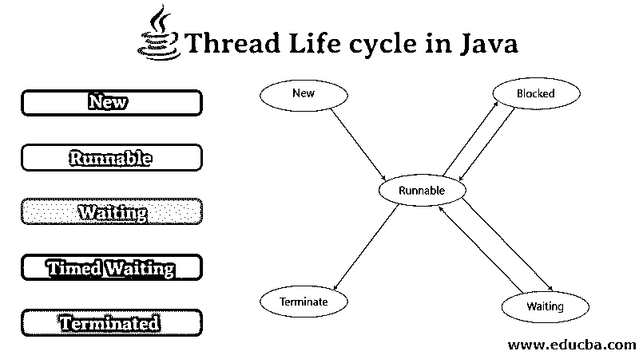
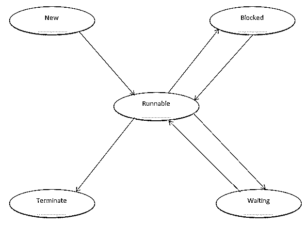
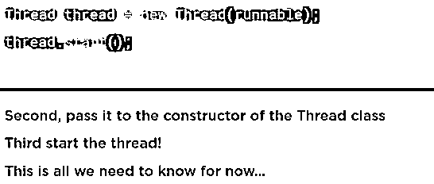
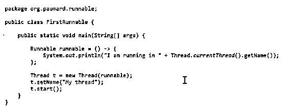
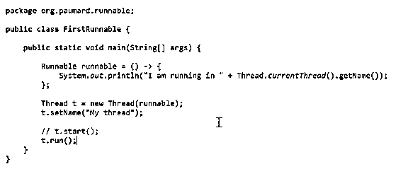

# Java 中的线程生命周期

> 原文：<https://www.educba.com/thread-life-cycle-in-java/>

## Java 线程生命周期简介

一个[线程](https://www.educba.com/what-is-threading/)在生命周期中经历了许多阶段。比如，一根线来到这个世界，开始，运行，然后就消失了。下图解释了线程的完整生命周期。

<small>网页开发、编程语言、软件测试&其他</small>

*   线程构造器通过一个新的状态产生一个线程。
*   在线程中调用 begin 方法可以使它通过 runnable 状态。
*   与 Java 相关的线程调度器在处理器接收到线程时运行该线程。
*   当线程进入阻塞状态时，它将再次运行，因为它又回到可运行状态。
*   如果 wait 方法被称为 thread 将进入等待状态，它将在整个 Inform 和 notify all 方法中变成通知后很快进入可运行状态。
*   一旦 run 方法终止，线程就结束。

### 什么是线程？

线程是在操作系统级别定义的。Java 语言以及所有其他语言都利用了操作系统提供的服务。从开发人员的角度来看，一个线程是一组指令，我们将编写我们的应用程序，并以某种方式执行。应用程序本身可以由几个线程组成。不同的线程可以同时执行。JVM (Java 虚拟机)与几个线程一起工作。垃圾收集有线程。有针对实时编译器的线程和其他技术线程。

### Java 中线程生命周期的状态

下面是 Java 中线程生命周期的不同状态:

**1。新:一个新线程在新状态中开始它的生命周期。在程序开始线程之前，它一直保持这种状态。此外，它也被称为创建线程。**

**2。Runnable:** 在一个最近诞生的线程可以开始之后，这个线程就变成了 Runnable。具有这种状态的线程被认为是在执行它们的进程。

**3。Waiting:** 偶尔，一个线程会转换到 Waiting 状态，即使这个线程正在等待另一个线程执行一个活动。只有当额外的线程指示等待线程继续执行时，线程才转换到可运行状态。

**4。定时等待:**一个可运行的线程可以很容易地定时等待状态，以获得特定的时间间隔。一旦该点间隔到期或者如果它真正等待的事件发生，具有这种状态的线程转换返回到可运行状态。

**5。终止:**一个可运行的线程进入终止状态，因为它完成了它的任务，否则终止。

### 如何用 Java 创建一个线程？

在 Java 中创建线程最基本的方法是使用 Runnable 模式。首先，你需要创建一个 Runnable 接口的实例，这非常容易；只有一种方法可以实现。然后我们将这个实例传递给 Thread 类的构造函数。然后，我们调用这个线程对象的 start()方法来启动一个新的线程，该线程将运行我们的 Runnable 对象中的任务。

首先，我们创建一个 Runnable 的实例。只有一个方法需要实现，称为 run()方法。这是用一个[匿名类](https://www.educba.com/anonymous-class-in-java/)的实例完成的 [Java 7](https://www.educba.com/java-7-features/) 模式。但是我们也可以使用 lambda 表达式来实现 Runnable，因为 Runnable 接口中只有一个方法。

让我们在非常简单的例子上创建线程。

我们将看到应该同步的非同步代码的竞争情况会出现什么问题，我们将使用同步来修复我们的代码。第一个例子非常简单；很基础的。它只是关于创建一个任务。

**输出:**

任务是 runnable 接口的一个实例，让我们称之为 Runnable，我们可以使用 lambda 表达式实现这个接口。这个任务被交给一个新的线程，并在这个线程的上下文中执行。所以我们要打印出运行这个任务的线程的名字。我在… Thread.currentThread()是 Thread 类的静态方法，返回运行当前任务的线程。我们只需要在这个线程对象上调用 getName()来返回一个线程的名字，然后在我们创建一个线程实例 t = new Thread 之后。将此 runnable 作为参数传递。这个线程将要执行这段代码。并启动它。这是我们需要调用的 start()方法。我们还可以使用 t.setName(“我的线程”)给这个线程一个显式的名称。现在我们可以执行这段代码了。现在我们不调用 start()方法，而是调用 run()方法，如果运行这段代码，问题是任务被正确执行了，但是在我们创建的线程中没有执行。它在主线程中执行，主线程是执行主方法的线程。因此，如果我们想要启动一个新线程，就不应该调用这个 run()方法。

**输出:**

### Java 中线程生命周期的方法

表中给出了简单线程描述的方法。

| **数据类型** | **线程方法名称** |
| 线 | **getName()**返回该线程的名称 |
| （同 Internationalorganizations）国际组织 | **get priority()**返回线程的优先级 |
| 布尔型 | **isAlive()**测试该线程是否仍在运行 |
| 空的 | **join()**

等待该线程死亡(终止)

 |
| 空的 | **run()**每当这个线程利用一个单独的 Runnable 对象(通常调用 Runnable 对象的 run 方法)构建时，这个方法将不做任何事情并返回。每当线程类可以扩展并且 run()方法在子类中被覆盖时，就会调用被覆盖的 run()方法。 |
| 空的 | **setName(**String name**)**用该线程更改名称，使[与参数](https://www.educba.com/comparable-in-java-example/)的名称相当。 |
| static void | **sleep(** 长毫秒 **)** 抛出中断/异常
它使当前正在执行的线程休息
所需的毫秒数。 |
| 静态空隙 | **sleep(**long millis, int Nanos**)** throws InterruptedException它使当前正在执行的线程休眠(停止执行)所需的毫秒量以及特定的纳秒量。 |
| 空的 | **start()**触发这些线程开始执行；Java 虚拟机调用该线程的 run 方法。 |
| 静态空隙 | **yield()**触发当前线程对象暂停，并允许其他线程短暂执行。 |
| 静态线程 | **currentThread()**返回当前正在执行的线程对象的名称。 |

### 结论

*   开始使用螺纹很简单，极难掌握。
*   设计包含线程安全方法的类具有挑战性。
*   Read: JavaDoc 获取 java.lang.Thread 类

### 推荐文章

这是 Java 中线程生命周期的指南。这里我们讨论线程生命周期的基本含义和不同状态以及 java 线程的创建。您也可以浏览我们推荐的其他文章，了解更多信息——

1.  [Java 中的框架](https://www.educba.com/frameworks-in-java/)
2.  [Java 中的星型模式](https://www.educba.com/star-patterns-in-java/)
3.  [Java 中的合并排序](https://www.educba.com/merge-sort-in-java/)
4.  [操作系统中的线程](https://www.educba.com/threads-in-operating-system/)

