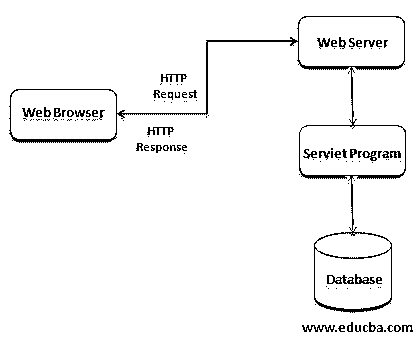
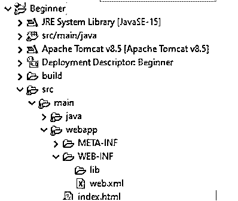
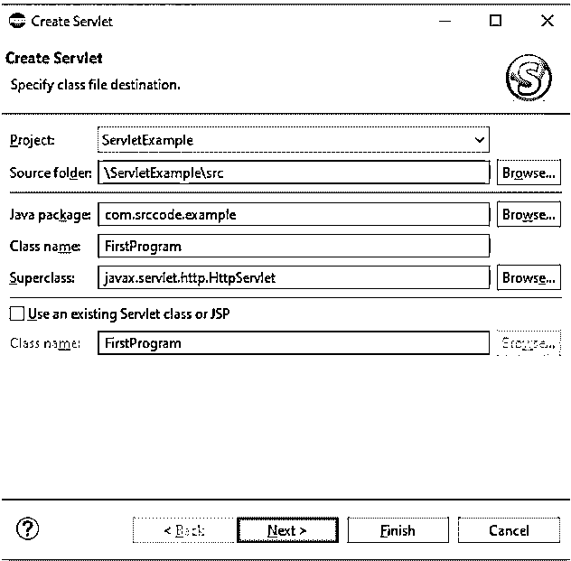
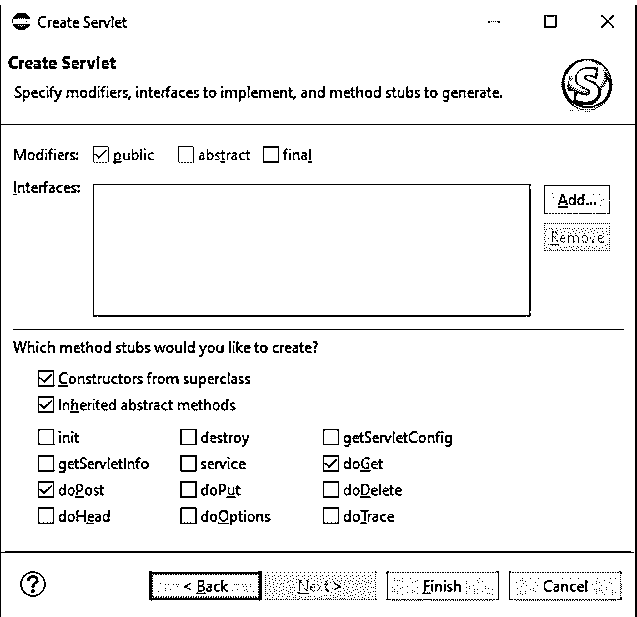

# Java 中的 Servlet

> 原文：<https://www.educba.com/servlet-in-java/>


## Java 中的 Servlet 简介

Java 中的 Servlet 可以用多种方式描述。作为一种技术，servlet 用于创建网页；作为 API，提供接口等。它用于扩展基于请求-响应编程模型托管应用程序的服务器的功能。Servlets 提供了基于组件和独立于平台的方法来构建基于 web 的应用程序，而没有任何性能限制。Java 中的 Servlets 可以完全访问 Java API 和 JDBC 来访问企业数据库。我们将详细了解这些 servlet 是什么，为什么使用它们，它的优点和局限性，以及 servlet 在 Java 中实际上是如何工作的。

Servlets 可以用许多其他方式描述，

<small>网页开发、编程语言、软件测试&其他</small>

*   Servlet 是一种用于创建 web 应用程序的技术
*   Servlet 也是一个 API，它提供了许多接口和类以及文档
*   这是一个为在 Java 中创建 Servlet 实现的接口
*   它是一个扩展服务器功能并响应传入请求的类。它可以是任何类型的请求。
*   它也是部署在服务器上创建动态网页的 web 组件。

### Java 中为什么需要 Servlet？

随着技术的发展，我们需要每天了解最新的更新或最新的技术堆栈。Servlets 充当接口、技术、web 组件、类或 API。使用 servlets，我们可以通过网页/表单或数据库以及任何其他数据源收集用户信息，并创建网页。

*   Java 中的 servlet 类似于使用通用网关接口(CGI)实现的程序，但是 servlet 比 CGI 有更多的优势。
*   就性能而言，servlets 明显优于 CGI。
*   是独立于平台的，因为 servlets 是用 Java 编写的。
*   它们在 Web 服务器的空间内执行。我们不需要在处理客户端请求时创建单独的流程。
*   Java 安全在保护服务器机器的资源时强制执行一组严格的限制，因此 Servlet 是可信的。
*   Servlets 可以通过套接字、RMI 机制与数据库、小应用程序或其他一些软件进行通信。

### Servlet 在 Java 中是如何工作的？

Java 中的 Servlets 检查通信接口、客户机和服务器的要求、使用的协议、编程语言和涉及的软件。Servlets 在以下步骤中执行，

**第一步:**客户端向 web 服务器发送请求，读取客户端发送的显式数据，可以是 HTML 表单、applet，也可以是自定义的 HTTP 客户端程序。

**步骤 2:** 然后，web 服务器接收请求。

**步骤 3:** 然后 web 服务器将请求传递给相应的 servlet，处理请求可能包括与数据库通信、调用 web 服务或者直接响应。

**步骤 4:** Servlet 然后处理请求，并以输出的形式生成响应。它可以是任何格式，HTML 或 XML，GIF 如果图像，或 Excel。

**步骤 5:** 这些 servlets 随后向服务器发回一个响应

**步骤 6:** 然后 web 服务器向客户端发送回响应，客户端随着浏览器显示在 UI 上。

#### Servlet 架构

上面的 [servlet 架构](https://www.educba.com/servlet-architecture/)使用了一些 Java 方法，比如:




*   **Servlet.init():** 由 Servlet 调用，表示 Servlet 实例执行成功，服务被调用。Servlet 然后调用 service()方法来处理客户机的请求。然后在使用 destroy()方法完成服务后终止
*   **Servlet.destroy():** 方法在整个生命周期中只运行一次，这给我们一个信号，表明 Servlet 实例结束了。

### 用 Java 创建 Servlet 的示例

首先，我们需要安装 Java、Eclipse 和 Tomcat:

**1。**我们将使用文件- >新建- >动态 Web 项目创建一个动态 Web 项目。


**2。**输入项目名称并选择目标运行时，点击下一步，需要勾选标记“生成 web.xml”然后完成

**3。**项目结构如下所示。




**4。**然后，点击文件- >创建新的 Servlet。







**5。**点击上面的完成。现在，Eclipse 将根据前面步骤中完成的输入或配置生成 Servlet 类。

**代码:**

**第一个程序. java**

```
package com.srccode.example;
import java.io.IOException;
import javax.servlet.ServletException;
import javax.servlet.annotation.WebServlet;
import javax.servlet.http.HttpServlet;
import javax.servlet.http.HttpServletRequest;
import javax.servlet.http.HttpServletResponse;
/**
* Servlet implementation class FirstProgram
*/
@WebServlet("/FirstProgram")
public class FirstProgram extends HttpServlet {
private static final long serialVersionUID = 1L;
/**
* @see HttpServlet#HttpServlet()
*/
public FirstProgram() {
super();
// TODO Auto-generated constructor stub
}
/**
* @see HttpServlet#doGet(HttpServletRequest request, HttpServletResponse response)
*/
protected void doGet(HttpServletRequest request, HttpServletResponse response) throws ServletException, IOException {
// TODO Auto-generated method stub
response.getWriter().append("Served at: ").append(request.getContextPath());
}
/**
* @see HttpServlet#doPost(HttpServletRequest request, HttpServletResponse response)
*/
protected void doPost(HttpServletRequest request, HttpServletResponse response) throws ServletException, IOException {
// TODO Auto-generated method stub
doGet(request, response);
}
}
```

我们将修改 Servlet 类的代码，如下所示，

**包 com . src code . example；**

```
import java.io.IOException;
import java.io.PrintWriter;
import javax.servlet.ServletException;
import javax.servlet.annotation.WebServlet;
import javax.servlet.http.HttpServlet;
import javax.servlet.http.HttpServletRequest;
import javax.servlet.http.HttpServletResponse;
/**
* Servlet implementation class FirstProgram
*/
@WebServlet("/FirstProgram")
public class FirstProgram extends HttpServlet {
private static final long *serialVersionUID* = 1L;
/**
* @see HttpServlet#HttpServlet()
*/
public FirstProgram() {
super();
// TODO Auto-generated constructor stub
}
private String mymsg;
public void init() throws ServletException {
mymsg = "Hi eduCBA Team! We are working on Java Servlet Tutorial! This is the first Servlet Program!";
}
/**
* @see HttpServlet#doGet(HttpServletRequest request, HttpServletResponse response)
*/
protected void doGet(HttpServletRequest request, HttpServletResponse response) throws ServletException, IOException {
// TODO Auto-generated method stub
response.setContentType("text/html");
PrintWriter printWriter = response.getWriter();
printWriter.println("<h1>" + mymsg + "</h1>");
}
/**
* @see HttpServlet#doPost(HttpServletRequest request, HttpServletResponse response)
*/
protected void doPost(HttpServletRequest request, HttpServletResponse response) throws ServletException, IOException {
// TODO Auto-generated method stub
doGet(request, response);
}
}
```

**在 web.xml 中**

```
<?xml version="1.0" encoding="UTF-8"?>
<web-app xmlns:xsi="http://www.w3.org/2001/XMLSchema-instance"  xsi:schemaLocation="http://xmlns.jcp.org/xml/ns/javaee http://xmlns.jcp.org/xml/ns/javaee/web-app_3_1.xsd" id="WebApp_ID" version="3.1">
<display-name>ServletExample</display-name>
<welcome-file-list>
<welcome-file>index.html</welcome-file>
<welcome-file>index.htm</welcome-file>
<welcome-file>index.jsp</welcome-file>
<welcome-file>default.html</welcome-file>
<welcome-file>default.htm</welcome-file>
<welcome-file>default.jsp</welcome-file>
</welcome-file-list>
</web-app>
```

**在 index.html**

```
<!DOCTYPE html>
<html>
<head>
<meta charset="UTF-8">
<title>BeginnersBook Servlet Demo</title>
</head>
<body>
<a href="welcome">Click to call Servlet</a>
</body>
</html>
```

**输出:**

右键单击项目并选择 Run As-> Run on Server。

现在打开浏览器，我们可以看到下面的输出，服务器将在本地主机上运行:

http://localhost:8080/servlet example/first program


### Java 中 Servlet 的优势

Java 中的 Servlet 有很多优点。Servlets 可以被视为运行在服务器端的 applet:

*   **Servlet 是持久的**:Servlet 保留在内存中，直到它们被 destroy()方法销毁，这有助于为传入的请求提供服务。它只需与数据库建立一次连接，就可以处理同一数据库上的多个请求。减少了用于连接数据库或任何其他来源的时间和资源
*   **servlet 是可移植的**:这意味着 servlet 与所有操作系统兼容，即在一个操作系统中编写的程序可以在另一个操作系统上执行
*   servlet 独立于服务器:servlet 与市场上的任何 web 服务器兼容
*   servlet 是独立于协议的:servlet 可以支持任何协议，如 FTP、Telnet 等。它提供了对 HTTP 协议的扩展支持
*   **servlet 是安全的**:由于这些 servlet 是服务器端程序，并且由 web 服务器单独调用，所以 web 服务器采取的所有安全措施都是继承的
*   servlet 是可扩展的:servlet 可以根据用户的需求扩展和变形为对象
*   **servlet 很快**:因为这些 servlet 被编译成字节码，所以执行起来比其他脚本语言更快。并且还提供类型检查和强错误。
*   Servlets 不贵:有许多免费的 web 服务器可供任何类型的使用，可能是个人的，也可能是商业的。

至此，我们结束了“Java 中的 Servlet”这一主题。我们已经通过一个例子了解了 Java 中的 Servlets 以及如何使用它们。我们还看到了它的优势，并了解了如何通过 Servlet 架构和 Servlet 方法逐步使用 Servlet。也看到了为什么在 Java 中使用 Servlets 以及它相对于 CGI 的优势。我们在 servlet 上还有很多要探索的，也有可用的 servlet 类型，将在后续教程中深入探讨。

### 推荐文章

这是 Java 中 Servlet 的指南。在这里，我们讨论了基本概念、优点、为什么我们需要 Java 中的 Servlet，以及它是如何工作的，并给出了例子和代码实现。您也可以浏览我们推荐的其他文章，了解更多信息——

1.  [什么是 Servlet？](https://www.educba.com/what-is-servlet/)
2.  [Servlet 过滤器](https://www.educba.com/servlet-filter/)
3.  [Java 包](https://www.educba.com/java-packages/)
4.  [Java 中的排序字符串](https://www.educba.com/sort-string-in-java/)


