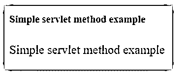

# Servlet 方法

> 原文：<https://www.educba.com/servlet-methods/>


## Servlet 方法简介

servlet 方法是 servlet 生命周期的重要组成部分，用于根据用户需求创建、操作和维护 web 应用程序。servlet 方法用于创建、初始化、处理和关闭 web 应用程序的操作周期。servlet 方法是用于开发可操作应用程序和调用 web 容器来操作 servlet 生命周期的重要特性。servlet 提供了多种方法来发送请求，从服务器获得响应，并根据需要进行操作。

### Servlet 方法概述

服务器端组件 servlet 是创建服务器端应用程序的有力工具。用 Servlets 构建基于 Web 的应用程序是一种基于组件的、独立于平台的解决方案，它没有 CGI 程序的性能限制。Web 开发人员可以使用 servlet 快速有效地创建服务器端应用程序，这些应用程序可以在任何支持 servlet 的 Web 服务器上运行。在 Java 虚拟计算机内部，Servlets 可以运行。当 servlet 在服务器上运行时，不测试浏览器的兼容性。

<small>网页开发、编程语言、软件测试&其他</small>

Servlets 可以访问整个 Java API 家族，包括用于企业数据库访问的 JDBC API。javax.servlet 和 javax.servlet.http 包中的几个 Java 类使用 servlets HTTP 协议。此外，servlets 可以访问特定于 HTTP 的调用库，并可以利用 Java 语言的所有成熟特性，如可移植性、性能、重用和崩溃保护。

### 不同的 Servlet 方法

通用 servlet 在运行 servlet 生命周期中使用和操作以下五种方法:

#### 1.Servlet init()方法

servlet 容器在一个 servlet 操作中只调用 init()方法一次。这个 inits()方法通知 servlet 它将投入使用。

init 方法必须使用以下条件之一:；【p ' mi/.

*   ServletException 引发条件。
*   web 服务器指定一个固定的时间限制。

**语法:**

```
public void init(ServletConfig configs) throws ServletException{
//initialize servlet object and parameters.
}
```

保存初始化函数和基本 servlet 设置的 ServletConfig 对象被传递给 init()方法，如果发生错误，该方法将引发 ServletException。

#### 2.Servlet 服务()方法

一旦 servlet 开始接收请求，servlet 容器就调用 service()方法，这样它就可以做出反应。Servlet 容器还将 ServletResponse 传递给数据库和显示页面。

javax.servlet.ServletRequest 和 javax.servlet.ServletResponse 这两个对象帮助 servlet 处理客户端请求。

**语法:**

```
public void service(ServletRequest requests, ServletResponse responses) throws ServletException{
//Pass servlet object and parameters.
}
```

#### 3.Servlet getServletConfig()方法

servlet 容器创建一个名为 ServletConfig()的 Servlet 方法。它是在对象生命周期的初始化期间提供给 servlet 的。它包含一些初始参数或配置数据。建议将特定于 servlet 的信息保存在 web.xml 中。

**语法:**

```
public String getServletConfig(){
// Add servlet code.
}
```

#### 4.Servlet getServletInfo()方法

servlet 方法显示或返回容器中的 servlet 信息。这个信息可以在 servlet 容器上操作。

**语法:**

```
public String getServletInfo(){
// Add servlet code.
}
```

#### 5.Servlet destroy()方法

servlet 销毁方法用于关闭 servlet 生命周期和连接。它在显示所需的输出后结束 servlet 功能。

**语法:**

```
public void destroy(){
// End servlet connections.
}
```

### Servlet 方法的示例

以下示例显示了 servlet 不同的方法及其按照操作的输出:

#### 示例#1

Hello world servlet 方法示例及其输出。

**HelloOutput.java:**

**代码:**

```
import java.io.IOException;
import java.io.PrintWriter;
import javax.servlet.Servlet;
import javax.servlet.ServletConfig;
import javax.servlet.ServletException;
import javax.servlet.ServletRequest;
import javax.servlet.ServletResponse;
public class HelloOutput implements Servlet {
private static final long serialVersionUID = 1L;
public HelloOutput() {
}
ServletConfig configurates=null;
@Override
public void init(ServletConfig configurates) throws ServletException {
this.configurates = configurates;
System.out.println("Servlet Object initializes here.");
}
@Override
public void destroy() {
System.out.println("Close connection and End process here.");
}
@Override
public ServletConfig getServletConfig() {
return configurates;
}
@Override
public String getServletInfo() {
return "Educba Website";
}
@Override
public void service(ServletRequest request, ServletResponse response)
throws ServletException, IOException {
response.setContentType("text/html");
PrintWriter printout = response.getWriter();
printout.println("<h2>Hello World First Example using " +
"Servlet Methods.</h2>");
printout.close();
}
}
```

**web.xml:**

```
<?xml version="1.0" encoding="UTF-8"?>
<web-app id="WebApp_ID" version="2.4"

xmlns:xsi="http://www.w3.org/2001/XMLSchema-instance"
xsi:schemaLocation="http://java.sun.com/xml/ns/j2ee
http://java.sun.com/xml/ns/j2ee/web-app_2_4.xsd">
<servlet>
<servlet-name> HelloOutput </servlet-name>
<servlet-class>
com.educba.learn.HelloOutput
</servlet-class>
</servlet>
<servlet-mapping>
<servlet-name> HelloOutput </servlet-name>
<url-pattern> /HelloOutput </url-pattern>
</servlet-mapping>
</web-app>
```

**输出:**


#### 实施例 2

带有 getServletInfo()方法输出的 servlet 方法示例。

**HelloOutput.java:**

**代码:**

```
import java.io.IOException;
import java.io.PrintWriter;
import javax.servlet.Servlet;
import javax.servlet.ServletConfig;
import javax.servlet.ServletException;
import javax.servlet.ServletRequest;
import javax.servlet.ServletResponse;
public class HelloOutput implements Servlet {
private static final long serialVersionUID = 1L;
public HelloOutput() {
}
ServletConfig configurates=null;
@Override
public void init(ServletConfig configurates) throws ServletException {
this.configurates = configurates;
System.out.println("Servlet Object initializes here.");
}
@Override
public void destroy() {
System.out.println("Close connection and End process here.");
}
@Override
public ServletConfig getServletConfig() {
return configurates;
}
@Override
public String getServletInfo() {
return "Educba Website";
}
@Override
public void service(ServletRequest requests, ServletResponse responses)
throws ServletException, IOException {
response.setContentType("text/html");
PrintWriter printout = response.getWriter();
printout.println("<h2>Hello World First Example using " + getServletInfo() +
".</h2>");
printout.close();
}
}
```

**web.xml:**

**代码:**

```
<?xml version="1.0" encoding="UTF-8"?>
<web-app id="WebApp_ID" version="2.4"

xmlns:xsi="http://www.w3.org/2001/XMLSchema-instance"
xsi:schemaLocation="http://java.sun.com/xml/ns/j2ee
http://java.sun.com/xml/ns/j2ee/web-app_2_4.xsd">
<servlet>
<servlet-name> HelloOutput </servlet-name>
<servlet-class>
com.educba.learn.HelloOutput
</servlet-class>
</servlet>
<servlet-mapping>
<servlet-name> HelloOutput </servlet-name>
<url-pattern> /HelloOutput </url-pattern>
</servlet-mapping>
</web-app>
```

**输出:**


#### 实施例 3

html 元素及其输出的 servlet 方法示例。

**HelloOutput.java:**

**代码:**

```
import java.io.IOException;
import java.io.PrintWriter;
import javax.servlet.Servlet;
import javax.servlet.ServletConfig;
import javax.servlet.ServletException;
import javax.servlet.ServletRequest;
import javax.servlet.ServletResponse;
public class HelloOutput implements Servlet {
private static final long serialVersionUID = 1L;
public HelloOutput() {
}
ServletConfig configurates=null;
@Override
public void init(ServletConfig configurates) throws ServletException {
this.configurates = configurates;
System.out.println("Servlet Object initializes here.");
}
@Override
public void destroy() {
System.out.println("Close connection and End process here.");
}
@Override
public ServletConfig getServletConfig() {
return configurates;
}
@Override
public String getServletInfo() {
return "Educba Website";
}
@Override
public void service(ServletRequest requests, ServletResponse responses)
throws ServletException, IOException {
response.setContentType("text/html");
PrintWriter printout = response.getWriter();
printout.print("<html><body>");
printout.println("<h5> Simple servlet method example </h5>");
printout.println("<p> Simple servlet method example </p>");
printout.print("</body></html>");
}
}
```

**web.xml:**

**代码:**

```
<?xml version="1.0" encoding="UTF-8"?>
<web-app id="WebApp_ID" version="2.4"

xmlns:xsi="http://www.w3.org/2001/XMLSchema-instance"
xsi:schemaLocation="http://java.sun.com/xml/ns/j2ee
http://java.sun.com/xml/ns/j2ee/web-app_2_4.xsd">
<servlet>
<servlet-name> HelloOutput </servlet-name>
<servlet-class>
com.educba.learn.HelloOutput
</servlet-class>
</servlet>
<servlet-mapping>
<servlet-name> HelloOutput </servlet-name>
<url-pattern> /HelloOutput </url-pattern>
</servlet-mapping>
</web-app>
```

**输出:**




### 结论

servlet 方法在 web 应用程序功能中起着重要的作用。它显示和定义关于服务器和显示输出。

### 推荐文章

这是 Servlet 方法的指南。这里我们分别讨论简介、不同的 servlet 方法和示例。您也可以看看以下文章，了解更多信息–

1.  Servlet 中的[会话](https://www.educba.com/session-in-servlet/)
2.  [Servlet 监听器](https://www.educba.com/servlet-listener/)
3.  [什么是 Servlet？](https://www.educba.com/what-is-servlet/)
4.  [Servlet 过滤器](https://www.educba.com/servlet-filter/)


