# Java 中的模式

> 原文：<https://www.educba.com/patterns-in-java/>

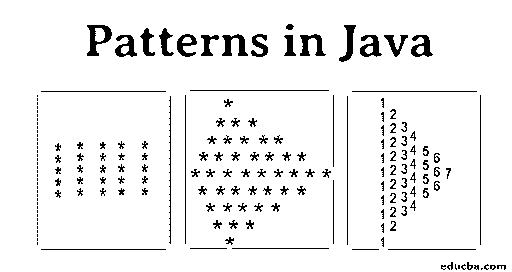


## Java 模式介绍

在文章《Java 中的模式》中，在学习任何 Java 编程语言和深入研究高级概念之前，理解循环的工作原理是很重要的。虽然有 for、while 和 do-while 三种类型的循环。每个循环都是根据程序的特定情况使用的，因为它们彼此略有不同。为了使用各种循环，需要一些编程逻辑，为此，模式实践被给予程序员，因为它涉及到逻辑和推理能力的使用。例如，它可以打印几何图形(如三角形、正方形等。)、金字塔、各种星星图案的盒子、数字和控制台屏幕上的字符样式。不同编程语言的循环格式或基本语法可能不同，但打印这些模式的一般逻辑是相同的。

### Java 中模式的例子

让我们通过一些例子来了解如何在 Java 中绘制模式

<small>网页开发、编程语言、软件测试&其他</small>

#### 示例 1:使用数字打印半个金字塔。

**代码:**

```
public class Pyramid
{
public static void main(String[] args)
{
int i, j;
​//outermost loop to represent the number of rows which is 5 in this case for(i= 1; i<= 5; i++)
{
​//innermost loop is to print the numbers in the specific rows for (j=1; j<=i; j++)
{
System.out.print(j +" " );
}
System.out.println();
}
}
}
```

**输出:**

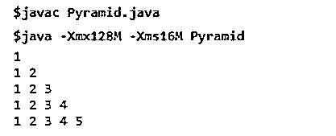


在上面的例子中，印刷图案只需要 2 个基本循环；第一个 for 循环是关于行数的。在我们的例子中，我们已经定义了行，即 5 行，否则我们也可以从用户那里获取输入并将其存储在一个变量中。内部循环是打印特定行中的数字；在完成一行或结束“j”循环后，使用 println()更改该行。

#### 示例 2:打印数字箭头。

**代码:**

```
public class NumberTriangle
{
public static void main(String[] args)
{
int i, j;
int rows =7;
​//outermost loop to represent the number of rows which is 7 in this case
//for the upper half of arrow
for (i=1; i<= rows; i++)
{
​//innermost loop is to print the numbers in the specific rows
//for the upper half of arrow
for (j=1; j<=i; j++)
{
System.out.print(j + " ");
}
System.out.println();
}
​//outermost loop to represent the number of rows which is 6 in this case
//for the lower half of arrow
for (i=rows-1; i>=1; i--)
{
​//innermost loop is to print the numbers in the specific rows
//for the lower half of arrow
for (j=1; j<=i; j++)
{
System.out.print(j + " ");
}
System.out.println();
}
}
}
```

**输出:**

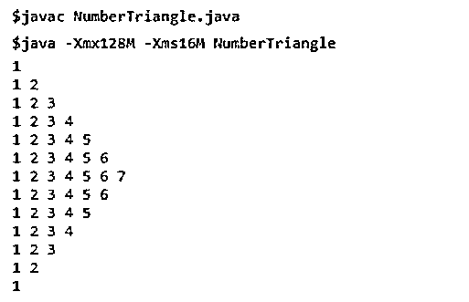


在上面的例子中，我们需要将箭头分成两半，每一半使用 2 个循环。前半部分的行将是为行设置的初始值，而下半部分的行计数比初始值小 1。两半的内部循环用于根据外部循环迭代每一行。

#### 示例 3:使用星号(*)打印完整的金字塔。

**代码:**

```
public class FullPyramid
{
public static void main(String[] args)
{
int i, j, k;
int rows = 5;
//outermost loop to represent the number of rows which is 5 in this case for(i= 1; i<= rows; i++)
{
//innermost loop to represent the spaces in pyramid for (j= 1; j<= rows-i; j++)
{
System.out.print(" ");
}
​//innermost loop to represent the stars (*) in pyramid for (k= 1; k<= 2*i-1; k++)
{
System.out.print("* ");
}
System.out.println();
}
}
}
```

**输出:**

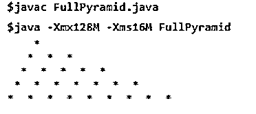


在上面的例子中，我们需要做 3 件事，即记住金字塔打印的总行数，第一个 for 循环从 1 到 rows 变量。其次，我们首先需要打印金字塔中的空格，然后在空格后打印图案(*)。对于第二个和第三个循环，For 循环在外部循环“I”中使用。

#### 示例 4:使用数字打印半倒金字塔。

**代码:**

```
public class ReversePyramid
{
public static void main(String[] args)
{
int i, j, k;
int rows = 5;
​//outermost loop to represent the number of rows which is 5 in this case for(i= 1; i<= rows; i++)
{
//innermost loop to represent the spaces
for (j= 1; j<= rows-1; j++)
{
System.out.print(" ");
}
​//innermost loop to represent the stars (*) in pyramid for (k= 1; k<= i; k++)
{
System.out.print("* ");
}
System.out.println();
}
}
}
```

**输出:**

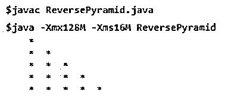


简单的半金字塔很容易，因为我们需要处理数字，*或者我们正在打印的字符，但是对于倒金字塔，我们需要首先打印空格，然后是图案，在我们的例子中是(*)。所以使用了 3 个 for 循环，其工作方式类似于全金字塔的情况。

#### 示例 5:使用字母打印金字塔的一半。

**代码:**

```
public class AlphabetPyramid
{
public static void main(String[] args)
{
int i, j;
​//outermost loop to represent the number of rows which is 5 in this case for(i= 1; i<= 5; i++)
{
int ch = 65;
​//innermost loop to represent the alphabets in a pyramid in particular row for (j= 1; j<= i; j++)
{
System.out.print((char)(ch + i - 1) + " ");
}
System.out.println();
}
}
}
```

**输出:**

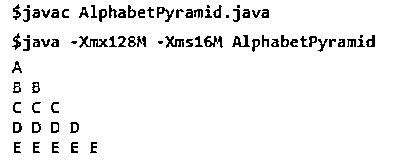


金字塔的打印逻辑与上例相同，使用 2 表示循环，一个表示行数，另一个表示特定行中的字符打印。但是主要要注意的是字符数据的处理。比如‘A’在 Java 中的数值是 65，所以所有的数学逻辑都是用字母表的数值来执行的，最后，以字符格式打印出来。

#### 例 6:字母表的打印模式。

**代码:**

```
public class AlphabetPattern
{
public static void main(String[] args)
{
int i, j;
//outermost loop to represent the number of rows which is 5 in this case for(i= 1; i<= 5; i++)
{
int ch = 65;
​//innermost loop to represent the alphabets for (j= 1; j<= i; j++)
{
System.out.print((char)(ch - 1 + j) + " ");
}
System.out.println();
}
}
}
```

**输出:**

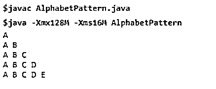


上述示例中处理字符值和 2 for 循环所遵循的基本模式与示例 5 相似，唯一的区别是用于打印所需模式的简单逻辑。

#### 示例 7:使用星号(*)打印正方形。

**代码:**

```
public class SquarePattern
{
public static void main(String[] args)
{
int i, j;
​//outermost loop to represent the number of rows which is 5 in this case for(i= 1; i<= 5; i++)
{
int ch = 65;
//innermost loop to represent the stars (*) for (j= 1; j<= 5; j++)
{
System.out.print(" * " + " ");
}
System.out.println();
}
}
}
```

**输出:**

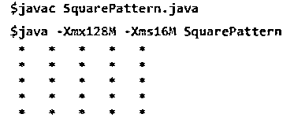


对于正方形的打印，我们需要长度和宽度，即正方形的两边应该相同，在我们的例子中是 5。因此，第一个循环用于正方形的长度或行数，内部循环用于正方形的宽度，即单行中有 5 颗星星。

#### 示例 8:使用星号(*)打印矩形。

**代码:**

```
public class RectanglePattern
{
public static void main(String[] args)
{
int i, j;
​//outermost loop to represent the number of rows which is 5 in this case for(i= 1; i<= 5; i++)
{
int ch = 65;
​//innermost loop to represent columns the stars (*) for (j= 1; j<= 9; j++)
{
System.out.print(" * " + " " );
}
System.out.println();
}
}
}
```

**输出:**

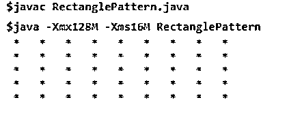


打印矩形(*)的基本逻辑与打印正方形相同，唯一的区别是矩形的长度和宽度不同。这里的“I”环代表矩形的长度，内部的“j”环代表环的宽度。我们的程序被认为是一个常量值；我们也可以询问用户，并将它们存储在单独的变量中。

#### 示例 9:使用星形打印钻石。

用 Java 打印钻石是一个非常简单的过程。它包括打印两个金字塔，一个向上，另一个反向。基本上，我们需要使用循环进行编码来打印两个独立的金字塔。

**代码:**

```
public class Diamond
{
public static void main(String[] args)
{
int i, j, k;
int rows = 5;
​//outermost loop to represent the number of rows which is 5 in this case.
// Creating upper pyramid
for(i= 1; i<= rows; i++)
{
//innermost loop to represent the spaces in upper pyramid for (j= 1; j<= rows-i; j++)
{
System.out.print(" ");
}
​//innermost loop to represent the stars (*) in upper pyramid for (k= 1; k<= 2*i-1; k++)
{
System.out.print("* ");
}
System.out.println();
}
​//outermost loop for the rows in the inverted pyramid for (i = rows-1; i>0; i--)
{
​//innermost loop for the space present in the inverted pyramid for (j=1; j<= rows - i; j++)
{
System.out.print(" ");
}
​//innermost loop inside the outer loop to print the ( * ) pattern in inverted pyramid for (k = 1; k<= 2*i-1; k++)
{
System.out.print("* ");
}
System.out.println();
}
}
}
```

在上面的示例中，应用几乎相同的逻辑来创建两个金字塔，一个在向上的方向，另一个在相反的方向。因此，第一个循环是关于模式中的行数，第二个是关于模式中的空格和星号(*)模式。

**输出:**

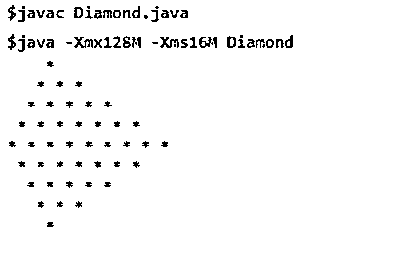


#### 示例 10:以阶梯格式打印二进制数。

**代码:**

```
public class BinaryStair
{
public static void main(String[] args)
{
int i, j;
//outer loop for the total rows which is 5 in this case for (i = 1; i <= 5; i++)
{
​//inner loop for the pattern of 0 and 1 in each row for (j = 1; j<= i ; j++)
{
if (j % 2 ==0)
{
System.out.print(0);
}
else
{
System.out.print(1);
}
}
System.out.println();
}
}
}
```

**输出:**

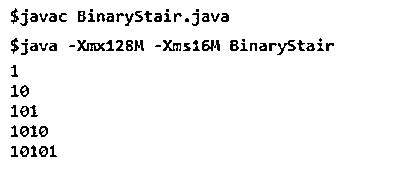


在上面的示例中，为了打印二进制模式，外部 for 循环“I”用于总行数，内部 for 循环“j”用于迭代直到外部循环“I ”,因为对于第一行，我们需要 1 个值，对于第二行，我们需要 2 个值，依此类推。If 和 else 语句用于打印 0 和 1 的交替值。假设第一次 i=1，j=1 和 1%2！= 0，则打印 1，执行将移出内循环。

#### 示例 11:打印重复字母图案的程序。

**代码:**

```
public class AlphabetReverseOrder
{
public static void main(String[] args)
{
int i, j, k;
//outer loop for the total rows which is 5 in this case for (i = 0 ; i<=5; i++)
{
int ch= 65;
//inner loop for the pattern of alphabets in till ‘i’ loop for (j = 0; j <=i ; j++)
{
System.out.print((char) (ch+j) + " ");
}
//inner loop for the pattern of alphabets in reverse order from ‘i’ loop for (k= i-1; k >=0; k--)
{
System.out.print((char) (ch+k) + " ");
}
System.out.println();
}
}
}
```

**输出:**

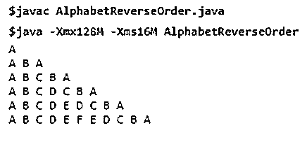


在上面的例子中，如果我们观察图案的每一行，我们需要首先以递增的顺序打印字母表，即 A B，然后以相反的顺序打印，即 A B A。为此，我们需要 3 个循环，第一个循环用于总行数。第二个 for 循环按升序打印字母，第三个 for 循环位于外部“I”循环内，以与“j”循环相反的顺序打印同一行中的字母。

### 结论

上面的例子及其解释清楚地展示了如何在 Java 中制作这样的[模式](https://www.educba.com/patterns-in-c-sharp/)。虽然这些模式在开始时看起来很难，但是深入观察它们如何在单个行中重复，以及根据应该使用多少个循环，就很容易做到这一点。今天，在大公司的面试中，候选人被要求写出不同难度的模式的逻辑，因为这种模式的制作显示了一个人的基本逻辑和编程知识。

### 推荐文章

这是 Java 模式的指南。在这里，我们讨论一个简要的概述，并使用一些例子和输出绘制不同的 java 模式。您也可以浏览我们推荐的其他文章，了解更多信息——

1.  [Java 中的星型模式](https://www.educba.com/star-patterns-in-java/)
2.  [Java 中的框架](https://www.educba.com/frameworks-in-java/)
3.  [PHP 中的模式](https://www.educba.com/patterns-in-php/)
4.  [JavaScript 中的模式](https://www.educba.com/patterns-in-javascript/)


