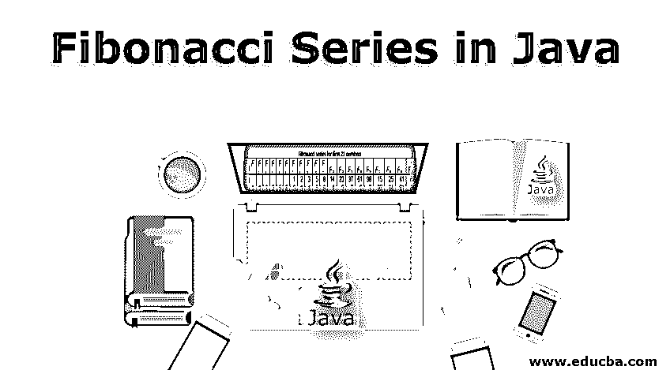
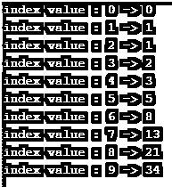

# Java 中的斐波那契数列

> 原文：<https://www.educba.com/fibonacci-series-in-java/>




## 斐波那契数列简介

斐波纳契数列的过程在于每个数字都是前面两个值的和，序列总是从基数 0 和 1 开始。斐波那契数与黄金分割率密切相关。在这个主题中，我们将了解 Java 中的斐波那契数列。

**公式:**

<small>网页开发、编程语言、软件测试&其他</small>

an = an − 2 + an − 1

| **前 21 个数字的斐波那契数列** |
| *F*T2】0 | *F* <sub>1</sub> | *F*T2】2 | *F*T2】3 | *F*T2 4 | *F*T2】5 | *F*T2】6 | *F*T2】7 | *F*T2】8 | *福*T2【9】福 | *F* <sub>10</sub> | *F* <sub>11</sub> | *F* <sub>12</sub> | *F* <sub>13</sub> | *F* <sub>14</sub> | *福*T2【15】福 | *F* <sub>16</sub> | *F* <sub>17</sub> | *F* <sub>18</sub> | *福* <sub>19</sub> | *福*T2【20】福 |
| Zero | One | One | Two | Three | Five | Eight | Thirteen | Twenty-one | Thirty-four | Fifty-five | Eighty-nine | One hundred and forty-four | Two hundred and thirty-three | Three hundred and seventy-seven | Six hundred and ten | Nine hundred and eighty-seven | One thousand five hundred and ninety-seven | Two thousand five hundred and eighty-four | Four thousand one hundred and eighty-one | Six thousand seven hundred and sixty-five |

### 关键应用

下面是斐波那契数列在 Java 中的主要应用:

*   英里到公里和公里到英里的转换。
*   敏捷方法的一些例子。
*   欧几里德的算法运行时分析计算是使用这一系列技术进行的。
*   斐波那契统计在数学上被一些伪随机数发生器磨损。
*   扑克规划过程涉及到这种技术的使用。
*   斐波纳契堆的数据结构技术是使用斐波纳契数列技术实现的。
*   在光学中，当一束光从两个由不同折射率的不同材料堆叠而成的半透明板的起点到终点闪烁时，它可能会从三个表面返回:两个板的顶点、中心和底面。当 k > 1 时，具有反射的不同光线路径的数字是斐波纳契数。

### 斐波那契数列程序(非递归程序)

下面是一个斐波那契数列程序:

**代码:**

```
// Fibonacci series program
public class Fibonacci {
// main program
public static void main(String[] args) {
int count = 10, var1 = 0, var2 = 1;
System.out.print("First " + count + " terms: ");
// Fibonacci series formation loop
for (int i = 1; i <= count; ++i)
{
System.out.print(var1 + " + ");
int added_sum= var1 + var2;
var1 = var2;
var2 = added_sum;
}
}
}
```

**输出:**


**说明:**

*   这个程序计算给定数字范围的斐波纳契数列。
*   这里，这个过程没有使用递归技术。

### 程序算法

*   根类 Fibonacci 是这样声明的，嵌入到这个类中的所有程序代码都必须处理实现一个 [Fibonacci 数列](https://www.educba.com/fibonacci-series-in-javascript/)的功能。
*   在根类内部，声明了 main 方法。通常，main 方法充当一个重要的 Java 方法。如果程序中没有 main 方法，JVM 就不会执行。主方法的各个子组件的解释如下所示，
*   接下来，隐含了变量初始化部分。本节涉及三个不同变量的初始化。其中两个用于通过变量级值交换实现斐波那契逻辑，另一个变量用于调节需要生成斐波那契逻辑的值的计数。
*   斐波纳契数列程序的关键逻辑是使用下面程序部分给出的 for 循环实现的。

**代码:**

```
for (int i = 1; i <= count; ++i)
{
System.out.print(var1 + " + ");
int added_sum= var1 + var2;
var1 = var2;
var2 = added_sum;
}
```

*   循环部分背后的逻辑如下:最初，在循环上执行一系列值；对于每个流量，范围值递增，循环发生。此外，在每个流中，这两个交换变量的值被加到第三个变量中。
*   求和后，第二个变量值被隐含到第一个变量中，这样就使得第一个变量值被从这个进程中冲走了。在下一步中，将求和值赋给第二个变量。

因此，在此实例结束时，对于单个逻辑流，将应用以下事件:

*   第一个变量的值被清除。
*   现有的第二个变量值填充到第一个变量中。
*   求和后的值被移入第二个变量。

在执行以下逻辑序列的过程中，对于需要的给定计数值，[可以得到斐波纳契数列](https://www.educba.com/fibonacci-series-php/)。

#### 1.斐波那契数列程序(使用数组)

**代码:**

```
import java.util.Arrays;
public class Main {
public static void main(String[] args) {
int Count = 15;
long[] array = new long[Count];
array[0] = 0;
array[1] = 1;
for (int x = 2; x < Count; x++) {
array[x] = array[x - 1] + array[x - 2];
}
System.out.print(Arrays.toString(array));
}
}
```

**输出** **:**


**说明:**

*   暗示上面起草的程序逻辑，但是在这个实例中，斐波纳契输入被存储为数组的一部分。
*   所以上面提到的所有操作都是针对一个数组进行的。

#### 2.斐波那契数列程序(不含任何循环)

**代码:**

```
public class Fibonaccifunction
{
private static int indexvalue = 0;
private static int endPoint = 9;
public static void main (String[] args)
{
int number1 = 0;
int number2 = 1;
fibonaccifunction(number1, number2);
}
public static void fibonaccifunction(int number1, int number2)
{
System.out.println("index value : " + indexvalue + " -> " + number1);
if (indexvalue == endPoint)
return;
indexvalue++;
fibonaccifunction(number2, number1+number2);
}
}
```

**输出** **:**




**说明:**

*   暗示了上面起草的程序逻辑，但是在这个实例中，使用名为 Fibonacci 的函数递归处理 Fibonacci 输入。

#### 3.斐波纳契数列程序(没有暗示任何循环，但只使用条件实现)

**代码:**

```
public class Fibonacci_with_conditions
{
static int number2=1;
static int number1=0;
static int next=0;
public static  void Fibonacci_conditions( int number)
{
if(number<10)
{
if(number == 0)
{
System.out.print(" "+number);
number++;
Fibonacci_conditions (number);
}
else
if(number == 1)
{
System.out.print(" "+number);
number++;
Fibonacci_conditions(number);
}
else{
next=number1+number2;
System.out.print(" "+next);
number1=number2;
number2=next;
number++;
Fibonacci_conditions(number);
}
}
}
public static void main(String[] args)
{
Fibonacci_conditions(0);
}
}
```

**输出** **:**


**说明:**

*   这意味着上面起草的程序逻辑，但在这种情况下，斐波纳契输入仅通过必要的条件语句来调节。
*   根据条件，必须进行变量的[交换。](https://www.educba.com/swapping-in-php/)

#### 4.斐波那契数列程序(没有循环，循环的概念是用 Nextint 方法实现的)

**代码:**

```
import java.util.*;
public class Fibonacci_series
{
public static void main(String[] args)
{
System.out.println("Input:");
int number= 10,value1=1,value2=0,value3=0;
num(number, value1, value2, value3);
}
public static void num(int number,int value1,int value2,int value3)
{
if(value1 <= number)
{
System.out.println(value1);
value3=value2;
value2=value1;
value1=value2+value3;
num(number,value1,value2,value3);
}
}
}
```

**输出** **:**

**

** 

**说明:**

*   这意味着上面起草的程序逻辑，但在这个实例中，Fibonacci 输入使用名为 num 的函数递归处理，循环使用 nextInt 函数执行。

### 结论–Java 中的斐波那契数列

这些程序意味着实现给定整数值的斐波那契数列。在给定的示例列表中，隐含了一组基本分类的技术。像面向数组的方法和单独条件的方法这样的技术非常特别。

### 推荐文章

这是一个 Java 的斐波那契数列指南。在这里，我们讨论斐波纳契数列和一组在给定的例子列表中隐含的技巧。您也可以阅读以下文章，了解更多信息——

1.  [C 中的斐波那契数列](https://www.educba.com/fibonacci-series-in-c/)
2.  [Java 中的 3D 数组](https://www.educba.com/3d-arrays-in-java/)
3.  [Java 注释](https://www.educba.com/java-annotations/)
4.  [Java 中的 string buffer](https://www.educba.com/stringbuffer-in-java/)


