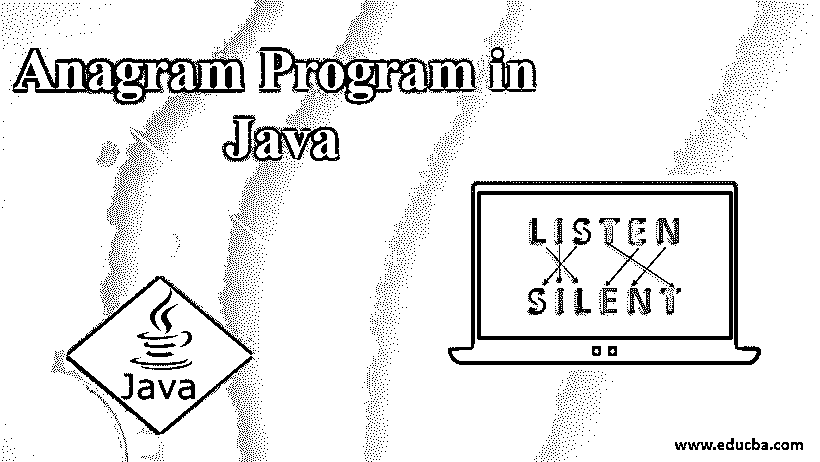

# Java 中的字谜程序

> 原文：<https://www.educba.com/anagram-program-in-java/>




## Java 中字谜程序的定义

变位词是通过重新排列一个不同单词的字母而形成的单词；变位词的关键是字母只能用一次，不能在新单词中重复出现。变位词是具有相同字母数的单词。这里的计数很重要。Java 中的字谜程序可以通过对两个字符串进行排序和比较，以上述方式使用。如果这些成功，那么它意味着字符串是一个变位词。

**算法:**

<small>网页开发、编程语言、软件测试&其他</small>

让我们来看看从一个特定的单词得到一个变位词的算法。有三种方法可以找出变位词。我们将逐一解释这三种方式。基本算法包括检查字符串的长度。一旦长度相同，就可以排序或计数并检查变位词。

### Java 中的字谜程序实例

对于给定的字符串，我们可以做的第一件事是对两个给定的字符串进行排序，以验证它们是否是变位词。一旦排序完成，就可以在排序后的订单中进行比较。该方法的时间复杂度为 O (n Logn)。这方面的 Java 代码可以编写如下:

#### 示例#1

**代码:**

```
// JAVA program to validate if two strings are anagrams
import java.io.*;
import java.util.Arrays;
import java.util.Collections;
class Main {
/* Below is a function which checks if the strings are anagram */
static boolean checkAnagram(char[] strana1, char[] strana2)
{
// Finding lengths of strings
int len1 = strana1.length;
int len2 = strana2.length;
// If lengths do not match then they cannot be anagrams
if (len1 != len2)
return false;
// Sort both strings
Arrays.sort(strana1);
Arrays.sort(strana2);
// Comparing the strings which are sorted earlier
for (int i = 0; i < len1; i++)
if (strana1[i] != strana2[i])
return false;
return true;
}
/* Main program to test Anagram*/
public static void main (String args[])
{
char strana1[] = { 't', 'e', 's', 't' };
char strana2[] = { 't', 't', 'e', 'w' };
if (checkAnagram(strana1, strana2))
System.out.println("The strings to be checked are" + " anagram of each other");
else
System.out.println("The strings to be checked are not" + " anagram of each other");
}
}
```

上面的程序首先检查两个给定字符串的长度。如果字符串不具有相同的长度，那么它将返回 false。只有当两个字符串的长度相同时，程序才会继续运行。通过使用数组排序函数，它将对两个数组中的字符串进行排序。一旦对两个字符串都使用了数组排序函数，就比较这两个字符串，并且在一个循环中比较每个字母。如果 for 循环成功，并且两个字符串中的所有字母都相同，那么输出将是一个变位词。即使有一个字母不匹配，它也会返回 false。这里的主程序检查字符串，并根据 checkAnagram 函数返回的结果显示字符串是否是变位词。

**输出:**


如果我们将输入改为' t '，' t '，' e '，' s '而不是 w，输出将如下。

**输出:**


#### 实施例 2

当验证的字符串很小时，可以使用此方法。这种方法认为存储的字符是 8 位，可以存储 256 个字符。在这个方法中，您可以首先使用大小为 256 的计数数组对字符串进行计数，并将计数数组中所有必需的值初始化为 0。遍历该数组，并在遍历时递增计数。完成后，您就可以比较计数数组了。如果计数相同，那么返回的结果将为真。

**代码:**

```
import java.io.*;
import java.util.*;
class ANA {
static int NO_CHARS = 256;
/* Below is a function which checks if the strings are anagram */
static boolean isAnagram(char strana1[], char strana2[])
{
// Here we create two arrays and initialize it to 0
int cnt1[] = new int[NO_CHARS];
Arrays.fill(cnt1, 0);
int cnt2[] = new int[NO_CHARS];
Arrays.fill(cnt2, 0);
int i;
// For every character in input strings, increment the count
for (i = 0; i < strana1.length && i < strana2.length;
i++) {
cnt1[strana1[i]]++;
cnt2[strana2[i]]++;
}
// Checking If both strings are of different length
if (strana1.length != strana2.length)
return false;
// Compare count arrays
for (i = 0; i < NO_CHARS; i++)
if (cnt1[i] != cnt2[i])
return false;
return true;
}
/* Main program to test to check if string is Anagram or not*/
public static void main(String args[])
{
char strana1[] = ("silent").toCharArray();
char strana2[] = ("lisent").toCharArray();
if (isAnagram(strana1, strana2))
System.out.println("The strings to be checked are" + " anagram of each other");
else
System.out.println("The strings to be checked are not" + " anagram of each other");
}
}
```

**输出:**


#### 实施例 3

可以使用 Java 中的 StringBuilder 函数来检查变位词。我们可以使用 deletechartAt()方法来删除第二个字符串中出现的任何字符。

**代码:**

```
public class Main
{
static void findAnagram(String str1, String str2)
{
String copystr1 = str1.replaceAll( " ", "").toLowerCase();
String copystr2 = str2.replaceAll(" ", "").toLowerCase();
//Setting the initial status to true
boolean flag = true;
if(copystr1.length() != copystr2.length())
{
//If copystr1 and copystr2 do not have same length then set the flag to false
flag = false;
}
else
{
//changing copystr1 to char array
char[] str1Array = copystr1.toCharArray();
//Creating StringBuilder from copystr2
StringBuilder sb = new StringBuilder(copystr2);
//Validating if  each character of str1Array is present in string builder
for (char c : str1Array)
{
int index = sb.indexOf(""+c);
if (index != -1)
{
sb = sb.deleteCharAt(index);
}
else
{
//If each character is not present, setting flag to false and breaking the loop
flag = false;
break;
}
}
}
if(flag)
{
System.out.println(str1+" and "+str2+" are anagrams");
}
else
{
System.out.println(str1+" and "+str2+" are not anagrams");
}
}
public static void main(String[] args)
{
findAnagram("Silent", "Listen");
}
}
```

这里的程序使用标志，并使用字符串生成器模块来帮助删除多余的字符。

**输出:**


### 推荐文章

这是一个 Java 语言的字谜程序指南。在这里，我们讨论的介绍和算法，随着不同的例子和它的代码实现变位。您也可以看看以下文章，了解更多信息–

1.  [Java 中的字符串类](https://www.educba.com/string-in-java/)
2.  [Java 中的堆栈类](https://www.educba.com/stack-class-in-java/)
3.  [C 语言中的字谜程序](https://www.educba.com/anagram-program-in-c/)
4.  [Python 中的字谜程序](https://www.educba.com/anagram-program-in-python/)


