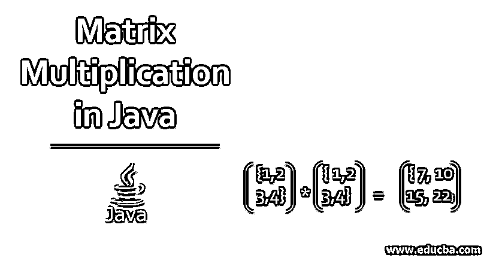
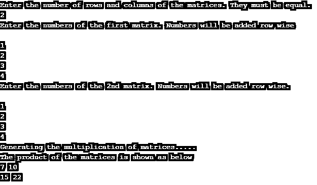

# Java 中的矩阵乘法

> 原文：<https://www.educba.com/matrix-multiplication-in-java/>




## Java 中的矩阵乘法简介

Java 中的矩阵存储在数组中。存在一维数组和二维数组，它们以矩阵的形式在称为数组的维度中存储值。在一维数组中只有一维存储的数字，而在二维数组中，数字以行和列的形式存储。在 Java 编程语言中，矩阵可以用于数字的加、减和乘。矩阵乘法是 Java 编程方法中最复杂的任务之一。在本文中，我们必须在 Java 中执行矩阵乘法，并展示如何将两个矩阵相乘并提供合理的输出。

### 一般方法

Java 编程语言中的矩阵乘法以非常简单的方式实现。首先，我们在第一个二维数组中输入数字，然后在第二个二维数组中输入元素的数字。数字按行相加，这意味着创建第一行，然后创建第二行中的数字，依此类推。然后，第二个矩阵以类似的方式创建，然后我们开始将矩阵中的数字相乘。

<small>网页开发、编程语言、软件测试&其他</small>

### Java 中矩阵乘法的例子

下面是矩阵乘法的例子

#### 示例#1

在编码示例中，我们看到如何按行输入两个矩阵，然后执行矩阵乘法。两个矩阵相乘的代码如下所示。声明了三个数组。第一个和第二个矩阵的乘积显示在第三个矩阵内。那么矩阵被显示为输出，该输出是阵列中两个矩阵的乘积。

**代码:**

```
import java.util.Scanner;
public class MatixMultiplication
{
public static void main(String args[])
{
int n;
Scanner input = new Scanner(System.in);
System.out.println("Enter the number of rows and columns of the matrices. They must be equal.");
n = input.nextInt();
int[][] a = new int[n][n];
int[][] b = new int[n][n];
int[][] c = new int[n][n];
System.out.println("Enter the numbers of the first matrix. Numbers will be added row wise \n");
for (int i = 0; i < n; i++)
{
for (int j = 0; j < n; j++)
{
a[i][j] = input.nextInt();
}
}
System.out.println("Enter the numbers of the 2nd matrix. Numbers will be added row wise.  \n");
for (int i = 0; i < n; i++)
{
for (int j = 0; j < n; j++)
{
b[i][j] = input.nextInt();
}
}
System.out.println("Generating the multiplication of matrices.....");
for (int i = 0; i < n; i++)
{
for (int j = 0; j < n; j++)
{
for (int k = 0; k < n; k++)
{
c[i][j] = c[i][j] + a[i][k] * b[k][j];
}
}
}
System.out.println("The product of the matrices is shown as below");
for (int i = 0; i < n; i++)
{
for (int j = 0; j < n; j++)
{
System.out.print(c[i][j] + " ");
}
System.out.println();
}
input.close();
}
}
```

显示了 2*2 矩阵的输出。第一个矩阵由{ 1，2

3,4}

并且第二矩阵也包含相同的元素。在样本输出中，我们注意到矩阵和样本输出的相乘。矩阵的元素以非常好的方式产生。生产的产量

{1,2                          { 1,2                                      { 7, 10

3,4}        *                3,4}              =                       15, 22}

**输出:**




#### 实施例 2

在编码示例 2 中，我们有相同的程序，但是现在我们使用三维数组进行乘法。我们现在使用 3 * 3 矩阵乘法，并在另一个三维数组中显示输出。

**代码:**

```
import java.util.Scanner;
public class Matix
{
public static void main(String args[])
{
int n;
Scanner input = new Scanner(System.in);
System.out.println("Enter the number of rows and columns of the matrices. They must be equal.");
n = input.nextInt();
int[][] a = new int[n][n];
int[][] b = new int[n][n];
int[][] c = new int[n][n];
System.out.println("Enter the numbers of the first matrix. Numbers will be added row wise \n");
for (int i = 0; i < n; i++)
{
for (int j = 0; j < n; j++)
{
a[i][j] = input.nextInt();
}
}
System.out.println("Enter the numbers of the 2nd matrix. Numbers will be added row wise.  \n");
for (int z = 0; z < n; z++)
{
for (int k = 0; k < n; k++)
{
b[z][k] = input.nextInt();
}
}
System.out.println("Generating the multiplication of matrices.....");
for (int i = 0; i < n; i++)
{
for (int j = 0; j < n; j++)
{
for (int k = 0; k < n; k++)
{
c[i][j] = c[i][j] + a[i][k] * b[k][j];
}
}
}
System.out.println("The product of the matrices is shown as below");
for (int k = 0; k < n; k++)
{
for (int l = 0; l < n; l++)
{
System.out.print(c[k][l] + " ");
}
System.out.println();
}
input.close();
}
}
```

从第二个示例代码开始，我们打印了两个 3 * 3 的矩阵。第一个矩阵是{1，1，1

1,1,1

1,1,1}

第二个矩阵也是一样的。矩阵乘法的生成方式如下

{1,1,1                          {1,1,1                                                 { 3,3,3

1,1,1                *         1,1,1                                   =              3,3,3

1,1,1}                          1,1,1}                                                 3,3,3}

**输出:**


### 结论

在本文中，我们看到一个 2 * 2 矩阵和一个 3 * 3 矩阵相乘，输出以非常漂亮的方式显示。输出被清楚地给出。使用[矩阵乘法](https://www.educba.com/matrix-multiplication-in-matlab/)，我们也可以创建一个矩阵的 4*4 乘法。在程序的第一步中会询问碱基。我们也可以创建 5 * 5，6 * 6 的矩阵。基数越大，程序越复杂。

然而，矩阵的简单乘法在计算以 X 轴、Y 轴或 Z 轴作为反射轴的点的反射时非常有用。这些简单的概念用于坐标几何，也用于几何应用的数学建模。

### 推荐文章

这是一个 Java 矩阵乘法指南。在这里，我们讨论了 Java 中矩阵乘法的介绍、一般方法和相应的例子。您也可以浏览我们推荐的其他文章，以了解更多信息-

1.  [Java 命名惯例](https://www.educba.com/java-naming-conventions/)
2.  [Java 中的重载和覆盖](https://www.educba.com/overloading-and-overriding-in-java/)
3.  [Java 中的静态关键字](https://www.educba.com/static-keyword-in-java/)
4.  [Java 中的 NumberFormatException](https://www.educba.com/numberformatexception-in-java/)


