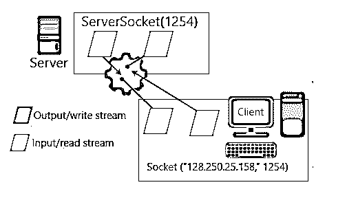

# Java 中的套接字编程

> 原文：<https://www.educba.com/socket-programming-in-java/>


## Java 套接字编程简介

万维网和互联网改变了我们的生活方式和相互交流的方式，也改变了我们从事科学、工程和商业的方式。现代生活完全被互联网所左右，或者以互联网为中心。企业不断寻求新的方式来生产各种服务，并以引入创新的新方式与各种服务进行通信。在本文中，我们将讨论 Java 中的套接字编程。

套接字为 [OSI 模型](https://www.educba.com/what-is-osi-model/)的传输层的编程网络提供接口。使用套接字的网络通信在整个互联网中无处不在。除此之外，用 Java 编写的套接字程序可以与用 C、C++、Python 等非 Java 语言编写的套接字程序通信。

<small>网页开发、编程语言、软件测试&其他</small>

### 套接字类方法

Java 中有 Socket 类方法。套接字被绑定为一个端口号，以便 TCP 识别数据要发送到的端口号。Java 提供了一组类，其中之一是 java.net。这用于网络应用的快速开发。java.net 包中的关键类、接口和异常简化了创建客户端和服务器程序的复杂性，它们是:

类别包括:

*   内容处理程序
*   数据报包
*   数据报套接字
*   数据报套接字 Imp 1
*   HTTP URL 连接
*   I 网络地址
*   多播套接字
*   服务器套接字
*   (电源)插座
*   插座 Imp 1
*   统一资源定位器
*   URL 连接
*   URL 编码器
*   URL 流处理程序

接口包括:

*   内容处理程序工厂
*   文件名映射
*   套接字实现工厂
*   URL 流处理程序工厂

例外情况如下:

*   绑定异常
*   连接异常
*   格式错误的 URL 异常
*   没有到主机的路由异常
*   协议异常
*   套接字异常
*   未知的主机异常
*   未知的服务异常

### TCP/IP 套接字编程

java.net 软件包中有两个用于创建程序的类。

*   服务器套接字
*   (电源)插座

服务器程序通过输入和输出流进行通信。如果有一个连接请求，那么就有一个新的套接字发挥作用，这里是一个与它建立的连接。




#### 方法 1–创建服务器套接字程序

用 Java 创建服务器套接字程序有不同的步骤。

创建服务器套接字程序的简单步骤如下:

**第一步:**Socket 服务器打开。

```
Server Socket General= new Server Socket(PO)
```

这里 PO 是端口号。

在这里，端口号被分配给服务器网络，它将通过该网络使用输入/输出流进行通信。

第二步:有一个客户请求，我们必须耐心等待。

```
Socket General= server. accept()
```

这是服务器。accept()等待客户端，这里套接字的名称是 client。

**步骤 3:** 创建 I/O 流，从而建立连接

数据输入流

```
is = new Data Input Stream(client. Get Input Stream());
```

数据输出流

```
os = new Data Output Stream(client. get Output Stream());
```

输入流和输出流被分配了 Get Input Stream()，它们分别被调用。

**步骤 4:** 创建与客户的联系。

从客户端接收:

```
string hello = br. Read Line();
```

将其发送给客户端:

```
br. Write Bytes("How are you\n");
```

下面的代码与客户端进行通信，接收并向客户端发送请求。

**第五步:**最后，让套接字退出。

最后，使用关闭套接字函数来关闭和结束套接字编程。

下面显示了一个简单的服务器套接字示例:

一个连接服务器的简单程序。

**代码:**

```
import java.net.*;
import java.io.*;
public class SimpleMachine {
public static void main(String args[]) throws IOException {
// On port 1362 server port is registered
ServerSocket soc = new ServerSocket(1362);
Socket soc1=soc.accept(); // Link is accepted after waiting
// Linked with the socket there should be a connection
OutputStream s1out = soc1.getOutputStream();
DataOutputStream dosH = new DataOutputStream (s1out);
// A string command is sent
dosH.writeUTF("Hello how are you");
// The connection can be closed but the server socket cannot.
dosH.close();
s1out.close();
soc1.close();         }
}
```

#### 方法 2–创建一个简单的服务器套接字程序

现在我们将看到一个简单的 Java 客户端程序。

用 Java 创建简单客户端程序的步骤如下所示:

**第一步:**制作 Socket 对象。

```
Socket client= new Socket(server, port_id)
```

服务器和端口 ID 已连接；也就是说，服务器连接到端口 ID。

**步骤 2:** 创建输入/输出流。

```
is = new Data Input Stream(client.getInputStream());
```

```
os = new Data Output Stream(client.getOutputStream());
```

输入流是，输出流 os 用于与客户端通信。

**步骤 3:** 输入/输出流用于与客户端对话。

从服务器读取数据:

```
string hello = br. readLine();
```

向服务器发送数据:

```
br.writeBytes("How are you\n")
```

该步骤与服务器通信。输入流和输出流都与服务器通信。

**步骤 4:** 完成后关闭套接字。

这个函数将在最终完成时关闭客户端。

下面是一个简单的服务器套接字程序的例子。

一个简单的客户端程序。

**代码:**

```
import java.net.*;
import java.io.*;
public class SimpleMachineClient {
public static void main(String args[]) throws IOException
{
// At port 1325, connection to the server is opened
Socket s1H = new Socket("host",1325);
// Read the input stream by getting an input file from the socket
Input Stream s1I = s1\. getInputStream();
Data Input Stream disH = new Data Input Stream(s1In);
String str = new String (disH.readUTF());
System.out.println(str);
// After it is done, we can close the connection.
disH.close();
s1I.close();
s1H.close();
}
}
```

### 结论

套接字编程在 Java 和任何其他编程语言中都是有益的。用 Java 编写的程序可以连接用 C 或 C++编写的程序。换句话说，当两者之间必须有连接时，套接字程序的语言并不重要。在本文中，我们基本上看到了简单服务器和简单客户端的例子，其中服务器套接字之间有一个连接，另一个例子中，服务器套接字之间有一个连接。我们使用 TCP/IP 编程来实现同样的目的。然而，有很多编程技术，如 UDP 编程技术和 URL 编程技术。我们在这篇文章中没有看到这样的例子。我们重点介绍了 TCP/IP 编程技术。

### 推荐文章

这是一个 Java 套接字编程指南。在这里，我们讨论套接字类方法和两个类，这两个类来自用于创建程序的 java.net 包。您也可以浏览我们推荐的其他文章，了解更多信息——

1.  [Java 包](https://www.educba.com/java-packages/)
2.  [Java 中的合并排序](https://www.educba.com/merge-sort-in-java/)
3.  [Java 包示例](https://www.educba.com/java-package-example/)
4.  [Java 中的计算器](https://www.educba.com/calculator-in-java/)


