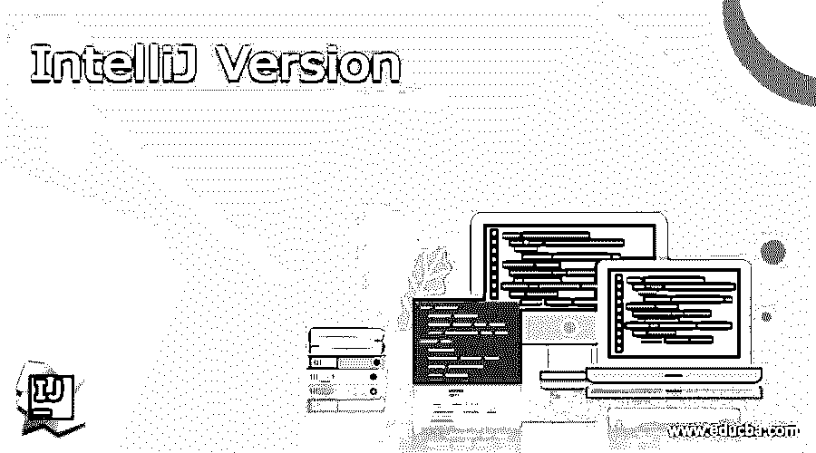

# IntelliJ 版本

> 原文：<https://www.educba.com/intellij-version/>

## IntelliJ 版本介绍

JetBrains 开发的集成开发环境称为 IntelliJ，它可以用于开发任何计算环境，并且是用 Java 编码语言开发的。它被称为 IntelliJ IDEA，是一个“集成开发环境”。它通过分析代码将所有编码语言和在该语言中创建的项目的符号连接起来，这些数据用于错误处理、项目分析和文件导航。我们有 IntelliJ 中所有东西的快捷方式，以及系统中代码的重复检测和快速修复。代码分析是在运行中完成的，解决方案会立即提供。

### 版本

*   IntelliJ 最初于 2001 年 1 月发布&这成为第一个具有适当的代码导航和编码结构重构能力的 Java 编程 IDE。现在，我们无法在 IntelliJ 支持页面上看到任何早期版本及其支持。IntelliJ 页面中提供的版本来自 2017 年，并且只对少数版本提供支持。我们有 2017.1、2017.2、2017.3、2018.1、2018.2、2018.3、2019.1、2019.2、2019.3、2020.1、2020.2、2020.3、2021.1 和 2021.2 版。更新到最新版本以获得 IntelliJ 团队的支持很重要。IntelliJ 的其他最旧版本为 11.0、12.1、13.0、13.1、14.0、14.1、15.0、2016.1、2016.2 和 2016.3
*   2017.1、2017.2、2017.3 版本不支持 IntelliJ，这些是目前可用的最早版本。这些版本的指南与 Android Development、Grail 和 Groovy 一起提供。我们也可以在版本中使用 Scala 语言。我们有不同的框架，如 AspectJ、Android、CoffeeScript、ColdFusion、Docker、EJB、Erlang 和 Java 等不同的框架，因此我们可以在 IntelliJ 中使用任何编码语言。在这里，Python 和 Ruby 插件也是可用的，因此开发人员可以在 IntelliJ 的早期版本中安装和使用任何语言。所有 IntelliJ 版本都有终极版和社区版，所有操作系统都受支持。
*   除了 2017 版的所有框架，2018 版还提供了从 Eclipse 和 NetBeans 的迁移。这有助于开发人员将他们的代码从 Eclipse 或 NetBeans 转移到 IntelliJ，并根据他们的需求对代码框架进行必要的更改。IntelliJ 版本也支持 Java EE 版本，这使得开发人员可以用 Java 格式编写任何代码并进行修改。Grails 3 版本在此版本中提供，只能通过旗舰版打开。我们可以打开 Groovy、Scala 和 Gradle 的任何版本，直接从 IntelliJ 的 UI 创建项目。
*   IntelliJ 文档中仍然支持 2019 版本，但它被称为应用程序的早期版本。community edition 和 Ultimate editions 直接在文档中提供，其中 community edition 是免费版本，Ultimate 附带 30 天试用期，在此期间为应用程序开发提供附加工具。我们可以直接安装，也可以使用工具箱来安装应用程序。Linux 提供了另一个名为 snap package 的解决方案，它可以自动安装更新，这样用户就不需要更新新版本了。安装 IntelliJ 2019 版本的系统至少需要 2GB RAM 和 2.5GB 磁盘空间。它可以在 64 位系统上工作，并且应该在系统中预装 Java，以便安装 IntelliJ IDEA。
*   2020.1 版见证了所有支持语言的变化。Java、Kotlin、Scala 和 Groovy 语言是可以在 IDE 中使用的公认的 JVM 语言，在 IDE 中可以将其编译成 JVM 字节码。IDE 中的插件支持大多数流行语言，如 Python、JavaScript、Ruby、PHP、Go、SQL、Dart 和 HTML 语言。尽管 IntelliJ 不支持 C 或 C++，但我们可以使用 CLion 插件在 C/C++中编写代码。编码语言有不同的 IDE，最好使用底层编码语言的 IDE。在 2020.1 版本中也提供了 Edu 版本，该版本为 Java 和任何其他具有交互式任务的编程语言提供了课程。我们可以根据自己的需求定制用户界面，让它看起来像其他 ide 一样熟悉。
*   在 2020.2 版中可以创建内置的分析器工具，以便可以记录 CPU 消耗的时间。我们有异步分析器和 Java 飞行记录器，可以记录系统中的 CPU 时间和 Java 虚拟机时间。在 2020.3 版本中，所有东西都提供了快捷方式，代码完成是通过上下文感知机制完成的。这有助于开发人员识别代码完成过程中发生的错误。
*   2021 版在应用上带来了很多变化。任何官方插件都可以在市场上找到，我们可以在系统中安装相同的 IntelliJ 使用。最新版本中提供了早期访问程序，以便开发人员能够尽早了解新特性。如果存在任何错误，我们可以让支持团队知道。该环境以编辑器为中心，将所有工具直接引入应用程序并使其变得有用。可以从 UI 访问最近的文件，快捷键 ctrl+shift+E 可以帮助我们找到文件最近的位置。
*   从早期版本开始就提供了重构，如果我们只更新项目的名称，这有助于更新所有引用的名称。它还要求确认，这样我们就可以允许更新命名约定。此外，2021.2 版附带了代码的静态分析，以便可以轻松地分析和纠正代码的 bug 和性能问题。我们有生成代码和成对字符的代码模板，以便在编码接口中添加和生成任何类型的构造函数。

### 结论

IntelliJ IDE 是最近开发人员使用的最成功的 IDE，因为它具有工具的智能性和灵巧性。我们可以从 GitHub 获得代码，这样任何人都可以使用。代码完成和检查工具使它成为 Java 或任何其他编码语言初学者的好朋友。

<small>网页开发、编程语言、软件测试&其他</small>

### 推荐文章

这是一个 IntelliJ 版本的指南。这里我们讨论一下 IntelliJ 版本的介绍，以便更好的理解。您也可以看看以下文章，了解更多信息–

1.  [Pro Tools 版本](https://www.educba.com/pro-tools-version/)
2.  [PowerPoint 版本](https://www.educba.com/powerpoint-version/)
3.  [卡夫卡版](https://www.educba.com/kafka-version/)
4.  [Joomla 版本](https://www.educba.com/joomla-version/)

